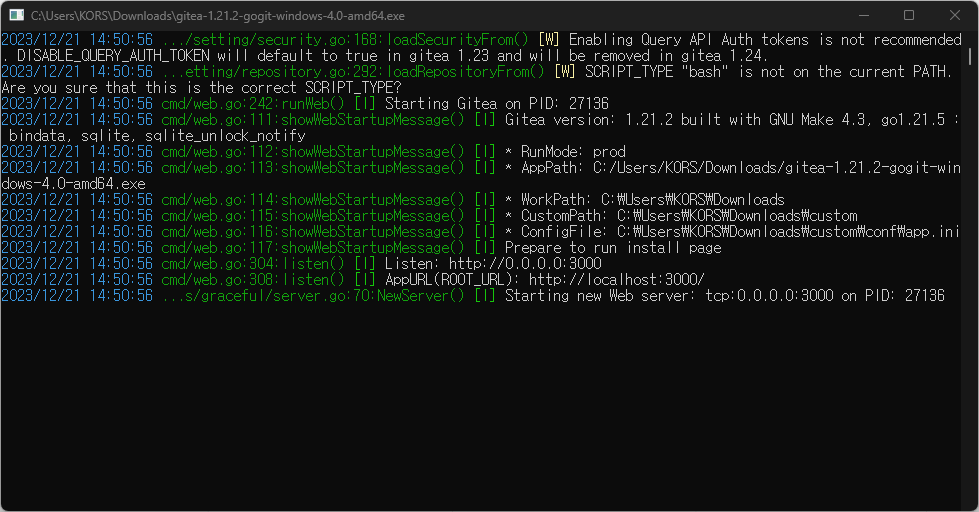

## 📌개요

깃 서버를 구축해서 같은 네트워크 망의 다른 PC에서 프로젝트 클론해보자.

## 📌Gitea란?

> [!INFO]
> `Gitea`는 `Git` 저장소를 관리하기 위한 오픈 소스 분산 버전 관리 시스템이다.

`GitHub`와 유사한 기능을 제공하며, 자체 호스팅이 가능하여 사용자가 자신의 서버에 설치하고 운영할 수 있다.
`Gitea`는 경량화된 애플리케이션으로, 개인 프로젝트나 소규모 팀에서 사용하기에 적합하다.
주요 기능으로는 코드 리뷰, 이슈 트래킹, 지속적 통합(CI) 등을 제공하며 그 외에도 유용한 기능을 많이 제공한다.

## 📌설치 및 구동

아래 깃헙 저장소에 접속하여 윈도우 설치 파일을 다운로드 받는다.

- https://github.com/go-gitea/gitea/releases
- `gitea-1.21.2-gogit-windows-4.0-amd64.exe`
	- 필요한 버전으로 받는다.

다운로드 받은 파일을 관리자 권한으로 실행하면 아래와 같은 명령창이 확인된다.
기본 포트 3000으로 접속할 수 있다.



접속하면 `Github` UI와 비슷한 화면에서 형상 관리가 가능하다.

### 데이터베이스 설정

- Gitea requires MySQL, PostgreSQL, MSSQL, SQLite3 or TiDB (MySQL protocol).
- 사용할 DB를 연결할 수도 있고, 기본적으로 별도의 DB와 연결하지 않아도 자체 SQLite와 함께 사용할 수 있다.
- ID: giteaadmin, PW: giteaadmin, e-mail: jgjo@kors.co.kr

### 각종 설정 

- `app.ini` 파일에서 관리자 생성, 사용자 권한 등 설정할 수 있다.
- 이번 경우 D드라이브에 설치했다. `These configuration options will be written into: D:\gitea_config\custom\conf\app.ini`

### Uninstall

- 삭제는 bat, sh 등 삭제 관련 소스를 찾을 수 있다.
- 일단 gitea 설치 시 설정했던 경로들의 gitea 관련 폴더를 삭제하면 다시 설치할 수 있다.
- 또한 `gitea-1.21.2-gogit-windows-4.0-amd64.exe`를 실행한 위치에 `data`, `custom` 폴더가 생성된 걸 확인할 수 있다.

## 📌보안 설정

> [!WARNING]
> 무엇보다 앞서 DNS가 필요하다. 외부 도메인 없이 내부 IP만으로 사용할 수가 없다. 유효하지 않은 인증서라고...

- gitea 문서: https://docs.gitea.com/next/administration/https-setup
- https 보안 설정을 위해 필요한 인증 파일을 발급해야 한다.
	- cert.pem
	- key.pem

```ini
[server]
...
ROOT_URL = https://000.000.000.000:3000/ #http >>> https 수정
PROTOCOL  = https #추가
CERT_FILE = custom/https/cert.pem #추가, 경로는 자유
KEY_FILE  = custom/https/key.pem #추가, 경로는 자유
```

### OpenSSL 설치

1. **다운로드**: OpenSSL 공식 웹사이트에서 Windows용 설치 파일을 다운로드한다. https://slproweb.com/products/Win32OpenSSL.html

2. **설치**: 다운로드한 설치 파일을 실행하여 OpenSSL을 설치한다.

### OpenSSL 명령어 사용

1. **명령 프롬프트 열기**: OpenSSL을 설치한 후, 명령 프롬프트(Windows의 cmd)를 연다.

2. **버전 확인**: OpenSSL이 정상적으로 설치되었는지 버전을 확인한다.

    ```bash
    openssl version
    ```

3. **RSA 키 생성**: 개인 키를 생성한다.

    ```bash
    openssl genrsa -out key.pem 2048
    ```

    이 명령은 2048 비트 길이의 RSA 개인 키를 생성하고 `key.pem` 파일에 저장한다.

4. **자체 서명된 인증서 생성**: 개인 키를 사용하여 자체 서명된 인증서를 생성한다.

    ```bash
    openssl req -new -x509 -key key.pem -out cert.pem -days 3650
    ```

    이 명령은 10년(3650일) 동안 유효한 자체 서명된 인증서를 생성하고 `cert.pem` 파일에 저장한다.
    입력하라는 대로 입력해도 멈추는 경우가 있는데 입력 후에 `.`을 입력해서 넘기거나 구글링하거나 빈 칸으로 넘어가보자.

5. **인증서 정보 입력**: 명령을 실행하면 추가 정보를 입력해야 할 수 있다. 실제 운영에서는 이 정보가 중요하며 신뢰할 수 있는 인증서를 위해 정확하고 유효한 정보를 제공해야 한다.

6. **파일 확인**: 생성된 `key.pem`과 `cert.pem` 파일을 확인하여 사용한다.

이제 생성된 `key.pem`과 `cert.pem` 파일을 필요한 곳에서 사용할 수 있다.

자체 서명된 인증서를 사용하는 경우, 클라이언트에서는 브라우저에 예외로 등록해야만 경고 없이 접속할 수 있다.
그러나 실제 제품에서는 신뢰할 수 있는 인증 기관으로부터 유효한 인증서를 구입하는 것이 좋다.

## 🎯결론

외부에 소스를 업로드 하길 원치 않지만, 자체적으로 버전 관리가 필요한 상황이었다.
내부에서 저장소를 공유하고 버전 관리를 할 수 있게 됐다.

## ⚙️EndNote

- 사용자 관리, 저장소 인증 관리 등은 포럼에서 확인하는 것이 좋을 것 같다.
- Gitea Forum: https://forum.gitea.com/
- 네트워크 연결 상태 때문인지 한 번씩 push에서 인증 오류 뜰 때가 있는데 다시 시도하면 정상적으로 된다.
