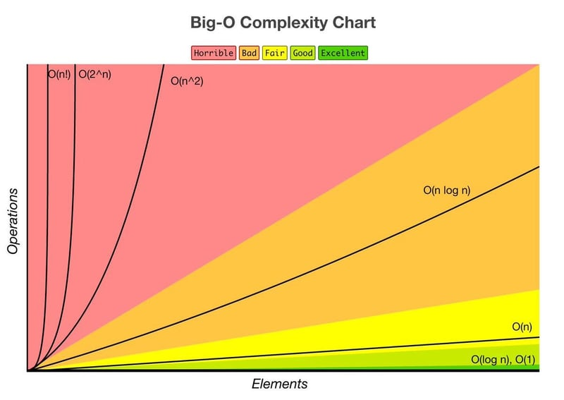

## 📌개요

알고리즘과 자료구조의 기본 원리를 이해하고 간단한 문제를 해결할 수 있다.

## 📌자료구조

### 배열과 문자열

#### 배열(Array)

동일한 타입의 요소들이 연속적으로 배치된 자료구조다.
인덱스를 통해 접근할 수 있으며, 고정된 크기를 갖는다.

- 장점: 인덱스를 통해 빠르게 접근 가능 (O(1))
- 단점: 크기가 고정되어 있으며, 요소의 삽입 및 삭제가 비효율적일 수 있음 (O(n))

#### 문자열(String)

문자의 배열로, 문자열의 길이에 따라 크기가 동적으로 변할 수 있다.

- 장점: 문자열 연산(비교, 연결 등)이 간편
- 단점: 문자열의 길이에 따라 연산 시간이 증가

### 연결 리스트(Linked List)

각 요소가 노드로 구성되며, 각 노드는 데이터와 다음 노드를 가리키는 포인터를 포함한다.
크기가 동적으로 변한다.

- **단일 연결 리스트(Singly Linked List)**: 각 노드가 다음 노드를 가리킨다.
- **이중 연결 리스트(Doubly Linked List)**: 각 노드가 이전 노드와 다음 노드를 가리킨다.
- 장점: 크기가 동적으로 변하며, 요소의 삽입 및 삭제가 용이 (O(1))
- 단점: 인덱스를 통한 접근이 비효율적 (O(n))

### 스택(Stack)과 큐(Queue)

#### 스택(Stack)

LIFO(Last In, First Out) 구조로, 마지막에 삽입된 요소가 가장 먼저 제거된다.

- 주요 연산: 삽입(push), 삭제(pop), 조회(peek)
- 장점: 구현이 간단하고, 함수 호출 스택 등에서 유용
- 단점: 특정 요소 접근이 비효율적 (O(n))

#### 큐(Queue)

FIFO(First In, First Out) 구조로, 처음에 삽입된 요소가 가장 먼저 제거된다.

- 주요 연산: 삽입(enqueue), 삭제(dequeue), 조회(front)
- 장점: 구현이 간단하고, 작업 대기열 등에서 유용
- 단점: 특정 요소 접근이 비효율적 (O(n))

### 해시 테이블(Hash Table)

키-값 쌍을 저장하는 자료구조로, 해시 함수를 사용하여 키를 인덱스로 변환하여 값을 저장한다.

- 장점: 평균적으로 빠른 접근, 삽입, 삭제 가능 (O(1))
- 단점: 해시 충돌 가능성, 해시 함수의 성능에 따라 성능 차이 발생

## 📌알고리즘

### 빅오 표기법(Big-O Notation)

[bigocheatsheet](https://www.bigocheatsheet.com/)

알고리즘의 시간 복잡도와 공간 복잡도를 나타내는 표기법으로, 입력 크기 n에 대한 연산 횟수나 메모리 사용량을 표현한다.

- O(1): 상수 시간, 입력 크기에 상관없이 일정한 시간 소요
- O(n): 선형 시간, 입력 크기에 비례하여 시간 소요
- O(log n): 로그 시간, 입력 크기의 로그에 비례하여 시간 소요
- O(n^2): 이차 시간, 입력 크기의 제곱에 비례하여 시간 소요

#### Common Data Structure Operations

  <table id="big-o-table">
    <thead>
      <tr>
        <th rowspan="2" class="sticky-left">Data Structure</th>
        <th colspan="4">Average Time Complexity</th>
        <th colspan="4">Worst Time Complexity</th>
        <th rowspan="2">Worst Space Complexity</th>
      </tr>
      <tr>
        <th>Access</th>
        <th>Search</th>
        <th>Insertion</th>
        <th>Deletion</th>
        <th>Access</th>
        <th>Search</th>
        <th>Insertion</th>
        <th>Deletion</th>
      </tr>
    </thead>
    <tbody>
      <tr>
        <td class="sticky-left">Array</td>
        <td class="excellent">Θ(1)</td>
        <td class="fair">Θ(n)</td>
        <td class="fair">Θ(n)</td>
        <td class="fair">Θ(n)</td>
        <td class="excellent">O(1)</td>
        <td class="fair">O(n)</td>
        <td class="fair">O(n)</td>
        <td class="fair">O(n)</td>
        <td class="fair">O(n)</td>
      </tr>
      <tr>
        <td class="sticky-left">Stack</td>
        <td class="fair">Θ(n)</td>
        <td class="fair">Θ(n)</td>
        <td class="excellent">Θ(1)</td>
        <td class="excellent">Θ(1)</td>
        <td class="fair">O(n)</td>
        <td class="fair">O(n)</td>
        <td class="excellent">O(1)</td>
        <td class="excellent">O(1)</td>
        <td class="fair">O(n)</td>
      </tr>
      <tr>
        <td class="sticky-left">Queue</td>
        <td class="fair">Θ(n)</td>
        <td class="fair">Θ(n)</td>
        <td class="excellent">Θ(1)</td>
        <td class="excellent">Θ(1)</td>
        <td class="fair">O(n)</td>
        <td class="fair">O(n)</td>
        <td class="excellent">O(1)</td>
        <td class="excellent">O(1)</td>
        <td class="fair">O(n)</td>
      </tr>
      <tr>
        <td class="sticky-left">Singly Linked List</td>
        <td class="fair">Θ(n)</td>
        <td class="fair">Θ(n)</td>
        <td class="excellent">Θ(1)</td>
        <td class="excellent">Θ(1)</td>
        <td class="fair">O(n)</td>
        <td class="fair">O(n)</td>
        <td class="excellent">O(1)</td>
        <td class="excellent">O(1)</td>
        <td class="fair">O(n)</td>
      </tr>
      <tr>
        <td class="sticky-left">Doubly Linked List</td>
        <td class="fair">Θ(n)</td>
        <td class="fair">Θ(n)</td>
        <td class="excellent">Θ(1)</td>
        <td class="excellent">Θ(1)</td>
        <td class="fair">O(n)</td>
        <td class="fair">O(n)</td>
        <td class="excellent">O(1)</td>
        <td class="excellent">O(1)</td>
        <td class="fair">O(n)</td>
      </tr>
      <tr>
        <td class="sticky-left">Skip List</td>
        <td class="good">Θ(log(n))</td>
        <td class="good">Θ(log(n))</td>
        <td class="good">Θ(log(n))</td>
        <td class="good">Θ(log(n))</td>
        <td class="fair">O(n)</td>
        <td class="fair">O(n)</td>
        <td class="fair">O(n)</td>
        <td class="fair">O(n)</td>
        <td class="bad">O(n log(n))</td>
      </tr>
      <tr>
        <td class="sticky-left">Hash Table</td>
        <td class="gray">N/A</td>
        <td class="excellent">Θ(1)</td>
        <td class="excellent">Θ(1)</td>
        <td class="excellent">Θ(1)</td>
        <td class="gray">N/A</td>
        <td class="fair">O(n)</td>
        <td class="fair">O(n)</td>
        <td class="fair">O(n)</td>
        <td class="fair">O(n)</td>
      </tr>
      <tr>
        <td class="sticky-left">Binary Search Tree</td>
        <td class="good">Θ(log(n))</td>
        <td class="good">Θ(log(n))</td>
        <td class="good">Θ(log(n))</td>
        <td class="good">Θ(log(n))</td>
        <td class="fair">O(n)</td>
        <td class="fair">O(n)</td>
        <td class="fair">O(n)</td>
        <td class="fair">O(n)</td>
        <td class="fair">O(n)</td>
      </tr>
      <tr>
        <td class="sticky-left">Cartesian Tree</td>
        <td class="gray">N/A</td>
        <td class="good">Θ(log(n))</td>
        <td class="good">Θ(log(n))</td>
        <td class="good">Θ(log(n))</td>
        <td class="gray">N/A</td>
        <td class="fair">O(n)</td>
        <td class="fair">O(n)</td>
        <td class="fair">O(n)</td>
        <td class="fair">O(n)</td>
      </tr>
      <tr>
        <td class="sticky-left">B-Tree</td>
        <td class="good">Θ(log(n))</td>
        <td class="good">Θ(log(n))</td>
        <td class="good">Θ(log(n))</td>
        <td class="good">Θ(log(n))</td>
        <td class="good">O(log(n))</td>
        <td class="good">O(log(n))</td>
        <td class="good">O(log(n))</td>
        <td class="good">O(log(n))</td>
        <td class="fair">O(n)</td>
      </tr>
      <tr>
        <td class="sticky-left">horrible-Black Tree</td>
        <td class="good">Θ(log(n))</td>
        <td class="good">Θ(log(n))</td>
        <td class="good">Θ(log(n))</td>
        <td class="good">Θ(log(n))</td>
        <td class="good">O(log(n))</td>
        <td class="good">O(log(n))</td>
        <td class="good">O(log(n))</td>
        <td class="good">O(log(n))</td>
        <td class="fair">O(n)</td>
      </tr>
      <tr>
        <td class="sticky-left">Splay Tree</td>
        <td class="gray">N/A</td>
        <td class="good">Θ(log(n))</td>
        <td class="good">Θ(log(n))</td>
        <td class="good">Θ(log(n))</td>
        <td class="gray">N/A</td>
        <td class="good">O(log(n))</td>
        <td class="good">O(log(n))</td>
        <td class="good">O(log(n))</td>
        <td class="fair">O(n)</td>
      </tr>
      <tr>
        <td class="sticky-left">AVL Tree</td>
        <td class="good">Θ(log(n))</td>
        <td class="good">Θ(log(n))</td>
        <td class="good">Θ(log(n))</td>
        <td class="good">Θ(log(n))</td>
        <td class="good">O(log(n))</td>
        <td class="good">O(log(n))</td>
        <td class="good">O(log(n))</td>
        <td class="good">O(log(n))</td>
        <td class="fair">O(n)</td>
      </tr>
      <tr>
        <td class="sticky-left">KD Tree</td>
        <td class="good">Θ(log(n))</td>
        <td class="good">Θ(log(n))</td>
        <td class="good">Θ(log(n))</td>
        <td class="good">Θ(log(n))</td>
        <td class="fair">O(n)</td>
        <td class="fair">O(n)</td>
        <td class="fair">O(n)</td>
        <td class="fair">O(n)</td>
        <td class="fair">O(n)</td>
      </tr>
    </tbody>
  </table>

#### Array Sorting Algorithms

  <table id="big-o-table">
    <thead>
      <tr>
        <th rowspan="2" class="sticky-left">Algorithm</th>
        <th colspan="3">Time Complexity</th>
        <th rowspan="2">Space Complexity (Worst)</th>
      </tr>
      <tr>
        <th>Best</th>
        <th>Average</th>
        <th>Worst</th>
      </tr>
    </thead>
    <tbody>
      <tr>
        <td class="sticky-left">Quicksort</td>
        <td class="bad">Ω(n log n)</td>
        <td class="bad">Θ(n log n)</td>
        <td class="horrible">O(n^2)</td>
        <td class="good">O(log n)</td>
      </tr>
      <tr>
        <td class="sticky-left">Merge Sort</td>
        <td class="bad">Ω(n log n)</td>
        <td class="bad">Θ(n log n)</td>
        <td class="bad">O(n log n)</td>
        <td class="fair">O(n)</td>
      </tr>
      <tr>
        <td class="sticky-left">Timsort</td>
        <td class="fair">Ω(n)</td>
        <td class="bad">Θ(n log n)</td>
        <td class="bad">O(n log n)</td>
        <td class="fair">O(n)</td>
      </tr>
      <tr>
        <td class="sticky-left">Heapsort</td>
        <td class="bad">Ω(n log n)</td>
        <td class="bad">Θ(n log n)</td>
        <td class="bad">O(n log n)</td>
        <td class="excellent">O(1)</td>
      </tr>
      <tr>
        <td class="sticky-left">Bubble Sort</td>
        <td class="fair">Ω(n)</td>
        <td class="horrible">Θ(n^2)</td>
        <td class="horrible">O(n^2)</td>
        <td class="excellent">O(1)</td>
      </tr>
      <tr>
        <td class="sticky-left">Insertion Sort</td>
        <td class="fair">Ω(n)</td>
        <td class="horrible">Θ(n^2)</td>
        <td class="horrible">O(n^2)</td>
        <td class="excellent">O(1)</td>
      </tr>
      <tr>
        <td class="sticky-left">Selection Sort</td>
        <td class="horrible">Ω(n^2)</td>
        <td class="horrible">Θ(n^2)</td>
        <td class="horrible">O(n^2)</td>
        <td class="excellent">O(1)</td>
      </tr>
      <tr>
        <td class="sticky-left">Tree Sort</td>
        <td class="bad">Ω(n log n)</td>
        <td class="bad">Θ(n log n)</td>
        <td class="horrible">O(n^2)</td>
        <td class="fair">O(n)</td>
      </tr>
      <tr>
        <td class="sticky-left">Shell Sort</td>
        <td class="bad">Ω(n log n)</td>
        <td class="horrible">Θ(n(log n)²)</td>
        <td class="horrible">O(n(log n)²)</td>
        <td class="excellent">O(1)</td>
      </tr>
      <tr>
        <td class="sticky-left">Bucket Sort</td>
        <td class="excellent">Ω(n + k)</td>
        <td class="excellent">Θ(n + k)</td>
        <td class="horrible">O(n^2)</td>
        <td class="fair">O(n)</td>
      </tr>
      <tr>
        <td class="sticky-left">Radix Sort</td>
        <td class="excellent">Ω(nk)</td>
        <td class="excellent">Θ(nk)</td>
        <td class="excellent">O(nk)</td>
        <td class="fair">O(n + k)</td>
      </tr>
      <tr>
        <td class="sticky-left">Counting Sort</td>
        <td class="excellent">Ω(n + k)</td>
        <td class="excellent">Θ(n + k)</td>
        <td class="excellent">O(n + k)</td>
        <td class="fair">O(k)</td>
      </tr>
      <tr>
        <td class="sticky-left">Cubesort</td>
        <td class="fair">Ω(n)</td>
        <td class="bad">Θ(n log n)</td>
        <td class="bad">O(n log n)</td>
        <td class="fair">O(n)</td>
      </tr>
    </tbody>
  </table>

### 재귀(Recursion) 기본

함수가 자기 자신을 호출하는 기법으로, 문제를 작은 하위 문제로 분할하여 해결한다.

- 장점: 코드가 간결해지고, 특정 문제(예: 트리 탐색)에서 유용
- 단점: 호출 스택의 크기가 커질 수 있으며, 무한 재귀를 방지하기 위해 종료 조건 필요

### 정렬 알고리즘

#### 버블 정렬(Bubble Sort)

>시간 복잡도: O(n^2)

인접한 요소들을 비교하여 정렬하는 알고리즘으로, 반복문을 통해 정렬이 완료될 때까지 계속 비교 및 교환한다.

#### 선택 정렬(Selection Sort)

>시간 복잡도: O(n^2)

매번 최솟값을 찾아서 정렬되지 않은 부분의 첫 번째 요소와 교환하는 알고리즘이다.

#### 삽입 정렬(Insertion Sort)

>시간 복잡도: O(n^2)

정렬된 부분과 정렬되지 않은 부분을 나누고, 정렬되지 않은 부분의 요소를 적절한 위치에 삽입하여 정렬한다.
