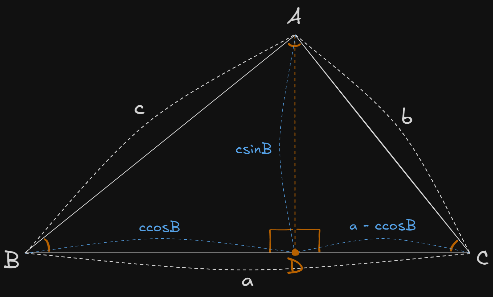

## 📌개요

코사인 법칙이 모든 삼각형에서 어떻게 성립하는지 증명을 정리

## 📌내용

코사인 법칙은 삼각형에서 두 변의 길이와 끼인각(사이의 각)을 이용하여 나머지 한 변의 길이를 구할 수 있는 중요한 공식이다.

$$a^2=b^2+c^2−2bc\cos A$$

위 식은 직각삼각형뿐만 아니라 모든 삼각형에서 성립하는데, 이는 피타고라스 정리를 일반 삼각형으로 확장한 개념이라고 볼 수 있다.

### 코사인 법칙 증명

#### 점 A에서 BC에 대한 수선의 발을 내림

$\triangle ABC$의 점$A$에서 $\overline{BC}$에 수선의 발을 내려서 점 $D$를 만든다고 하자.
이때 삼각형은 두 개의 직각삼각형 $\triangle{ABD}$와 $\triangle{ACD}$로 나뉜다.

#### 직각삼각형에서 피타고라스 정리 적용

삼각형의 구성 요소 정리
-  $\angle{ABC} = B$라고 하자.
-  점 $A$에서 $\overline{BC}$에 내린 수선의 발을 $D$라고 하자.
-  이때 $\overline{BD} = c\cos{B}$, $\overline{AD} = c\sin{B}$이다.

피타고라스 정리 사용
- $\triangle{ACD}$에서 $\overline{AD}^2+\overline{CD}^2=\overline{AC}^2$

$$
\begin{gathered}
b^2 = (c\sin B)^2 + (a-c\cos B)^2 \\
\end{gathered}
$$

위 피타고라스 정리를 전개

$$b^2=c^2\sin^2{B} + (a^2-2ac\cos{B}+c^2\cos^2{B})$$

삼각함수의 항을 묶어서 정리

$$b^2=c^2(\sin^2{B}+\cos^2{B})+a^2-2ac\cos{B}$$

삼각함수의 기본 항등식 $\sin^2{B} + \cos^2{B} = 1$을 적용

$$b^2 = c^2+a^2-2ac\cos{B}$$

#### 코사인 값 구하기

위 식을 코사인에 대해 정리

$$\cos{B} = \frac{c^2+a^2-b^2}{2ac}$$

## ⚙️EndNote

### 단위원(Unit Circle) 개념

단위원이란 반지름이 1인 원으로, 원점 (0,0)을 중심으로 하는 원이다.  
단위원의 방정식은 다음과 같이 주어진다.

$$x^2+y^2=1$$

삼각함수를 정의할 때, 단위원을 사용하면 다음과 같이 표현할 수 있다.
한 점 $P(x,y)$가 원 위에 있고, 이 점이 원점과 이루는 각이 $\theta$일 때,

$$
\begin{gathered}
x = \cos{\theta} \\
y = \sin{\theta}
\end{gathered}
$$

단위원의 정의에 따라 점 $P(x,y)$는 항상 원 위에 있어야 하므로, 다음이 성립한다.

$$\cos^2{\theta} + \sin^2{\theta} = 1$$

즉, 단위원 위의 모든 점이 원의 방정식을 만족하기 때문에 위의 기본 삼각함수 항등식이 성립한다.
