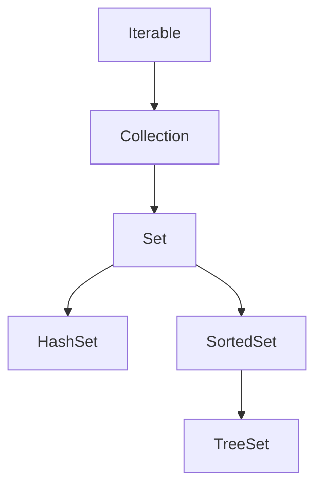

## 📌개요

`HashSet`은 Java 컬렉션 프레임워크의 일부이며 `Set` 인터페이스를 구현한 클래스다.
`Set`은 인터페이스(규약)이고 `HashSet`은 그 구현체다.

## 📌내용

### 구현 계층 구조



```java
// 개념도
Set 인터페이스 (규약)
↑ 구현
HashSet 클래스
└── (내부적으로 HashMap 사용)
    ├── 키(key): 실제 저장할 객체
    └── 값(value): PRESENT (Dummy Obejct)
```

### 내부 동작 방식

#### 데이터 저장 구조

`HashSet`은 내부적으로 `HashMap`을 사용하여 요소들을 저장한다.
`HashSet`에 추가하는 각 요소는 `HashMap`의 키(`Key`)로 저장되며 값(`Value`)에는 더미 객체(`PRESENT`)가 저장된다.

```java
// java.util.HashSet 실제 Java 소스 코드 일부 
public class HashSet<E>  
    extends AbstractSet<E>  
    implements Set<E>, Cloneable, java.io.Serializable  
{  
    @java.io.Serial  
    static final long serialVersionUID = -5024744406713321676L;  
  
    transient HashMap<E,Object> map;  
  
    // Dummy value to associate with an Object in the backing Map  
    static final Object PRESENT = new Object();  
  
    /**  
     * Constructs a new, empty set; the backing {@code HashMap} instance has  
     * default initial capacity (16) and load factor (0.75).     */    public HashSet() {  
        map = new HashMap<>();  
    }
}
```

#### 중복 제거 매커니즘

`HashSet`이 중복을 확인하는 방법은 두 단계로 이루어진다.

1. 해시 코드 비교: 먼저 객체의 `hashCode()` 메서드를 호출하여 해시 코드를 비교한다.
	- 해시 코드가 다르면 다른 객체로 판단한다.
	- 해시 코드가 같으면 2단계 진행
2. equals 비교: `equals()` 메서드를 사용하여 실제로 같은 객체인지 확인한다.
	- `equals()`가 `true`를 반환하면 같은 객체로 판단하여 추가를 허용하지 않음
	- `equals()`가 `false`를 반환하면 다른 객체로 판단하여 추가 허용

```java
// 중복 확인 pseudo
if(existingElement.hashCode() == newElement.hashCode() && existingElement.equals(newElement)) {
	// 중복으로 판단하여 추가하지 않음
} else {
	// 새로운 요소로 추가
}
```

#### 성능 특징

- 평균 시간 복잡도(add, remove, contains): O(1)
- 최악의 경우(모든 요소가 같은 해시 버킷에 있는 경우): O(n)

### 직접 구현해보는 간단한 HashSet 예제

값을 키로 사용하기 때문에 중복을 방지할 수 있고
키-값 쌍이어야 하는데 값을 키에 사용하니 값에는 넣을 필요 없이 더미 객체로 자리를 차지하게 두면 된다.

```java
package com.myhashset;  
  
import java.util.HashMap;  
  
public class MyHashSet<E> {  
  private static final Object PRESENT = new Object();  
  private HashMap<E, Object> map;  
  
  public MyHashSet() {  
    map = new HashMap<>();  
  }  
  
  // 요소 추가  
  public boolean add(E e) {  
    return map.put(e, PRESENT) == null;  
  }  
  
  // 요소 제거  
  public boolean remove(E e) {  
    return map.remove(e) == PRESENT;  
  }  
  
  // 요소 포함 여부 확인  
  public boolean contains(E e) {  
    return map.containsKey(e);  
  }  
  
  // 크기 반환  
  public int size() {  
    return map.size();  
  }  
  
  // 비어 있는지 확인  
  public boolean isEmpty() {  
    return map.isEmpty();  
  }  
  
  // 모든 요소 제거  
  public void clear() {  
    map.clear();  
  }  
  
  // 반복자 반환  
  public java.util.Iterator<E> iterator() {  
    return map.keySet().iterator();  
  }  
  
  public static void main(String[] args) {  
    MyHashSet<String> set = new MyHashSet<>();  
  
    set.add("Apple");  
    set.add("Banana");  
    set.add("Apple"); // 중복 추가 시도  
  
    System.out.println(set.contains("Apple")); // true  
    System.out.println(set.contains("Orange")); // false  
    System.out.println(set.size()); // 2  
  
    set.remove("Banana");  
    System.out.println(set.size()); // 1  
  }  
}
```

#### PRESENT의 역할

`PRESENT`는 `HashSet`이 내부적으로 사용하는 더미 객체(Dummy Object)로 `HashMap`에서 값 부분을 채우기 위한 목적으로 사용된다.

- `HashSet`은 내부적으로 `HashMap`을 사용하여 구현되어 있다.
- `HashMap`은 키-값 쌍으로 데이터를 저장하는데 `HashSet`은 오직 키만 저장하는 `Set` 인터페이스를 구현해야 한다.
- 따라서 값 부분에는 의미 없는 더미 객체를 저장한다.

#### 핵심 개념 요약

1. 키(`Key`)만 저장하는 `Set`의 특성
	- `HashSet`은 순수하게 Key들의 모음으로 동작해야 한다.
	- 하지만 내부적으로는 `HaspMap`을 사용해 구현되어 있다.
	- `HashMap`은 반드시 키-값 쌍으로 저장해야 한다.
2. 값(`Value`)을 처리하는 방법
	- 키에는 실제 저장할 값이 들어간다.
	- 값에는 항상 동일한 `PRESENT` 객체를 저장한다.
		- 모든 요소가 공유하는 더미 객체를 `private static final` 선언해서 메모리 낭비를 없앤다.
		- `HashMap`의 구조를 유지하면서 `Set`처럼 동작한다.
3. 중복 방지 매커니즘
	- `HashMap`은 키의 중복을 허용하지 않는다.
	- `HashSet.add()`는 내부적으로 `map.put(key, PRESENT)`를 호출한다.
		- 키가 처음 추가되면 → `null` 반환 → `true` 성공
		- 키가 이미 존재하면 → 기존 `PRESENT` 반환 → `false` 실패

## 🎯결론

- 구현 트레이드 오프: `HashSet`은 메모리 효율성(단일 `PRESENT` 사용)과 코드 재사용성(`HashMap` 활용) 사이의 절충안으로 설계됐다.
- 중복 검사의 본질: `hashCode()`와 `equals()`의 적절한 오버라이딩이 필수적이며, 이는 모든 `Map`/`Set` 기반 컬렉션의 공통 요구사항이다.
- 성능 보장: 이상적인 경우 O(1)의 시간 복잡도로 동작하나 불균형 해시 분포 시 O(n)으로 저하될 수 있다.

## ⚙️EndNote

### 사전 지식

- 해시 테이블 원리: 버킷 구조, 해시 충돌 처리 방식(체이닝/개방 주소법)
- 불변성(Immutability): `HashSet`에 저장된 객체의 필드 변경 시 발생하는 문제

### 더 알아보기

#### 다른 `Set` 구현체 비교

스레드 안전(Thread-safe): `Tread-safe`란 멀티 스레드 프로그래밍에서 일반적으로 어떤 함수나 변수, 혹은 객체가 여러 스레드로부터 동시에 접근이 이루어져도 프로그램의 실행에 문제가 없는 것을 말한다.

하나의 함수가 한 스레드로부터 호출되어 실해 중일 때, 다른 스레드가 그 함수를 호출하여 동시에 함께 실행되더라도 각 스레드에서 함수의 수행 결과가 올바르게 나오는 것을 말한다.

출처: [스레드 안전(Thread-Safety)란?](https://developer-ellen.tistory.com/205)

|구현체|내부 구조|순서 보장|null 허용|Thread-safe|
|---|---|---|---|---|
|`HashSet`|HashMap|❌|✅|❌|
|`LinkedHashSet`|LinkedHashMap|삽입 순서|✅|❌|
|`TreeSet`|Red-Black Tree|정렬 순서|❌|❌

#### Java 8+의 성능 개선

- 해시 충돌 시 연결 리스트 → Red-Black 트리로 전환
- `java.util.concurrent.ConcurrentSkipListSet` 병렬 처리용 구현체

#### 추천 참고 자료

- `HashSet`의 `HashMap` 활용 설계
	- Java 공식 문서에서는 `HashSet`이 `HashMap`을 기반으로 구현됨을 명시하고 있다. 이는 메모리 효율성과 코드 재사용성을 위한 설계 선택이다.
	- [Oracle Java Docs: HashSet](https://docs.oracle.com/javase/8/docs/api/java/util/HashSet.html)
- `hashCode()`와 `equals()`의 중요성
	- 객체의 중복 검사 매커니즘은 Java 컬렉션 프레임워크의 핵심 원리로 모든 `Map`/`Set` 구현체에 적용된다.
	- [Java Tutorial: Object Methods](https://docs.oracle.com/javase/tutorial/java/IandI/objectclass.html)