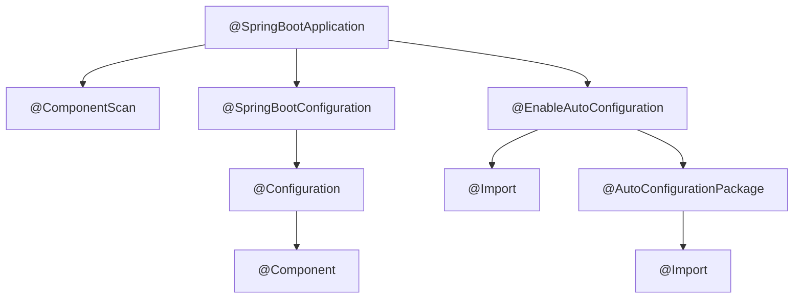
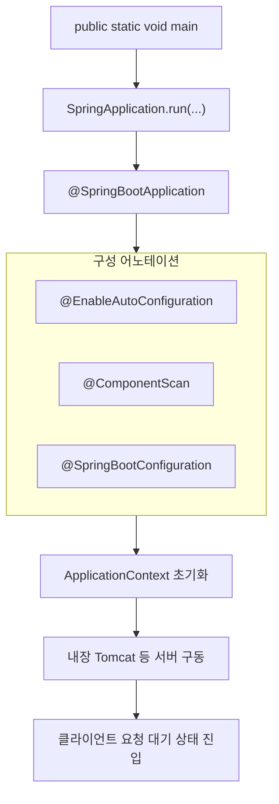

## 📌개요

"Spring과 Spring Boot는 뭐가 다르지?" 백엔드 개발을 배우기 시작하면 누구나 한 번쯤은 이 질문을 던진다. 이 글에선 Spring과 Spring Boot의 개념적 차이와 각자의 장단점을 정리하고, 실제 개발에서 어떤 상황에 어떤 것을 쓰는 게 맞는지 판단할 수 있는 기준을 다룬다. **Spring Boot는 Spring을 완전히 대체하는 것이 아니라, 더 쉽게 활용할 수 있게 돕는 프레임워크라는 점이 핵심**이다.

## 📌내용

### Spring이란?

Spring은 자바 기반의 **대형 애플리케이션 프레임워크**로, 주된 목표는 **기업용 애플리케이션 개발에서의 복잡성을 줄이는 것**이다. 다음과 같은 특징이 있다.

- **DI (Dependency Injection)**: 객체 간의 의존성을 느슨하게 관리.
- **AOP (Aspect-Oriented Programming)**: 횡단 관심사(로깅, 보안 등)를 분리.
- **트랜잭션 관리, 데이터 접근 (JDBC, ORM)** 등 다양한 엔터프라이즈 기능 지원.

> 장점은 유연성과 확장성인데, **단점은 설정이 복잡**하고 XML 또는 자바 기반의 방대한 설정 파일을 직접 작성해야 했다는 점이다.

### Spring Boot란?

Spring Boot는 **"Spring의 생산성을 혁신적으로 끌어올리기 위해 등장한 프레임워크"** 다. 쉽게 말하면, Spring을 더 쉽게 쓰게 해주는 **Spring의 확장판**이다.

- **자동 설정(Auto Configuration)**: 필요한 설정을 자동으로 감지.
- **내장 WAS 제공**: 톰캣, 제티 등을 내장해서 배포가 간편.
- **starter 의존성**: `spring-boot-starter-*`로 대표되는 의존성 관리 패키지 제공.
- **운영툴 내장**: 헬스체크, 메트릭 등 운영 편의성 향상.

### 어떤 관계일까?

- Spring Boot는 **Spring 프레임워크 위에서 동작**한다.
- Spring이 없으면 Spring Boot도 존재할 수 없다.
- 쉽게 말하면, Spring Boot는 **Spring의 사용성을 높여주는 껍데기(Wrapper)** 라고 보면 된다.

| 구분             | Spring                                        | Spring Boot                                      |
|------------------|----------------------------------------------|--------------------------------------------------|
| 초기 설정         | 수동 설정 (XML, Java Config)                  | 자동 설정, Starter 의존성                         |
| 웹 서버          | 별도 설치 필요                                 | 내장 톰캣 등 제공                                  |
| 개발 생산성       | 설정 주도                                      | 빠른 개발 & 운영 편의성                           |
| 진입 장벽         | 높음                                           | 낮음                                              |
| 주요 용도         | 복잡한 엔터프라이즈 시스템                     | 빠른 프로토타이핑, 마이크로서비스 등              |

### 왜 Spring Boot가 탄생했나?

Spring의 유연성은 좋았지만 **개발자들이 너무 많은 설정에 지쳐 갔다.** 당시 루비 온 레일즈(Ruby on Rails) 같은 프레임워크가 "관습이 코드보다 우선한다(Convention over Configuration)"라는 철학으로 큰 인기를 끌면서, Spring 진영도 더 생산적인 개발 환경을 고민하게 됐다. 그 결과물이 바로 Spring Boot다.

### 언제 어떤 걸 써야 할까?

- **Spring만 사용하는 경우**
	- 이미 사내 표준화된 Spring 환경이 있고, 커스텀한 설정이 중요한 레거시 시스템.
	- 직접 세밀하게 설정을 제어해야 하는 경우.

- **Spring Boot를 사용하는 경우**
	- 빠르게 서비스를 런칭해야 하는 스타트업, 프로토타입 개발.
	- 마이크로서비스 아키텍처처럼 독립적 서비스가 많은 구조.
	- DevOps/운영 환경에서 헬스체크, 메트릭 등 운영 편의성을 중요하게 여기는 경우.

### Spring Boot의 한계

- 내부가 워낙 자동화돼 있어서 **초보자일 땐 '왜 이렇게 동작하지?'라는 혼란이 올 수 있음.**
- 필요 이상으로 불필요한 의존성이 포함될 때도 있어서, **프로젝트 규모가 커질수록 최적화와 경량화가 필요**함.
- 내장 톰캣 등을 사용하는 경우 컨테이너 기반 환경에서는 커스텀 설정이 까다로울 수 있음.

### SpringBoot 살짝 뜯어보기

#### 메인 클래스의 역할

Spring Boot 애플리케이션은 `public static void main(String[] args)` 메서드를 진입점으로 실행되며 이 메인 클래스가 Spring Boot 실행 구조의 출발점이자 전체 설정 및 컴포넌트 구성을 담당하는 핵심 위치를 차지한다.

##### `main()` 메서드의 역할

Java Application의 진입점은 `main()` 메서드이며 Spring Boot도 예외는 아니다.
Spring Boot에서는 이 메서드 내부에서 다음과 같은 방식으로 애플리케이션을 시작한다.

```java
@SpringBootApplication
public class MyApplication {
	public static void main(String[] args) {
		SpringApplication.run(MyApplication.class, args);
	}
}
```

- `SpringApplication.run(...)`은 스프링 컨테이너를 초기화하고 내장 서버(Tomcat 등)을 구동하며 전체 애플리케이션을 실행하는 메서드
- 이 호출은 결국 ApplicationContext 생성, 설정파일 로딩, 자동 구성 처리, 컴포넌트 스캔 등의 일련의 과정을 시작한다.
- `main()` 메서드가 있는 클래스는 보통 구성의 기준점이 되는 루트 패키지에 위치시켜 이후 컴포넌트 탐색 및 의존성 주입의 범위를 결정하는데 사용된다.

#### `@SpringBootApplication`

Spring은 처음엔 너무 방대해서 **DI, AOP 같은 핵심 개념만 뽑아서 작은 프로젝트에 적용**해봤다.
Spring Boot는 공식 문서의 **Getting Started**를 따라하면서 구조를 눈에 익히고, 실제로 `@SpringBootApplication` 어노테이션이 내부적으로 어떤 동작을 하는지 코드를 따라가 보면서 깊이 이해해 보는 것에 도전했다.

처음 SpringBoot 프로젝트를 생성하면 `@SpringBootApplication`이라는 어노테이션이 보인다.
이 한 줄이 모든 걸 시작하게 만들지만 대부분은 단순히 "부트스트랩용 어노테이션" 정도로만 알고 넘어간다. 하지만 실제 동작 원리를 이해해야 Spring Boot의 진짜 힘을 느낄 수 있다.

#### `@SpringBootApplication`은 뭘 감싸고 있나?

사실 이건 복합 구성(Meta-Annotation)으로 세 가지 주요 어노테이션을 묶고 있다.



```java
@Target(ElementType.TYPE)  
@Retention(RetentionPolicy.RUNTIME)  
@Documented  
@Inherited  
@SpringBootConfiguration  
@EnableAutoConfiguration  
@ComponentScan(excludeFilters = { @Filter(type = FilterType.CUSTOM, classes = TypeExcludeFilter.class),  
   @Filter(type = FilterType.CUSTOM, classes = AutoConfigurationExcludeFilter.class) })  
public @interface SpringBootApplication {
	...
}
```

#### `@SpringBootConfiguration`

말 그대로 스프링 설정 파일 역할을 한다.
이건 `@Configuration`의 확장판이다.
즉, 이 클래스가 빈 설정의 진입점임을 알려준다.

#### `@EnableAutoConfiguration`

Spring Boot의 핵심 기능.
자동 설정을 활성화해서 클래스패스에 있는 라이브러리와 환경에 따라 필요한 설정을 자동으로 구성한다.
이건 내부적으로 `spring.factories` 파일을 통해 각종 `AutoConfiguration` 클래스를 로딩한다.

#### `@ComponentScan`

현재 패키지를 기준으로 빈 검색을 시작한다.
컨트롤러, 서비스 등을 `@Component` 계열로 붙이면 이게 알아서 찾아 등록해준다.

#### 실행 흐름 시각화

위에서 살펴본 메인 클래스와 `@SpringBootApplication`의 세 가지 구성 요소는 애플리케이션 실행 시 정해진 순서와 구조에 따라 동작한다.



1. `main()` : 애플리케이션의 단순한 진입점이 아니라 Spring Boot 전체 실행의 기준점
2. `SpringApplication.run()` : 실행 컨텍스트 구성, 리스너 등록, 설정 파일 로딩 등 수행
3. `@EnableAutoConfiguration` : 클래스패스를 기반으로 설정 후보 자동 로딩 및 적용
4. `@ComponentScan` : 지정된 패키지에서 컴포넌트(@Component, @Service 등) 자동 탐색
5. `@SpringBootConfiguration` : Java 기반 설정 클래스 등록. 수동 Bean 정의에 사용
6. `ApplicationContext` 초기화 : 의존성 주입 및 라이프사이클 콜백 수행
7. 내장 서버 실행 : 기본 포트(8080)에서 HTTP 요청을 수신할 수 있는 상태로 전환됨

이 흐름은 단순히 외워야 할 절차가 아니라, **설정 누락, 컴포넌트 인식 실패, 자동 설정 충돌** 등의 문제를 디버깅할 때 반드시 이해하고 있어야 하는 구조이다.

## 🎯결론

>[!info] Spring Boot는 단순한 대체제가 아니라 Spring을 쉽고 빠르게 활용하도록 돕는 파트너다.

이번 포스팅을 통해 Spring과 Spring Boot의 관계를 명확히 이해하고, `@SpringBootApplication` 내부의 작동 방식을 직접 따라가 본 경험으로, 단순 사용자가 아니라 **이해하고 제어할 줄 아는 개발자로 한 걸음 성장했다.**

다음 단계로는 Spring Boot의 자동 설정(AutoConfiguration) 메커니즘을 더 깊이 파고들어, 커스텀 자동 설정을 만드는 방법까지 알아보면 좋겠다.

## ⚙️EndNote

### 사전 지식

- Java 언어 기초
- 객체지향 프로그래밍 개념 (DI, AOP 등)
- 톰캣과 같은 WAS 개념

### 더 알아보기

- [Spring 공식 문서](https://spring.io/projects/spring-framework)
- [Spring Boot 공식 문서](https://spring.io/projects/spring-boot)
- [스프링 부트 Reference Docs](https://docs.spring.io/spring-boot/docs/current/reference/html/)
- 마이크로서비스 아키텍처