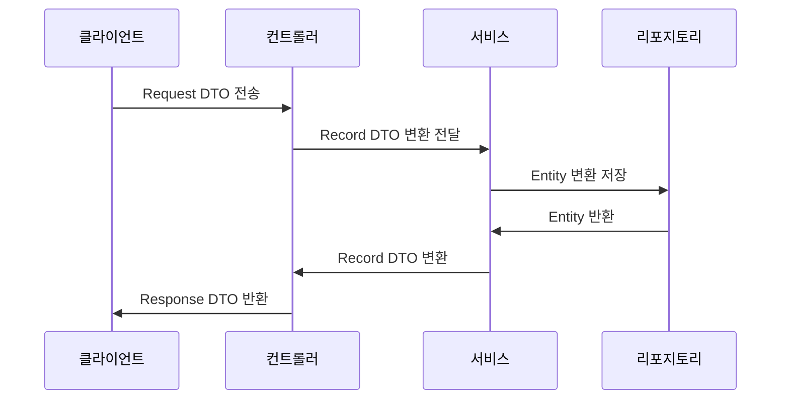

## 📌개요

DTO는 계층 간 데이터 전송을 위한 객체로 Java 개발에서 빈번히 사용된다.

기존에는 Class로 DTO를 구현했지만 Java 14부터 등장한 Record를 활용해보면 불변성, 간결성, 명확성을 모두 확보할 수 있다.

주문 시스템을 예시로 Record를 활용해 DTO를 효과적으로 구현하는 방법을 알아보자.

- DTO: Data Transfer Object
- 불변성(Immutability): 생성 후 수정 불가
- 간결성(Simplicity): 반복 코드 자동 생성
- 명확성(Clarity): 순수 데이터 객체임을 명시

## 📌내용

### DTO란?

Data Transfer Object는 다음과 같은 특징을 가진다.

- 데이터 전송 전용 객체
	- 비즈니스 로직 없이 순수 데이터만 포함한다.
- 계층 간 데이터 변환
	- 예: Controller <-> Service 계층 연결
- 선택적 데이터 노출
	- 민감 정보 필터링 또는 필요한 데이터만 전송

### DTO 사용 Flow



### Class DTO VS Record DTO

#### Class DTO (기존 방식)

```java
public class ProductDTO {
    private final Long id;
    private final String name;
    private final double price;

    // 생성자
    public ProductDTO(Long id, String name, double price) {
        this.id = id;
        this.name = name;
        this.price = price;
    }

    // 수동 작성 필요
    public Long getId() { return id; }
    public String getName() { return name; }
    public double getPrice() { return price; }

	// getter, setter, toString(), equals(), hashCode() 등 ... 
}
```

#### Record DTO (Java 16+)

Record는 `Constructor`, `getter`, `equals()`, `hashCode()`, `toString()`을 자동 생성한다.
그 외에도 추가적인 기능을 제공하지만 직접 구현해야 하는 부분도 있다.

```java
public record ProductDTO(Long id, String name, double price) {}
```

### Record로 DTO 구현하기

간단히 어떻게 동작하는지 알아본다.

#### 테스트 프로젝트 구조

```text
├─main
│  ├─java
│  │  └─org
│  │      └─b9f1
│  │          │  Main.java
│  │          │
│  │          ├─dto
│  │          │      ProductDTO.java
│  │          │      UserDTO.java
│  │          │
│  │          └─service
│  │                  UserService.java
```

##### UserDTO.java

```java
public record UserDTO(  
    String id,  
    String userName,  
    String email,  
    LocalDateTime createdAt  
) {}
```

##### ProductDTO.java

```java
public record ProductDTO(  
    String id,  
    String name,  
    int price,  
    int stock  
) {}
```

##### UserService.java

```java
public class UserService {  
  
  private final Map<String, UserDTO> userStorage = new HashMap<>();  
  
  public UserDTO createUser(String userName, String email) {  
    String id = UUID.randomUUID().toString();  
    UserDTO newUser = new UserDTO(  
        id,  
        userName,  
        email,  
        LocalDateTime.now()  
    );  
    userStorage.put(id, newUser);  
    return newUser;  
  }  
  
  public UserDTO getUser(String id) {  
    return userStorage.get(id);  
  }  
}
```

##### Main.java

```java
public class Main {  
  
  public static void main(String[] args) {  
    // 1. UserService 테스트  
    UserService userService = new UserService();  
    UserDTO user = userService.createUser("길동쓰", "길동@길동쓰.com");  
    System.out.println("생성된 사용자: " + user);  
  
    // Java Record의 getter는 전통적인 Java Beans 스타일(getXXX()) 과 다르게 동작한다.  
    // user.getEmail() 이게 아니고 필드명과 동일한 메서드를 사용한다.  
    System.out.println("생성된 사용자 이메일: " + user.email());  
  
    // 2. ProductDTO 직접 사용  
    ProductDTO product = new ProductDTO("LT1", "Laptop", 1000, 10);  
    System.out.println("상품 정보: " + product);  
  }  
}
```

### Record DTO의 적절한 사용처

#### ✅ Record DTO를 사용하면 좋은 경우

>[!tip] 성능 팁
>Record는 일반 클래스보다 메모리 사용량이 20~30% 적고 생성 속도가 약 15% 빠른 것으로 측정된다고 한다. (JMH 벤치마크 기준)

1. 간단한 데이터 전송 객체
	- API 요청/응답 모델
	- 계층 간 데이터 전달
	- 데이터베이스 조회 결과 매핑
2. 값 객체(Value Object)
	- 좌표(Coordinate), 금액(Money) 등 도메인 원시값 래핑
3. 임시 데이터 그룹핑
	- 다중 반환값 처리
```java
public record Pair<A, B>(A first, B second) {}
```

#### ❌ RecordDTO가 부적합한 경우

1. 가변 객체가 필요한 경우
	- 상태 변경이 빈번한 도메인 모델
2. 복잡한 비즈니스 로직 포함
	- 유효성 검사 외 추가 로직이 필요한 경우
3. 상속이 필요한 구조

### 주의사항

1. 불변성 유지
	- 값 변경이 필요하면 새 객체 생성
		```java
		ProductResponse updated = new ProductResponse(
		    original.id(),
		    "새 이름", // 변경
		    original.price()
		);
		```
2. Jackson 직렬화
	- 기본 지원되지만 커스텀 설정 필요시 `@JsonCreator` 사용
		```java
		public record ProductRequest(String name, double price) {
			@JsonCreator
			public ProductRequest { /* ... */ }
		}
		```
3. 상속 불가
	- `final` 클래스이므로 상속할 수 없음

## ⚙️EndNote

### 사전 지식

- Java 16+ (Record 정식 기능)
- DTO 패턴
- 불변 객체(Immutable Object)

### 더 알아보기

- [Oracle - Record Classes](https://docs.oracle.com/en/java/javase/16/language/records.html)
- [Baeldung - The DTO Pattern (Data Transfer Object)](https://www.baeldung.com/java-dto-pattern)