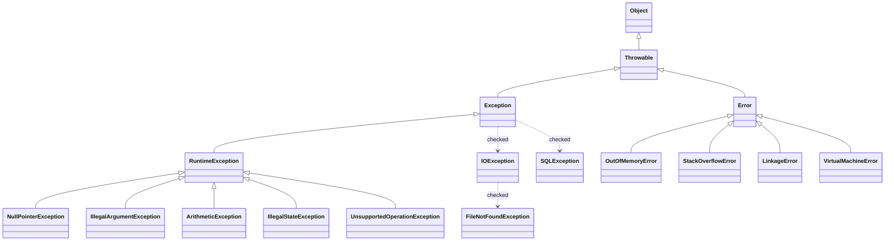

## 📌개요

Java 예외 처리는 프로그램의 안정성, 복원력, 유지보수성을 결정 짓는 핵심 설계 요소다.

예외는 크게 다음 세 가지로 구분된다.

- Checked Exception: 외부 자원 접근 등 복구 가능한 예외 상황을 명시적으로 선언 (컴파일 타임에 처리)
- Unchecked Exception: 실행 중 발생하는 로직 오류, 주로 프로그래머의 실수에서 기인, 명시적 처리 강제가 없다.
- Error: OutOfMemory, StackOverflowError와 같은 시스템 레벨의 치명적 오류

특히 Checked, Unchecked Exception 간의 선택은 단순한 문법 차원이 아니라 설계 전략과 깊은 연관이 있다.

## 📌내용

### Java 예외 계층 구조

해당 계보도가 전부는 아니며 필요한 부분만 그렸다는 점을 참고하자.



### Checked Exception

- `RuntimeException`을 상속하지 않는 예외
- 컴파일 시점에 강제적으로 처리 필요(`try/catch` 또는 `throws`)
- 복구 가능성이 있는 외부 자원 오류 등

#### 예시 코드

```java
import java.io.*;
import java.util.*;

public class CheckedExceptionExample {
    public static void main(String[] args) {
        try {
            Scanner scanner = new Scanner(new File("example.txt"));
            while (scanner.hasNextLine()) {
                System.out.println(scanner.nextLine());
            }
            scanner.close();
        } catch (FileNotFoundException e) {
            System.out.println("파일을 찾을 수 없습니다: " + e.getMessage());
        }
    }
}
```

### Unchecked Exception

- `RuntimeException` 또는 그 하위 클래스
- 컴파일러 검사 없음, 개발자 의도에 따라 예외 처리 선택
- 대부분 개발자의 실수 또는 버그로 발생

```java
public class UncheckedExceptionExample {
    public static void main(String[] args) {
        int[] numbers = {1, 2, 3};
        int index = 10;

        try {
            System.out.println(numbers[index]);
        } catch (ArrayIndexOutOfBoundsException e) {
            System.out.println("잘못된 인덱스 접근: " + e.getMessage());
        }
    }
}
```

### 언제 어떤 예외를 사용할까?

>[!tip] Effective Java > Item 70
>복구 가능한 경우에만 Checked Exception을 사용하고 그렇지 않다면 RuntimeException을 사용하라.

| 상황               | 추천 예외            | 이유                              |
| ---------------- | ---------------- | ------------------------------- |
| 복구 가능한 외부 리소스 오류 | Checked          | IO, DB 등은 사용자 안내 및 재시도 가능       |
| 프로그래머 실수나 버그     | Unchecked        | NPE, IllegalArgument 등 빠른 실패 유도 |
| 공통된 예외 추상화       | Custom Unchecked | 도메인 중심 예외 설계에 유리                |

### 예외 처리의 진화 흐름 요약

| 시대/환경                              | 트렌드                                    | 주요 배경 및 이유                                                                                                         |
| ---------------------------------- | -------------------------------------- | ------------------------------------------------------------------------------------------------------------------ |
| **초기 Java (JDK 1.0~1.4)**          | Checked 중심 설계                          | - 강력한 컴파일 타임 검사<br>- API 사용자의 실수 방지<br>- "복구 가능한 예외는 명시적으로 처리하라"는 철학                                               |
| **현업 개발자들의 반발 증가 (2000년대 중반)**     | Checked 회의론                            | - 반복적인 `throws` 선언으로 **코드 노이즈 증가**<br>- 예외 처리 로직이 무분별해짐<br>- 대부분의 클라이언트가 catch 후 무시하거나 로그만 남김                      |
| **Effective Java (2008~2018)**     | 선택적 사용 권장                              | - Joshua Bloch: "복구 가능한 경우에만 Checked 사용하라"<br>- `RuntimeException` 기반 설계 권장<br>- 예외는 **API 설계의 계약**이므로 의미 있게 사용 권장 |
| **Spring Framework 대중화 (2005~현재)** | Unchecked 기반 설계                        | - 대부분의 Spring 예외는 `RuntimeException` 기반<br>- 선언적 트랜잭션, AOP 등과 결합해 Checked 예외가 불편함<br>- 개발자에게 **선택적 예외 처리 자유**를 부여  |
| **모던 자바 개발 & DDD 확산 (2010s~)**     | 도메인 기반 Unchecked 전략                    | - 예외는 “도메인 규칙 위반”을 표현<br>- 예외를 catch하지 말고 **전파 후 해석**하는 방식 선호<br>- API, 도메인, 인프라 계층별로 예외 책임 분리                     |
| **지금의 흐름 (2020s~)**                | 명확한 계층 전략 + RuntimeException 기반 커스터마이징 | - 예외를 try-catch로 무조건 처리하는 시대는 끝남<br>- Unchecked 중심이지만 무분별하지 않게 도메인화<br>- 예외 메시지는 로깅, 사용자 응답, 추적 가능성까지 고려           |

### 예외를 설계 관점에서 본다는 것

>[!SUMMARY] 예외는 "실행 흐름의 탈출권"이다.
>
>- 예외는 단순한 코드 에러가 아니라 소프트웨어의 책임 구조를 드러내는 설계 도구다.
>- 예외를 어디서 발생시키고 어디서 잡을지는 팀의 기술 철학과 도메인 전략이 반영되어야 한다.
>- 결국 예외는 도메인의 경계를 지키는 마지막 방패 역할을 해야 한다.

누가, 언제, 어떤 책임을 갖고 이 탈출권을 행사해야 할까?

- 사용자 입력 오류가 발생했을 때?
- DB 연결 실패가 발생했을 때?
- 도메인 규칙을 어겼을 때?

~~···사람들에게서 잊혀졌을 때다···!!!~~

모든 예외를 try-catch로 처리할 수도 있지만 그건 제어 흐름의 책임을 흐트러뜨리고 도메인의 진실을 숨기는 위험한 선택일 수 있다.

#### 예외 설계의 3요소

| 요소                 | 설명                                | 책임 주체                       |
| ------------------ | --------------------------------- | --------------------------- |
| **예외 발생 (throw)**  | 어디에서, 어떤 상황에서 예외를 발생시킬 것인가        | 도메인, 인프라 계층                 |
| **예외 전파 (throws)** | 예외를 호출자에게 넘길 것인가, wrapping할 것인가   | 서비스 계층                      |
| **예외 처리 (catch)**  | 예외를 어디에서 처리하고 사용자에게 어떤 메시지를 줄 것인가 | API 계층 (Controller, Filter) |

#### 예외는 무조건 처리하는 것이 아니라 올바른 계층에서 해석하는 것

예외를 너무 빨리 처리해버리면 문제를 숨기게 된다.

- 예시 코드
    ```java
    try {
        orderService.placeOrder(...);
    } catch (Exception e) {
        log.warn("에러 발생", e); // 그리고 그냥 끗-⭐.
    }
    ```

이렇게 하면 실제로 어떤 문제가 발생했는지 알 수 없고 서비스 로직에서의 책임 분리가 흐려진다.
반대로 모든 예외를 끝까지 전파하면 Controller, API 계층이 도메인의 모든 세부사항을 알아야 한다.

#### 좋은 예외 설계의 기준

1. 도메인 계층에서는 의미 있는 커스텀 예외를 발생 시킨다.
    - 예: `InsufficientBalanceException`, `InvalidCouponException`
2. 서비스 계층에서는 예외를 변환하거나 해석하지 않는다.
    - 가능한 한 도메인 예외 그대로 전파 (또는 기술 예외를 도메인 예외로 래핑)
3. 컨트롤러/외부 인터페이스 계층에서 예외를 해석하고 사용자 메시지로 변환한다.
    - 예: `@ControllerAdvice`, `@ExceptionHandler`, HTTP 상태 코드 매핑

### 예외와 트랜잭션 롤백의 관계

>[!QUOTE]
>예외는 단순한 오류가 아니라, **트랜잭션의 커밋 여부를 결정짓는 시그널**이다.

Spring에서는 `@Transactional`을 사용할 경우, 예외 발생 시 해당 트랜잭션의 **롤백 여부**는 예외의 종류에 따라 자동으로 결정된다.

#### 용어 정리부터

| 용어             | 설명                                                   |
| -------------- | ---------------------------------------------------- |
| **비즈니스 예외**    | 사용자의 입력 실수, 제약 조건 위반, 정책 위반 등 "업무 규칙을 어긴 것"을 의미함     |
| **복구 가능한 예외**  | catch 후 재시도하거나 사용자 안내를 통해 정상 흐름으로 회복할 수 있는 예외        |
| **복구 불가능한 예외** | 시스템 오류, null 포인터, DB 연결 끊김 등 외부적이거나 근본적으로 해결 불가능한 예외 |

#### Spring의 기본 트랜잭션 롤백 규칙

| 예외 유형                 | 롤백 여부  | 설명                  |
| --------------------- | ------ | ------------------- |
| `RuntimeException` 계열 | 롤백     | 기본적으로 트랜잭션을 롤백한다.   |
| `Error` 계열            | 롤백     | 시스템 오류로 간주하고 롤백한다.  |
| `Checked Exception`   | **커밋** | 기본적으로 롤백하지 않고 커밋된다. |

>[!QUOTE]
>In its default configuration, the Spring Framework’s transaction infrastructure code marks a transaction for rollback only in the case of runtime, unchecked exceptions. That is, when the thrown exception is an instance or subclass of `RuntimeException`. (`Error` instances also, by default, result in a rollback).
>Checked exceptions that are thrown from a transactional method do not result in a rollback in the default configuration. You can configure exactly which `Exception` types mark a transaction for rollback, including checked exceptions by specifying _rollback rules_.
>
>"기본 설정에서, Spring Framework의 트랜잭션 인프라 코드는 런타임, 언체크 예외의 경우에만 트랜잭션을 롤백하도록 표시합니다. 즉, 발생한 예외가 `RuntimeException`의 인스턴스이거나 하위 클래스인 경우입니다. (`Error` 인스턴스도 기본적으로 롤백을 유발합니다). 체크 예외가 트랜잭션 메서드에서 발생하면 기본 설정에서는 롤백되지 않습니다.
>롤백 규칙을 지정하여 확인된 예외를 포함하여 어떤 예외 유형이 트랜잭션을 롤백할지 정확하게 구성할 수 있습니다."

#### 예시 코드

```java
@Transactional
public void processPayment(Order order) throws PaymentException {
    // ...
    if (!paymentGateway.charge(order)) {
        throw new PaymentException("결제 실패"); // Checked Exception
    }
}
```

위 예시는 기본적으로 트랜잭션이 커밋된다.
하지만 결제 실패 시에도 롤백되길 원할 수 있다.

#### 롤백 대상 명시 방법

- `rollbackFor` 속성 사용
    ```java
    @Transactional(rollbackFor = PaymentException.class)
    public void processPayment(Order order) throws PaymentException {
        // ...
    }
    ```
- `noRollbackFor`로 반대로 명시도 가능
    ```java
    @Transactional(noRollbackFor = ValidationException.class)
    ```

>[!TIP] 실무팁
>- 비즈니스 로직에서 **롤백을 유도하고 싶다면** Unchecked Exception을 사용하거나, `rollbackFor`를 반드시 명시하자.
>- `@Transactional`은 **프록시 기반**이므로 **public 메서드에서만 작동**하며 **내부 호출 시 적용되지 않는다**는 점도 주의해야 한다.

## 🎯결론

- Spring은 예외의 의미나 복구 가능성에 관계 없이 **예외의 타입**만을 기준으로 트랜잭션 롤백 여부를 결정한다.
- 기본적으로 `RuntimeException` 및 `Error` 만 롤백 대상이며, **체크 예외**는 롤백되지 않는다.
- 체크 예외에 대해서도 롤백이 필요하다면, `@Transactional` 애너테이션의 `rollbackFor` 속성을 사용하여 명시적으로 지정하거나, 언체크 예외로 감싸서 던져야 한다.

## ⚙️EndNote

### 사전 지식

- Java의 상속 구조 (`Object`, `Throwable`, `Exception`)
- try-catch-finally 구문 이해
- `throws`와 `throw`의 차이
- Java의 기본 예외 클래스 예시 (`NullPointerException`, `IOException` 등)

### 더 알아보기

- Effective Java > Item 69~77: 예외 처리의 정석
- Spring의 전역 예외 처리 방식: `@ControllerAdvice`, `@ExceptionHandler`
- 도메인 기반 예외 설계: `BusinessException`, `ValidationException`, `PolicyViolationException`
- DDD에서의 예외 처리 전략: 도메인 규칙 위반 표현, 계층 간 책임 분리
- Exception vs Error: JVM에서의 메모리 관리와 예외 차이
- 로깅과 예외: `log.warn`, `log.error` 언제 쓰고, StackTrace는 어떻게 다룰 것인가

### 참고 자료

- [자바 예외 처리의 진화: Checked Exception에서 Unchecked Exception으로](https://f-lab.kr/insight/java-exception-handling-evolution?gad_source=1&gad_campaignid=22368870602&gbraid=0AAAAACGgUFfN4ag4oS6KPd4XXwILthRon&gclid=CjwKCAjw56DBBhAkEiwAaFsG-gWjJJHmGm9P8UWourw-QNkxw5y5V-FkZftBiULc0i1Ta95GJRTaIxoCj_MQAvD_BwE)
- [[Java] Checked Exception과 Unchecked Exception](https://seungjjun.tistory.com/250)
- [Rolling Back a Declarative Transaction](https://docs.spring.io/spring-framework/reference/data-access/transaction/declarative/rolling-back.html)