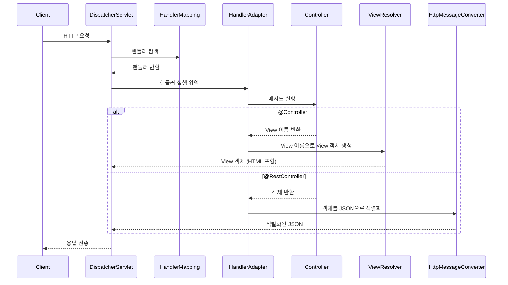

## 📌개요

Spring MVC는 클라이언트의 요청을 처리하고 응답을 반환하는 웹 프레임워크다.
이때 핵심적인 역할을 하는 것이 `@Controller`, `@RestController`이다.

두 어노테이션은 비슷해보이지만 응답 방식에서 중요한 차이를 가진다.

## 📌내용

### 요청 처리 흐름



1. `Client`가 HTTP 요청을 하게 되면 `DispatcherServlet`이 가로챔
    - 모든 HTTP 요청은 `DispatcherServlet`이 가로채며 시작된다.
2. `DispatcherServlet`은 `HandlerMapping`을 통해 해당 요청을 처리할 Handler를 찾은 다음 HandlerAdapter에게 해당 핸들러를 실행하도록 위임한다.
    - 실행을 위임한다.
3. `HandlerAdapter`는 `Controller`의 메서드를 실행한다.
    - 어떤 Handler가 됐든 `HandlerAdapter`가 실제 메서드를 실행한다.
4. `@Controller`, `@RestController` 케이스의 Resolver 호출
    1. `@Controller` 어노테이션으로 등록된 메서드의 경우 `Controller`가 반환한 View 이름과 Model 데이터를 기반으로 `DispatcherServlet`이  `ViewResolver`를 통해 View 객체를 생성한 뒤 이를 렌더링하여 응답을 생성한다.
        - `ViewResolver`는 단순히 View를 찾아주는 역할
        - 실제 렌더링은 View 객체가 수행한다.
    2. `@RestController` 어노테이션으로 등록된 메서드가 반환한 객체는 `DispatcherServlet` → `HandlerAdapter` → `HttpMessageConverter`를 통해 JSON을 생성한 뒤 `DispatcherServlet`에게 전달한다.
        - 직렬화 처리를 위임한다.
5. `@Controller`, `@RestController` 케이스의 응답 반환
    1. `@Controller`의 경우 `ViewResolver`는 View 이름에 해당하는 View 객체를 찾는 역할만 하고 해당 View 객체가 DispatcherServlet의 호출에 의해 실제 HTML을 렌더링해 클라이언트에 전달한다.
        - ViewResolver → View 객체 탐색
        - View → HTML 렌더링
    2. `@RestController`의 경우 `HttpMessageConverter`는 객체를 JSON으로 직렬화만 하고 직렬화된 결과는 `DispatcherServelet`을 통해 클라이언트에게 반환된다.
        - `DispatcherServlet`이 응답의 시작과 끝을 담당하며 `HttpMessageConverter`는 응답 본문 생성을 돕는다.

### `@Controller`

- 전통적인 MVC 구조에서 사용
- `Model`에 데이터를 담고 View 이름을 반환
- View Resolver가 View 템플릿을 렌더링하여 응답

```java
@Controller
public class HelloController {

    @GetMapping("/hello")
    public String hello(Model model) {
        model.addAttribute("name", "Nine");
        return "hello"; // templates/hello.html
    }
}
```

- JSON 응답을 위해 `@ResponseBody`와 함께 사용
    ```java
    @Controller
    public class ApiController {
    
        @ResponseBody
        @GetMapping("/api/hello")
        public String apiHello() {
            return "Hello from Controller!";
        }
    }
    ```

### `@RestController`

- RESTful 웹 서비스에서 주로 사용
- `@Controller + @ResponseBody`의 조합
- 리턴값을 그대로 JSON 등으로 직렬화하여 Response Body로 전달

```java
@RestController
public class HelloRestController {

    @GetMapping("/hello")
    public String hello() {
        return "Hello, Nine!";
    }
}
```

### 차이점 비교

| 구분 항목    | @Controller                                             | @RestController                   |
| -------- | ------------------------------------------------------- | --------------------------------- |
| 리턴 타입    | View 이름 또는 ModelAndView 객체 / ResponseEntity 직접 직렬화한 데이터 | 객체 또는 문자열 (자동 JSON 직렬화됨)          |
| 사용 목적    | 템플릿 렌더링 기반 웹 앱 (HTML) / 필요시 JSON 응답도 가능                 | API 응답을 위한 JSON/데이터 전송용           |
| 응답 처리    | ViewResolver를 통해 HTML 렌더링                               | HttpMessageConverter를 통해 JSON 직렬화 |
| 조합 어노테이션 | `@Controller`, `@ResponseBody` 필요                       | `@RestController` 단독 사용 가능        |

## 🎯결론

- `@Controller`는 View 기반 응답을 기본으로 하지만 `@ResponseBody`나 `ResponseEntity`를 사용하면 JSON 데이터도 응답할 수 있다.
- `@RestController`는 모든 메서드가 데이터(JSON 등) 응답을 기본으로 하며, API 서버 구현에 적합하다.

Spring MVC에서 클라이언트 요청을 처리하는 흐름을 이해하면, 상황에 맞는 어노테이션 선택이 쉬워진다. View 기반 웹 페이지와 RESTful API를 구분하여 설계하는 것이 핵심이다.

## ⚙️EndNote

### 사전 지식

- MVC 디자인 패턴
- Servlet과 DispatcherServlet의 역할
- View Resolver, HttpMessageConverter 작동 원리

### 더 알아보기

- [Spring MVC Architecture](https://docs.spring.io/spring-framework/docs/current/reference/html/web.html#mvc)
- [@RestController Javadoc](https://docs.spring.io/spring-framework/docs/current/javadoc-api/org/springframework/web/bind/annotation/RestController.html)
- [Baeldung - Controller vs RestController](https://www.baeldung.com/spring-controller-vs-restcontroller)
- [Spring 공식 가이드 - RESTful Web Service](https://spring.io/guides/gs/rest-service)