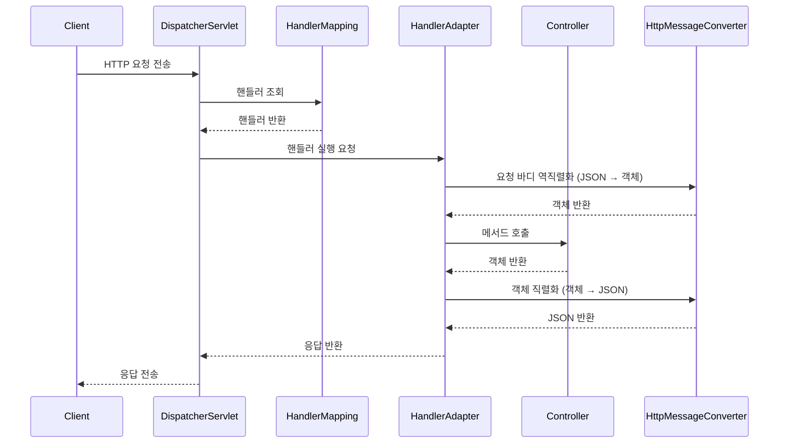

## 📌개요

Spring Boot를 활용한 REST API 개발에서 `@RestController`는 가장 많이 사용되는 어노테이션 중 하나다. 하지만 그 이면에서 실제 HTTP 요청이 어떻게 애플리케이션으로 전달되고, 어떤 과정을 거쳐 클라이언트에게 JSON 등으로 응답이 전달되는지는 자주 간과된다.

이번 글에서는 Spring MVC의 요청 처리 흐름을 DispatcherServlet을 기점으로 전반적으로 살펴보고, 특히 `HttpMessageConverter`가 어떤 역할을 하며 언제 동작하는지 명확히 정리해본다.

## 📌내용

### 요청 처리 흐름 요약

Spring Boot 애플리케이션에서 HTTP 요청이 들어오면 다음과 같은 순서로 처리된다.

1. **요청 수신 – `DispatcherServlet`**
    - 모든 HTTP 요청은 먼저 `DispatcherServlet`에서 수신된다.
    - 이 서블릿은 Front Controller로서 전체 요청의 진입점이며, Spring Boot에서는 자동으로 등록된다.
        
2. **핸들러 탐색 – `HandlerMapping`**
    - 어떤 컨트롤러 메서드가 이 요청을 처리할지 결정한다.
    - `@RequestMapping`, `@GetMapping` 등으로 설정된 경로 정보를 기반으로 매핑이 일어난다.
        
3. **핸들러 실행 – `HandlerAdapter`**
    - 찾은 핸들러(즉, `@RestController`의 메서드)를 실행하는 어댑터.
    - `@RequestBody`가 선언되어 있다면 이 시점에 `HttpMessageConverter`를 통해 JSON → 객체 변환이 이뤄진다.
        
4. **응답 변환 – `HttpMessageConverter`**
    - 컨트롤러 메서드가 반환한 Java 객체는 `HttpMessageConverter`를 통해 다시 JSON 등의 HTTP 응답 본문으로 변환된다.
    - 이때 사용되는 대표적인 구현체로는 `MappingJackson2HttpMessageConverter`가 있으며, 내부적으로 Jackson을 사용한다.
        
5. **응답 반환 – `DispatcherServlet`**
    - 변환된 응답은 다시 `DispatcherServlet`을 통해 클라이언트에게 반환된다.

### `HttpMessageConverter`의 동작 시점과 역할

`HttpMessageConverter`는 **요청과 응답의 바디(body)를 변환**하는 컴포넌트로서 다음과 같은 역할을 한다:

- `@RequestBody`가 있는 경우:
    - 요청 바디를 JSON → Java 객체로 역직렬화 (ex. DTO로 바인딩)
- `@ResponseBody` 또는 `@RestController`가 있는 경우:
    - 반환되는 객체를 Java 객체 → JSON으로 직렬화

이 변환은 `RequestMappingHandlerAdapter`에 등록된 `messageConverters` 리스트를 순회하며 타입과 Content-Type 헤더를 기반으로 적절한 컨버터를 찾아 자동으로 수행된다.



### MappingJackson2HttpMessageConverter

`MappingJackson2HttpMessageConverter`는 Spring MVC에서 **Java 객체를 JSON으로 직렬화하거나 JSON을 Java 객체로 역직렬화할 때 사용되는 기본 `HttpMessageConverter`**이다. 내부적으로 [Jackson](https://github.com/FasterXML/jackson) 라이브러리를 활용하여 JSON 처리 기능을 수행한다.

Spring Boot를 사용하면 기본적으로 Jackson이 의존성에 포함되며, 이로 인해 `MappingJackson2HttpMessageConverter`는 자동으로 등록되어 동작한다. 주로 다음과 같은 상황에서 사용된다:
- 클라이언트가 `Content-Type: application/json`으로 JSON 요청을 보낼 경우, `@RequestBody`에 해당 JSON이 자동으로 매핑된다.
- 컨트롤러가 객체를 반환할 때 `@ResponseBody` 또는 `@RestController`가 붙어 있으면, 해당 객체는 JSON으로 변환되어 응답된다.

```java
@PostMapping("/users")
public ResponseEntity<UserResponse> createUser(@RequestBody UserCreateRequest request) {
    User user = userService.create(request);
    return ResponseEntity.ok(new UserResponse(user));
}
```

위의 예시에서 `@RequestBody`를 통해 들어온 JSON은 Jackson이 `UserCreateRequest`로 역직렬화하며, 반환되는 `UserResponse`는 JSON으로 직렬화되어 클라이언트로 전달된다.

#### 커스터마이징

Jackson 설정은 다양하게 커스터마이징할 수 있다. 예를 들어:
- `ObjectMapper`의 설정 변경 (`@JsonNaming`, `@JsonProperty`, `@JsonIgnore` 등)
- 날짜 포맷 지정
- `null` 필드 무시
- 필드 snake_case ↔ camelCase 자동 변환

```java
@Bean
public Jackson2ObjectMapperBuilderCustomizer customizer() {
    return builder -> builder
        .featuresToDisable(SerializationFeature.WRITE_DATES_AS_TIMESTAMPS)
        .propertyNamingStrategy(PropertyNamingStrategies.SNAKE_CASE)
        .serializationInclusion(JsonInclude.Include.NON_NULL);
}
```

이렇게 하면 `MappingJackson2HttpMessageConverter`에 연결된 `ObjectMapper`가 위 설정을 따라 동작하게 된다.

#### 기타 팁

- Spring Boot는 `spring.jackson.*` 속성을 통해 설정을 간편하게 지원한다.
- 필요에 따라 `WebMvcConfigurer`에서 직접 `HttpMessageConverter`를 설정해 특정 타입만 Jackson 대신 다른 컨버터로 처리하게 할 수 있다.

```java
@Override
public void configureMessageConverters(List<HttpMessageConverter<?>> converters) {
    converters.add(new MappingJackson2HttpMessageConverter(myCustomObjectMapper()));
}
```

## 🎯결론

> Spring MVC의 요청 처리 흐름은 `DispatcherServlet`에서 시작해 `HandlerMapping`, `HandlerAdapter`, `HttpMessageConverter`를 통해 RESTful 서비스를 완성한다.

특히 `HttpMessageConverter`는 요청과 응답을 Java 객체 ↔ JSON 사이에서 자동 변환해주는 핵심적인 컴포넌트로, 동작 시점과 역할을 명확히 이해하는 것이 REST API 개발의 안정성과 유지보수성을 높이는 데 매우 중요하다.

## ⚙️EndNote

### 사전 지식

- 서블릿 기반 웹 애플리케이션 구조
- Spring MVC의 `@Controller`, `@RestController` 어노테이션 차이
- Jackson의 직렬화/역직렬화 개념

### 더 알아보기

- [Spring Web MVC 공식 문서](https://docs.spring.io/spring-framework/reference/web/webmvc.html)
- [Spring Boot의 HttpMessageConverters 설정](https://docs.spring.io/spring-boot/docs/current/reference/html/web.html#web.servlet.spring-mvc.message-converters)
- [DispatcherServlet 내부 구조](https://docs.spring.io/spring-framework/reference/web/webmvc/mvc-servlet.html)