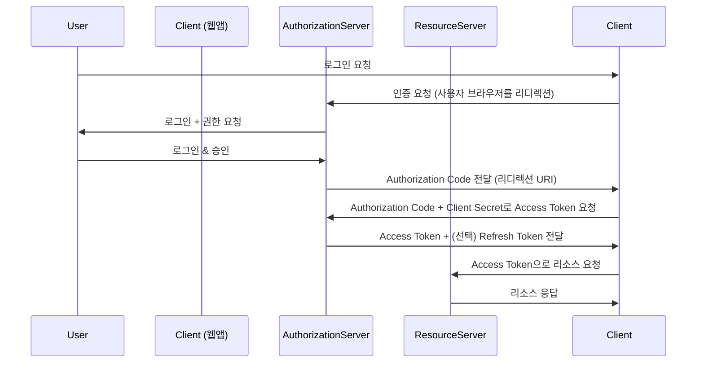

## 📌개요

백엔드 인증 인프라를 설계하며 OAuth 2.0이 표준처럼 자리 잡았다는 사실을 체감하고 있다.

특히 소셜 로그인이나 외부 리소스 접근 권한 위임 기능을 구현하면서 “Authorization Code Grant” 방식의 구조와 흐름을 완벽히 이해하는 것이 중요하다고 판단해 이 글을 작성하게 되었다.

이번 포스팅에서는 OAuth 2.0의 주요 컴포넌트와 함께 Authorization Code Grant가 어떤 흐름으로 동작하는지 실전 중심으로 알아본다.

## 📌내용

### OAuth 2.0의 주요 컴포넌트

|컴포넌트|설명|
|---|---|
|**Resource Owner**|리소스(정보)의 실제 소유자. 보통 사용자(User)|
|**Client**|리소스 접근을 요청하는 애플리케이션 (ex. 우리가 개발하는 웹앱)|
|**Authorization Server**|인증을 담당하며, Access Token을 발급하는 서버|
|**Resource Server**|보호된 리소스를 제공하는 API 서버 (Authorization Server와 분리될 수도 있음)|

### Authorization Code Grant 흐름

이 방식은 **보안성과 유연성**을 모두 만족하는 방식으로, 웹 앱에서 가장 많이 사용된다.

#### 흐름 요약

1. **인증 요청:** Client가 Authorization Server에 인증 요청 URL로 리디렉트.
2. **사용자 승인:** 사용자는 로그인 후 권한 승인.
3. **코드 수신:** Authorization Server는 Redirect URI에 `Authorization Code`를 포함하여 리디렉트.
4. **토큰 요청:** Client는 받은 코드를 Authorization Server에 전송하며, Access Token 요청.
5. **토큰 수신:** Authorization Server는 Access Token을 응답.
6. **API 요청:** Client는 받은 Access Token을 사용해 Resource Server에 요청.
7. **데이터 수신:** 유효한 토큰이면 리소스를 응답.

#### Refresh Token은 왜 필요할까?

Access Token은 일반적으로 **짧은 유효시간(예: 1시간)** 을 가진다.
이때 Refresh Token이 있으면 재로그인 없이 새로운 Access Token을 발급 받을 수 있어 UX 개선에 큰 역할을 한다.

## 🎯결론

OAuth 2.0의 핵심은 **책임 분리와 위임**이며, Authorization Code Grant는 가장 안전하고 실전적인 인증 흐름이다.

## ⚙️EndNote

### 사전 지식

- HTTP 프로토콜의 기본 흐름
- RESTful API의 인증/인가 개념
- HTTPS 통신 방식

### 더 알아보기

- [RFC 6749: The OAuth 2.0 Authorization Framework](https://datatracker.ietf.org/doc/html/rfc6749)
- [Spring Security OAuth2 공식 문서](https://docs.spring.io/spring-security/reference/servlet/oauth2/index.html)
- [JWT.io](https://www.jwt.io/)
- 키워드: `PKCE`, `Client Credentials`, `Implicit Grant`, `OpenID Connect`, `Refresh Token Rotation`