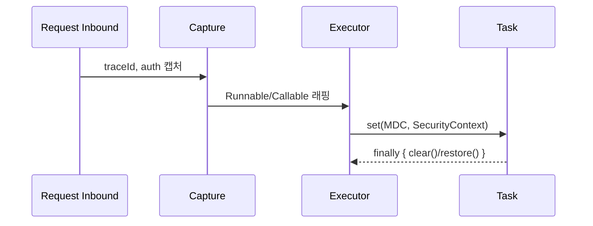

## 📌개요

멀티스레드와 비동기 환경에서 흔히 사용하는 **MDC(Logback Mapped Diagnostic Context)** 나 **SecurityContext** 는 내부적으로 `ThreadLocal` 기반으로 동작한다.

문제는 요청을 처리하는 스레드가 바뀌는 순간(예: `@Async`, `Executor`, `CompletableFuture`, Reactor 등) 이 컨텍스트 정보가 사라지거나 누락되기 쉽다는 것이다.

따라서 **로그 추적성과 보안 인증 상태를 잃지 않고 스레드를 건너뛰어 전파하는 방법**이 필요하다.
서블릿 기반(Spring MVC + @Async/Executor/CompletableFuture)과 리액티브 기반(Reactor/WebFlux)에서 각각 컨텍스트를 안전하게 전달하는 실전 패턴을 살펴본다.

## 📌내용

### 왜 사라지나? `ThreadLocal`의 본질

- **MDC(Logback MDC)**, **SecurityContextHolder**는 기본적으로 `ThreadLocal` 기반이다.
- 작업이 **다른 스레드**(스레드풀, ForkJoin)에서 실행되면 값이 비어 있거나 **이전 요청의 쓰레기 값**이 남을 수 있다(스레드 재사용).
- 해결 핵심: **(캡처) → (전파) → (정리)** 의 생명주기를 명시한다.

### 서블릿(동기/비동기) 스택: 6가지 정석 패턴

#### A. `Runnable/Callable` 래핑(핵심 원리)

```java
class MdcPropagatingRunnable implements Runnable {
  private final Runnable delegate;
  private final Map<String, String> captured;

  MdcPropagatingRunnable(Runnable delegate) {
    this.delegate = delegate;
    this.captured = MDC.getCopyOfContextMap();
  }

  @Override public void run() {
    Map<String, String> old = MDC.getCopyOfContextMap();
    try {
      if (captured != null) MDC.setContextMap(captured);
      delegate.run();
    } finally {
      if (old != null) MDC.setContextMap(old); else MDC.clear();
    }
  }
}
```

- **캡처 → set → 실행 → 복원/clear**.
- `SecurityContext`도 동일 원리로 적용 가능.

#### B. `TaskDecorator`로 전역 적용(@Async/ThreadPoolTaskExecutor)

```java
@Bean
TaskDecorator mdcTaskDecorator() {
  return (Runnable r) -> new MdcPropagatingRunnable(r);
}

@Bean
Executor taskExecutor(TaskDecorator decorator) {
  ThreadPoolTaskExecutor ex = new ThreadPoolTaskExecutor();
  ex.setTaskDecorator(decorator);
  ex.initialize();
  return ex;
}
```

- 장점: `@Async`, `CompletableFuture`, 커스텀 `Executor` 모두 **자동 전파**.

#### C. Spring Security 전파 전용 유틸

```java
Executor delegate = Executors.newFixedThreadPool(8);
Executor secExecutor =
  new DelegatingSecurityContextExecutor(delegate);

secExecutor.execute(() -> { /* SecurityContext 보존됨 */ });
```

- **`DelegatingSecurityContext*`** 계열(Executor, ExecutorService, Runnable, Callable)을 사용하면 **인증 컨텍스트만** 확실히 전달된다.
- MDC도 필요하면 B 패턴과 **조합**.

#### D. `SecurityContextHolder` 전략 옵션

```java
SecurityContextHolder.setStrategyName(
  SecurityContextHolder.MODE_INHERITABLETHREADLOCAL);
```

- **자식 스레드**에 한해 상속.
- 한계: **스레드풀 재사용**과는 맞지 않는다(“새로 만든 자식 스레드”만 상속).

#### E. `CompletableFuture`에서의 주의

```java
var ctx = MDC.getCopyOfContextMap();
CompletableFuture.supplyAsync(() -> {
  if (ctx != null) MDC.setContextMap(ctx);
  try { return doWork(); }
  finally { MDC.clear(); }
}, taskExecutor);
```

- 기본 공급자는 **ForkJoinPool** → 문맥 유실. 항상 **전파 가능한 Executor**와 **명시적 set/clear** 사용.

#### F. 작업 종료 시 **정리(clean-up)** 는 의무

- 실패, 취소 케이스까지 **finally에서 clear/복원**.
- 그렇지 않으면 **컨텍스트 누수**로 다른 요청 로그가 오염된다.

### 리액티브(Reactor/WebFlux) 스택: 컨텍스트는 데이터다

#### A. SecurityContext 리액티브 전용 API 사용

- 인증은 `ReactiveSecurityContextHolder`를 통해 Reactor **Context**에 저장/조회.
- 예) WebFilter에서 `contextWrite`로 주입, 다운스트림에서 자동 사용.

#### B. MDC Reactor Context, MDC 브리징

```java
// 컨텍스트 키 정의
record TraceCtx(String traceId) { static final String KEY = "TRACE"; }

// 컨텍스트 주입
Mono.deferContextual(ctxView -> {
  TraceCtx t = ctxView.get(TraceCtx.KEY);
  return Mono.fromRunnable(() -> log.info("trace={}", t.traceId()));
})
.contextWrite(ctx -> ctx.put(TraceCtx.KEY, new TraceCtx("abc-123")));

// 공통 브리징 연산자(예시)
public static <T> Function<Publisher<T>, Publisher<T>> mdc() {
  return pub -> Flux.from(pub).doOnEach(signal -> {
    if (!signal.isOnNext() && !signal.isOnError() && !signal.isOnComplete()) return;
    var ctx = signal.getContextView();
    String traceId = ctx.getOrDefault(TraceCtx.KEY, new TraceCtx("-")).traceId();
    try (var ignored = MDC.putCloseable("traceId", traceId)) {
      // MDC는 이 시점 로깅에만 반영됨
      if (signal.getType() == SignalType.ON_NEXT) {
        log.debug("processing...");
      }
    }
  });
}
```

- 핵심: Reactor 로그는 **시그널 순간에만** MDC에 넣고 즉시 닫는다(`MDC.putCloseable`).
- 장점: 스레드 hops가 잦아도 **오염, 누수 없음**.
- 리액터 체인 가장 바깥에서 `transform(mdc())`로 한 번만 적용.

### 무엇을 언제 사용하는 게 좋을까

|상황|권장 패턴| 비고                   |
|---|---|---|
|Spring MVC + `@Async`/`Executor`|**TaskDecorator(B)** + 필요 시 **DelegatingSecurityContext(C)**| 전역 일관성, 적용 쉬움        |
|단발 커스텀 스케줄러/쓰레드|**Runnable/Callable 래핑(A)**| 최소 오버헤드              |
|`CompletableFuture`|**전파 가능한 Executor** + **명시적 set/clear(E)**| ForkJoinPool 지양      |
|자식 스레드만 생성|**INHERITABLETHREADLOCAL(D)**| 풀 재사용 환경에 부적합        |
|WebFlux/Reactor|**ReactiveSecurityContextHolder** + **MDC 브리징(B 리액티브판)**| ThreadLocal 직접 접근 금지 |

### 체크리스트

1. **캡처 시점**은 요청 입구(필터/인터셉터/웹필터)에서.
2. **전파 책임**은 스케줄링/실행 시점(Executor/연산자)에서.
3. **정리**는 항상 `finally` 또는 `try-with-resources(MDC.putCloseable)`로.
4. 풀 크기, 큐 적재량을 조정해 **컨텍스트 스와핑 비용**을 최소화.
5. 성능 민감 구간에선 **필드형 추적 ID**(메서드 파라미터로 전달)도 고려 — 오버헤드와 가독성의 트레이드오프.

### 캡처, 전파, 정리 시각화



## 🎯결론

비동기의 본질은 **스레드 이동**이고, 해법의 본질은 **캡처-전파-정리의 규율**이다.
이 원칙만 지키면 `MDC`와 `SecurityContext`는 어느 실행 모델에서도 흔들리지 않는다.

## ⚙️EndNote

### 사전 지식

- ThreadLocal과 스레드풀 재사용 모델
- Logback MDC 기본 사용법 (`MDC.put`, `MDC.clear`, `MDC.putCloseable`)
- Spring Security: `SecurityContextHolder`, `Authentication`
- Reactor의 `Context`와 신호(시그널) 기반 훅

### 더 알아보기

- Spring Security: `DelegatingSecurityContextExecutor`, `DelegatingSecurityContextCallable/Runnable`
- Spring Framework: `TaskDecorator`, `ThreadPoolTaskExecutor`, `@Async`
- Reactor: `Context`, `contextWrite`, `doOnEach`, `SignalType`
- 로깅: 분산 트레이싱(TraceId/SpanId)와 MDC 연동, `MDC.putCloseable` 활용 패턴