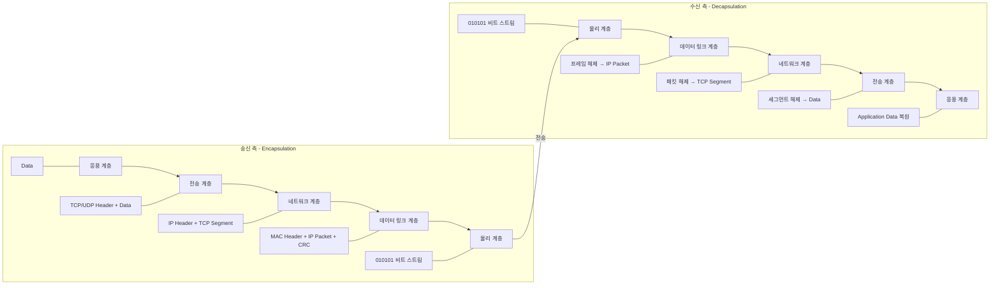
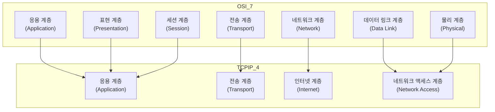

## 📌개요

네트워크를 이해할 때 가장 먼저 마주하는 개념이 바로 **계층 모델(Layered Model)** 이다.

대표적으로 **TCP/IP 4계층 모델**과 **OSI 7계층 모델**이 있는데, 두 모델은 네트워크 통신을 구조적으로 설명하는 기준이 된다.

두 모델을 각각 설명하고, 어떤 차이가 있으며 실무에서는 어떻게 이해하면 좋은지 다뤄본다.

## 📌내용

### OSI 7계층 모델

국제표준화기구(ISO)에서 제정한 **OSI(Open Systems Interconnection)** 모델은 네트워크 통신 과정을 7단계로 나눈다.

1. **물리 계층 (Physical)**: 전기 신호, 케이블, 하드웨어 전송 매체
2. **데이터 링크 계층 (Data Link)**: MAC 주소, 프레임 전송, 오류 검출 (예: Ethernet, Switch)
3. **네트워크 계층 (Network)**: IP 주소 기반 라우팅 (예: IP, Router)
4. **전송 계층 (Transport)**: 종단 간 통신, 신뢰성 보장 (예: TCP, UDP)
5. **세션 계층 (Session)**: 세션 관리, 연결 유지/종료 (예: NetBIOS)
6. **표현 계층 (Presentation)**: 데이터 형식 변환, 암호화 (예: SSL/TLS, JPEG)
7. **응용 계층 (Application)**: 사용자 서비스 제공 (예: HTTP, FTP, SMTP)

### TCP/IP 4계층 모델

실제 인터넷 프로토콜에서 사용되는 구조는 **TCP/IP 모델**이다. OSI보다 단순화되어 있으며, 실무에서는 이 모델을 주로 따른다.

1. **네트워크 액세스 계층 (Network Access)**: 하드웨어 인터페이스, 데이터 링크 & 물리 계층 포함
2. **인터넷 계층 (Internet)**: IP 주소 기반 라우팅 (IP, ICMP 등)
3. **전송 계층 (Transport)**: TCP/UDP 기반 통신 제어
4. **응용 계층 (Application)**: 애플리케이션 서비스 (HTTP, FTP, DNS, SMTP 등)

오늘날 인터넷이 동작하는 실제 표준 구조다.

### 두 모델의 비교

|구분|OSI 7계층|TCP/IP 4계층|특징|
|---|---|---|---|
|계층 수|7|4|TCP/IP는 실용적으로 단순화|
|정의 기관|ISO|ARPANET/DoD|목적 차이: 이론 vs 실무|
|표현/세션|독립 계층 존재|응용 계층에 통합|OSI는 세밀, TCP/IP는 실용|
|전송 계층|TCP/UDP 모두 포함|동일|신뢰성(연결형 vs 비연결형) 제공|
|보급|이론/교육 중심|인터넷 표준|TCP/IP가 사실상 전세계 표준|

>[!TIP]
>네트워크 공부 초기에 "OSI 7계층"을 무조건 외워야 하는지 의문이었다.
>하지만 실무에서는 “이론적 설명”보다 TCP/IP 모델이 더 쓰인다.
>결국 “OSI는 네트워크 교과서의 언어, TCP/IP는 인터넷의 언어”라고 이해하면 쉽다.
>즉, **OSI는 이상적인 개념도, TCP/IP는 현실 세계 지도**라고 비유할 수 있다.

## 🎯결론

**OSI 7계층은 개념적 학습과 문제 진단에 유용하고, TCP/IP 4계층은 인터넷의 실제 동작 표준이다.**

즉, 공부할 때는 OSI로 세밀하게 이해하고, 실무에서는 TCP/IP로 단순하게 적용하는 것이 가장 효율적이다.

## ⚙️EndNote

### 사전 지식

- 네트워크 기본 용어 (패킷, 프레임, 포트, 프로토콜)
- 인터넷 프로토콜(IP), TCP/UDP 개념
- OSI와 TCP/IP 모델의 역사적 배경

### 더 알아보기

- [Wikipedia - OSI model](https://en.wikipedia.org/wiki/OSI_model)