## 📌개요

옵시디언을 사용하며 블로그는 따로 정리하거나 재작성해서 Velog, Tistory 등 개발 블로그를 업로드 했었다. 그러다 문득 학습하고 정리하면서 블로그에 배포도 되면 편하겠다 생각했다.

Quartz, Jekyll, Hugo 다양한 정적 사이트 생성기를 알아보며 선택한 기준과 배포해서 사용하다가 불편한 점을 만나 전환한 계기도 간략하게 정리한다.

거창하게 표현하자면 옵시디언을 SSoT로 삼아 플랫폼에 종속되지 않는 지속 가능한 블로그 아키텍처를 설계한다.

요약하면 낭만 쉽지 않다.

## 📌내용

### 블로그 선택 기준

Velog, Tistory 등 내가 작성하고 게시만 하면 되고 첨부 파일도 신경 쓸 게 없다. 간편하고 좋다.
SSG로 블로그를 운영하다가 다시 돌아가거나 둘 다 운영하는 유저도 많은 것 같다.

나만의 블로그라는 게 좋아서 정보를 찾아보다가 가장 쉬운 건 Quartz였는데 테마가 아쉬웠다.
적당히 쉽고 테마가 다양하고 빠르게 시작할 수 있어서 처음엔 Jekyll 블로그를 배포했다.

#### 다루기 쉬운가?

| 구분      | Quartz       | Jekyll         | Hugo                   |
| ------- | ------------ | -------------- | ---------------------- |
| 타겟      | 옵시디언 사용자     | 단순 블로그 입문자     | 대규모 사이트/전문가            |
| 설치 편의성  | 매우 쉬움        | 보통(Ruby 설치 필요) | 쉬움(파일 하나면 끝)           |
| 커스텀 난이도 | 쉬움(JS/TS 기반) | 보통(Liquid 문법)  | 약간 높음(Go 문법, JS 파츠 가능) |

#### 테마가 다양한가?

1. Jekyll
    - 가장 오래되어 테마가 수천 개에 달한다. 웬만한 디자인은 이미 누군가 만들었다.
2. Hugo
    - 인기가 많아지면서 세련되고 현대적인 테마가 많아졌다.
3. Quartz
    - 옵시디언 퍼블리싱이라는 특수한 목적에 집중하기 때문에 일반적인 블로그 테마 종류는 적은 것 같다. 대신 소스 수정을 통한 커스텀이 쉽다.

### Jekyll에서 Hugo로 전환한 이유

빌드가 너무 느리다.
포스팅 100개도 안 되는데 빌드 시간이 5분 이상 걸리는 것 보고 위기감을 느꼈다.
캐싱이나 빌드 최적화 방법도 다양한데 일단 이런 작업을 해주어야 할 정도로 느리다는 게 불편했다.

#### Hugo 압도적 1위

- 기술 기반: Go 언어(컴파일 언어)
- 성능: 세계에서 가장 빠른 SSG라는 슬로건을 내걸 만큼 빠르다.
- 체감 속도: 문서가 1,000개일 때 빌드 시간이 수 초 내외다. 문서가 10,000개가 넘어가도 수 초 안에 빌드가 완료된다고 한다. 대규모 기술 문서 사이트에 Hugo가 가장 많이 쓰이는 이유라고 한다.

#### Quartz 준수한 성능 2위

- 기술 기반: TS/Node.js(하이브리드, 컴파일/트랜스파일 + JIT 컴파일)
- 성능: Hugo만큼은 아니지만 상당히 빠르다. 내부적으로 캐싱 시스템이 잘 되어 있어 변경된 부분만 빠르게 업데이트한다.
- 체감 속도: 수백~수천 개의 옵시디언 노트를 처리하기에 충분히 쾌적하다. 다만 복잡한 JS 플러그인을 많이 추가할 수록 조금씩 느려질 수 있다.

#### Jekyll 비교적 느림 3위

- 기술 기반: Ruby (인터프리터 언어)
- 성능: 구조적인 한계로 문서 양이 많아지면 속도가 눈에 띄게 저하된다.
- 체감 속도: 문서가 수천 개를 넘어가면 빌드에 몇 십 분 단위가 걸리기도 한다. 증분 빌드 기능이 있지만 다른 SSG에 비해 느리다.

### 전환하며 만난 문제

블로그 전환하면서 문서의 속성 값이 문제가 됐었다.
카테고리를 작성하는데 4~5레벨 이상 허용하는 테마도 있고 그렇지 않은 것도 있다.

그냥 세분화한 카테고리가 제대로 적용만 안 되는 거면 수정 없이 사용하겠는데 빌드가 안 되거나 문서가 깨지는 등 문제가 있었다.

근데 작성된 문서가 많다면 일괄 편집 프로그램을 찾거나 직접 커스텀하게 만들어서 사용해야 할 것이다.

다행히 DataView 플러그인으로 카테고리는 따로 관리하고 있었고 문서가 엄청 많은 상태는 아니어서 속성의 카테고리를 다 제거했다.

그리고 Hugo 테마에 맞게 정리해서 일단락되었다.

>[!TIP]
>`DataView` 플러그인은 DQL(Dataview Query Language, SQL과 굉장히 비슷하다), DataviewJS(JavaScript) 언어로 사용할 수 있다.
>쿼리가 익숙하든 JS가 익숙하든 편한 걸로 사용하면 될 것 같다.
>
>직관적인 이름에 걸맞게 옵시디언에서 관리하는 문서들의 데이터를 가지고 내가 원하는 뷰를 만들 수 있다.


### 무엇을 하고자 하는가?

1. 플랫폼에 종속되지 않는 문서 관리가 가능한지 고민하고 최대한 표준화하려고 한다.
2. 첨부 파일을 양쪽에서 관리하는데 이건 좀 문제가 있다.
3. `PARA` 정리법을 적용해서 잘 사용하고 있기 때문에 경로가 메인이 되면 안 된다. 관리될 수 있는 속성을 정의해야 한다.

#### Jekyll에서 Hugo로 전환하면서 느낀 것

Templater 플러그인을 사용해서 문서 성격에 따라 개인적으로 필요한 양식은 표준화 했지만 이런 전환점에선 수정이 불가피하다.

정착할 수 있다면 좋겠지만 언제든 맘 편히 전환할 수 있는 기반을 만들고 싶다.

#### 첨부 파일 관리도 불편

##### 어디에 둬야 하는 거야?

호스팅으로 빼서 URL을 사용하는 등 써드 파티를 적용한 사례도 많다. 무료 이미지 호스팅 사용하다가 사이트가 없어져서 이미지 다 날린 케이스도 있고 비교적 안전하게 운영되고 있는 imgur 플러그인 소개도 가끔 보인다.
나는 가장 간편하고 안전하게 볼트 내에서 첨부 파일 폴더를 따로 관리하려고 한다.

##### 문법은 왜 달라?

왜 불편하냐면 옵시디언에서 붙여 넣거나 링크한 건 이런 위키링크 형태다.

- `![[location/image.png]]`

Markdown 문법이 기대하는 이미지 첨부는 이런 형태다.

- ``

사실 이건 설정에서 끌 수 있고 직접 만들어서 간단히 치환하는 방법을 사용할 수도 있다.
`설정 > Options/Files and Links > Use[[WikiLinks]]` 이거 비활성화 하면 기본 마크다운 형태로 삽입할 수 있다.

지금 가장 불편한 건 낭만 따라간답시고 일 벌린 다음 잘못 관리하고 있는 것이다.

1. 옵시디언에서 신나게 이미지 넣고 작성한다.
2. Hugo 블로그 저장소에 문서 옮기고 이미지도 옮기고 링크 맞추고..
3. 오탈자 없나, 깨지는 건 없나 검토하는 단계로 합리화하기.

이렇게 불편함이 많아지면 포스팅 하나 작성해볼까? 하는 데에 결심이 필요해진다. 안 된다. 개선이 필요하다.

>[!TIP]
>**PARA란?** (PARA method)
>디지털 자료를 관리하는 하나의 방법론이다.
>
>하나의 경로에 고정되는 데이터가 아니라 현재 내 관심사에 따라 Project, Resources 폴더로 왔다가 Area, Archive로 갔다가 유연하게 문서가 움직인다.
>
>PARA의 자료들은 계속해서 이동하며 장기 기억으로 가져가야 할 데이터, 데드라인을 명확히 하고자 하는 프로젝트, 우선 순위를 재조정 한다거나 계속한 상관 관계에 있다.
>한 곳으로 옮긴 이후 완료되거나 포기하면 죽는 데이터가 아니라 계속해서 돌아가는 자원이 되는 방식쯤으로 이해한다.
>
>- **Project**
>    - 데드라인이 정해진 작업 즉, **완료가 필요한 것들**
>- **Area**
>    - **데드라인이 명확하지 않은** 관리하는 것들의 영역  
>    - ex) 건강, 재정, 공부 등..
>- **Resource**
>    - 지속적으로 관심을 가지는 주제의 자료들  
>    - **Area를 이루기 위한 것들**
>- **Archive**
>    - 위의 것들 중 마무리 지었거나 더이상 사용하지 않는 것들을 **보관**

### 어떻게 할 수 있는가?

내가 게시할 문서만 동기화하는 건 그리 복잡하지 않겠지만 외부 호스팅 의존이 필요한 이미지가 문제였다.

- 그냥 이미지 Base64로 박아버리면 첨부 파일 따로 안 해도 되잖아?
    - 미리 보기 모드가 아닌 수정 모드에서 엄청난 스압을 만나고 문서 용량도 커진다.
    - 확장자를 달고 링크된 이미지가 아니라서 CPU가 열일하는 모습을 볼 수 있다.
    - 이미 이미지 압축, 스압 줄여주는 플러그인도 있다. ㅋㅋ

>이것저것 고민해보다가 나중에 또 개선해야 하는 거 너무 깊게 고민하지 않기로 했다.

#### 준비물

- 옵시디언 볼트
    - GitHub 저장소로 올리고 Private/Public 나눠야 할 수도 있다.
    - GitHub 저장소의 이미지 서빙 기능을 활용하기 위해 이미지 저장소를 따로 만들어야 할 수도 있다.
- Hugo 블로그 저장소
    - GitHub Pages로 배포

#### PoC(Proof of Concept)를 정의해보자

이번 아키텍처의 핵심 목적은 문서를 복사하거나 이미지를 옮기는 수동 작업을 없애고 옵시디언의 PARA 체계를 유지하면서 특정 속성만으로 블로그를 배포하는 것.

##### 검증 과제

- 파일 선별:
    - 보관함 전체가 아닌 `publish: true` 속성을 가진 파일만 추출 가능한가?
    - 공개되지 않아야 하는 것들을 분리할 수 있는가?
- 경로 동기화:
    - Git Submodule을 통해 옵시디언의 첨부 파일과 Hugo 저장소의 첨부 파일을 물리적으로 일치 시킬 수 있는가?
    - GitHub 저장소 자체가 호스팅 서버 역할을 하며 Hugo가 빌드 과정에서 상대 경로를 기반으로 URL을 생성하는가?
- 문법 변환: 옵시디언 전용 문법(Callouts 등)을 Hugo가 이해하는 표준 마크다운이나 숏코드로 자동 치환 가능한가?
- 배포 자동화: 가벼운 명령어로 빌드 및 배포가 완료되는가?

#### 다이어그램

```mermaid
sequenceDiagram
    participant Obs as Obsidian_Repo (Private Vault)
    participant ObsAction as GitHub_Actions (Obsidian Repo)
    participant AssetRepo as Assets_Repo (Submodule / Public)
    participant HugoRepo as Hugo_Repo (Public, GitHub Pages)

    Note over Obs: 문서 작성 (Properties에 publish: true 추가)
    Obs->>Obs: git push (Private Repo로)
    
    Obs->>ObsAction: 1. Push 이벤트 트리거
    
    rect rgb(240, 240, 240)
        Note over ObsAction: [추출 및 변환 단계]
        ObsAction->>ObsAction: 2. 보관함 스캔 (publish: true 검색)
        ObsAction->>ObsAction: 3. 마크다운 변환 (WikiLink -> MarkDown, 또는 설정으로 대체)
    end

    ObsAction->>AssetRepo: 4. 신규 이미지 Push (Submodule 업데이트)
    
    ObsAction->>HugoRepo: 5. 추출된 글(md) & 이미지 링크 전달 (Git Push)

    Note over HugoRepo: [자동 배포 단계]
    HugoRepo->>HugoRepo: 6. Hugo 빌드 프로세스 시작
    Note over HugoRepo: 7. 빌드 결과물(HTML) 생성 및 호스팅 시작

    Note over HugoRepo: https://ID.github.io 접속 가능
```




#### 첨부 파일을 어떻게 관리해야 할까?

1. 옵시디언 볼트에서 관리 중인 Assets 폴더를 저장소로 만들어 원격에 업로드
2. Assets 원격 저장소를 옵시디언 볼트의 Submodule로 지정
3. 하게 되면 git은 Submodule을 특별하게 취급기 때문에 따로 `.gitignore` 파일에 Assets 폴더를 추가하지 않아도 된다.
4. 이미지를 추가하는 경우 Submodule 폴더인 Assets 폴더에 추가.
5. 옵시디언 프로그램에서 복사한 이미지 붙여 넣기의 경우 설정에 의해 지정된 경로에 이미지가 생성된다. Submodule 폴더인 Assets 폴더로 지정. 3과 동일하게 동작

#### 변경 사항을 어떻게 업로드 하지?

이후 옵시디언 볼트에서 작업 후 변경 사항을 push하려면?

1. Assets 저장소를 먼저 push. 명령어 만들어두면 편할 듯? 편해? 이게?
    ```bash
    cd Assets && git add . && git commit -m "update assets: {{date}}" && git push
    cd ..
    git add . && git commit -m "vault backup: {{date}}" && git push
    ```
2. Assets 업데이트 된 후 옵시디언 볼트 push
3. 옵시디언 원격 저장소의 GitHub Actions 실행된다.
4. GitHub Actions는 기능 수행만 하는 것이 아니라 임시 서버가 된다.
5. GitHub Actions 실행되는 환경 안에서
    1. 새롭게 포스팅 되어야 하는 문서들 필터링. 조건은 `publish: true` 뿐인데 이미 게시된 건 어떻게 알고 새로운 것만 배포에 사용하지?
        1. 방식 A: 전체 덮어쓰기(가장 확실)
            - 배포할 때마다 Hugo 저장소의 `content/posts` 폴더를 비운다.
            - 현재 Obsidian에서 `publish: true`인 모든 파일을 다시 복사해서 넣는 방식
            - **장점**: 상태 관리가 필요 없고 Obsidian에서 `publish: false`로 바꾼 글이 블로그에서 자동으로 사라진다.
            - **단점**: 파일이 아주 많아진다면 아주 미세하게 시간이 더 걸리지만, Hugo와 Git은 변경되지 않은 파일은 무시하므로 효율적
        2. 방식 B: 파일 비교(증분 방식)
            - `git diff` 명령어를 사용하여 마지막 배포 커밋 이후 변경되거나 추가된 파일만 찾기
            - 하지만 이 방식은 Obsidian에서 글을 수정했을 때 블로그에 반영하기가 까다로워 보통 **방식 A**를 권장합니다.
    2. Obsidian 저장소와 Hugo 저장소를 동시에 Clone
        1. 필터링 스크립트 실행 (Python이나 Shell 스크립트)
        2. 찾은 파일들을 Hugo 저장소의 `content/posts` 경로로 복사
        3. Actions 서버가 사용자 권한을 가지고 Hugo 저장소에 원격 Push
    3. 이미지 관리
        1. 물리적 전송은 없다.
        2. 1번 단계에서 Assets를 원격에 업로드했기 때문에 Hugo 저장소는 빌드될 때 Assets Submodule의 최신 커밋을 바라보게만 설정
        3. Hugo 저장소의 배포 Actions가 실행될 때 `git submidule update --remote` 명령어를 수행하여 최신 이미지를 스스로 긁어오기

### 첨부 파일 저장소 만들고 Submodule 지정

이 저장소는 이제 옵시디언 볼트 저장소와 블로그 배포 저장소에서 서브 모듈로 활용하게 된다.

#### 첨부 파일 저장소 업로드

1. `[Obsidian Vault]/[attachment location]` 안의 소스를 잠시 백업
2. 별도 저장소로 업로드

#### 부모 저장소에서 Submodule 지정

1. Obsidian 루트 폴더에서 해당 폴더를 삭제하거나 이름을 변경
2. 서브 모듈 등록
    ```bash
    git submodule add [원격_저장소_URL] [로컬에서_사용할_경로]
    ```
    - 등록 중 멈추는 경우 한 번에 주고 받을 수 있는 데이터의 용량 제한 때문일 수 있다. 부모 저장소에서 데이터 용량 제한을 늘린다.
        ```bash
        # 버퍼 크기를 낭낭하게 500MB로 설정
        git config --global http.postBuffer 524288000
        ```
    - 그럼 로컬 앱에선 이미지가 잘 표현된다.

서브 모듈에 변경이 발생하면 부모 저장소에서도 변경 사항이 있다고 표시된다.
내용은 없지만 서브 모듈의 최신 상태를 바라보기 위한 포인터가 변경되는 거라고 한다.

서브 모듈 커밋 업로드, 부모 저장소에서 업데이트 두 번의 작업을 해야 하니 그냥 부모 저장소에선 서브 모듈의 변경을 무시하고 GitHub Actions에서 항상 서브 모듈의 최신 상태를 바라보도록 설정해야겠다.

```bash
# 서브모듈의 포인터 변화(커밋 변경)를 무시하도록 설정
git config -f .gitmodules submodule."[로컬에서_사용할_경로]".ignore all
```

명령어가 정상적으로 실행되면 `.gitmodules` 파일에 다음과 같이 기록된다.

```
[submodule "[로컬에서_사용할_경로]"]
	path = [로컬에서_사용할_경로]
	url = [원격_저장소_URL]
	ignore = all
```

만약 지정하다가 실수하면 `.gitmodules`, `.git/config` 여기저기 기록이 남기 때문에 깔끔하게 지우는 절차가 중요하다.

1. 해당 경로를 제거
2. `.git/modules/` 내부 보관소에서 서브 모듈 데이터 삭제
3. 실제 폴더가 남아있다면 물리적으로 삭제
4. 필요하다면 변경 사항 커밋
5. 올바르게 다시 등록
    1. 만약 이미 존재하는 폴더라는 오류가 발생한다면 캐시를 비워야 할 수도 있다.

#### 블로그 저장소에서 Submodule 지정

또 문제가 있다. 계획대로라면

1. 이제 첨부 파일은 서브 모듈로 분리해서 관리
2. 배포 시 post 경로는 새롭게 비운 뒤 업데이트

수동으로 낭만 있게 관리한다고 합리화하며 다음과 같은 트리로 관리하고 있던 구조를 바꿔야 한다.

```
Hugo_Blog/content/post
├─ [YEAR]
│  ├─ [MONTH]
│  │  └─ [DATE-TITLE]
│  │    ├─ index.md
│  │    ├─ image1.[jpg|png]
│  │    └─ image2.[jpg|png]
│  └─ ...
├─ ...
└─ README.md
```

일단 백업해두고 한 번 비우고 배포 돌리면 채워지겠지 뭐.
- 문서는 `content/post`
- 정적 파일은 `static/assets/images`, 이게 서브 모듈

### 성능이 우려되는데 일단 되는지 보자

지금 계획은 Obsidian 커밋과 업로드 이후 GitHub Actions가 동작한다.
다음과 같은 작업이 필요하고 $O(n)$의 복잡도를 가지게 된다.

1. 그나마 최적화를 위해 모든 문서의 상단만 읽고 게시 가능한지 판단
2. `http`, `https` 등으로 시작하는 이미 외부 URL인 것을 제외한 로컬에서 등록한 이미지라고 판단되는 것들을 Hugo 구조에 맞게 치환

간단히 최적화 방안이 있는지만 확인

- PARA 체계를 이용하지만 대부분 Resource에서 작업하니까 여기만 스캔
- Area, Archive 갔다가 문서 개정이 필요한 경우 Resource로 옮겨서 배포 후 정리
- `grep`을 활용한 고속 필터링: 모든 파일을 열어서 내용을 확인하는 대신 파일 시스템 레벨에서 게시 가능 플래그를 포함한 파일 목록만 먼저 뽑기
    ```bash
    # 내용에 'publish: true'가 포함된 파일 리스트만 추출
    grep -l "publish: true" *.md > publish_list.txt
    ```
- `sed` 또는 `perl` 이용한 일괄 치환: 파일을 하나씩 열어 저장하는 방식이 아니라 스트림 방식으로 메모리에서 바로 치환. 이런 식으로
    ```bash
    # http 또는 https로 시작하지 않는(?!http) 이미지 링크만 타겟팅
    perl -i -pe 's/!\[\[(?!https?:\/\/)(.*?)\]\]/!\[\[\/assets\/$1\]\]/g' [대상파일]
    ```
- Git Diff를 활용한 증분 배포
    ```bash
    # 마지막 커밋 이후 바뀐 파일만 골라내기
    git diff --name-only HEAD~1
    ```

이걸로 기대할 수 있는 것?
복잡도는 $O(n)$이지만 실제 작업량$(n)$을 필터링으로 줄이고 작업 속도를 스트림 처리로 극대화

1. PARA 체계와 `grep`의 시너지
    - 전체 문서에서 Resource로 스캔 범위 제한
    - `grep`은 파일을 메모리에 다 올리지 않고 바이너리 수준에서 패턴만 훑고 지나가기 때문에 수천 개의 파일을 찾아도 거의 파일 시스템 탐색 속도와 맞먹음
2. `perl` 스트림 처리로 속도 최적화
    - 파일을 열고 닫는 오버헤드가 없음
    - 한 줄씩 흐르듯 지나가며 치환하므로 텍스트 데이터 처리에 있어서는 이론적으로 최대 속도
3. Git Diff 증분 배포
    - $(n)$을 전체 문서-Resource-오늘 내가 수정한 문서로 범위 제한
    - 문서가 많아져도 오늘 3개만 작업했다면 작업량은 3개뿐

그 다음으로 고민해볼 것
- 이미지 존재 여부 체크: 치환된 이미지 파일이 실제 서브 모듈에 있는지 체크하여 누락된 이미지가 있다면 빌드 타임에 경고
- `rsync` 활용: 파일이 변경된 경우에만 복사하므로 I/O를 한 번 더 아낄 수 있음

### Obsidian 저장소에서 GitHub Actions 작성

1. `publish: true`인 파일만 골라낸다.
2. 위키 링크를 표준 마크다운으로 바꾸고 이미지 경로를 `assets`로 변경
3. 가공된 파일을 Hugo 저장소로 보내기, 이후 Hugo 저장소에서 빌드 트리거

#### GitHub Token 설정

Obsidian 저장소가 Hugo 저장소에 접근하여 파일을 push해야 하므로 PAT(Personal Access Token) 필요

- `GitHub 설정 > Developer settings > Personal access tokens`에서 생성
    - 권한: repo 전체
- 생성한 토큰을 Obsidian 저장소의 `Settings > Secrets and variable > Actions`에 등록

#### .github/workflows/deploy.yml 작성

우선 지금은 문서의 양이 많지 않으니 가장 효율적인 방법으로 Hugo의 post 폴더를 비우고 새롭게 넣는다.

이후엔 게시된 문서를 유지하며 신규 문서 추가, 변경된 파일만 업데이트 방식으로 변경 필요.

>[!TIP]
>마크다운 표준에서는 코드 블록 내부에 ` ``` `이 들어갈 경우 외부 감싸개는 그보다 많은 백틱 4개(` ```` `)를 사용하도록 권장한다.
>
>만약 코드 내부에 백틱 4개가 들어있다면 외부는 5개로 감싸야 하며, 이 개수에는 제한이 없다.
>반드시 바깥쪽이 안쪽보다 최소 1개는 더 많아야 한다.

````yaml
name: Deploy Posts to Hugo

on:
  push:
    branches:
      - main  # 브랜치명
    paths: # TODO: PARA 체계 중 배포 대상이 포함된 폴더만 감시
      - '02.Resource/**'
      - '03.Area/**'
      - '04.Archive/**'

jobs:
  deploy:
    runs-on: ubuntu-latest
    steps:
      - name: Checkout Obsidian Vault
        uses: actions/checkout@v4
        with:
          fetch-depth: 0 # 증분 배포(diff)를 위해 전체 이력 가져오기

      - name: Set up Hugo Repo
        uses: actions/checkout@v4
        with:
          repository: [계정]/[Hugo_저장소_이름]
          token: ${{ secrets.HUGO_DEPLOY_TOKEN }}
          path: hugo-dest # Hugo 저장소를 임시 폴더에 체크아웃

      - name: Filter and Transform Posts
        run: |
          # 1. Hugo 포스트 폴더 비우기
          rm -rf hugo-dest/content/post/*
          mkdir -p hugo-dest/content/post/

          # 2. 하위 폴더 탐색 활성화 및 awk 실행
          # shopt -s globstar: ** 패턴 사용을 위한 셸 옵션 활성화
          shopt -s globstar 
          
          PUBLISH_FILES=$(awk '
            FNR <= 15 && /publish: true/ { print FILENAME; nextfile } 
            FNR > 15 { nextfile }
          ' 02.Resource/**/*.md 03.Area/**/*.md 04.Archive/**/*.md || true)

          if [ -z "$PUBLISH_FILES" ]; then
            echo "배포 대상 파일이 없습니다."
            exit 0
          fi

          # 3. 파일 복사 및 변환
          # 공백이 포함된 파일명을 안전하게 처리하기 위해 IFS 설정
          SAVEIFS=$IFS
          IFS=$'\n'

          for file in $PUBLISH_FILES; do
            # 파일명만 추출
            filename=$(basename "$file")
            dest="hugo-dest/content/post/$filename"
            
            # 복사 (파일 경로에 따옴표 필수)
            cp "$file" "$dest"

            # 4. Perl 통합 치환 (성능 최적화 및 중첩 코드 블록 완벽 보호)
            # - 동적 백틱 개수 대응: 시작한 백틱 개수만큼 닫는 백틱이 나올 때까지 스킵
            # - 인라인 코드 보호: 한 줄 내의 백틱 영역 스킵
            # - 위키링크 변환 및 표준링크 프리픽스 보정을 한 번의 스캔으로 처리
            perl -i -0777 -pe '
              s/
                (?:^|\n)(`{3,})[\s\S]*?\n\1(?:\n|$) (*SKIP)(*F) |
                `[^`\n]+` (*SKIP)(*F) |
                (?:
                  !\[\[(?!https?:\/\/)(.*?)\]\] |
                  !\[(.*?)\]\((?!https?:\/\/|\/assets\/images\/)(.*?)\)
                )
              /
                $2 ? "" : "!\[$3\](\/assets\/images\/$4)"
              /gex' "$dest"
            
            # image: 속성이 비어있으면 주석 처리하여 Hugo 에러 방지
            perl -i -pe 's/^image:\s*$/# image: /g' "$dest"
          done

          # IFS 복구
          IFS=$SAVEIFS

      - name: Push to Hugo Repo
        run: |
          cd hugo-dest
          git config user.name "github-actions[bot]"
          git config user.email "github-actions[bot]@users.noreply.github.com"
          git add .
          # 변경사항이 있을 때만 커밋
          if ! git diff --cached --quiet; then
            git commit -m "Update posts from Obsidian (at $(date +'%Y-%m-%d %H:%M:%S'))"
            git push origin master
          else
            echo "변경 사항이 없어 생략합니다."
          fi
````

#### 파일 탐색 방식 기술 비교

| 방식                | 기술적 명칭       | 특징 (비유)                                                | 효율성                  |
| ----------------- | ------------ | ------------------------------------------------------ | -------------------- |
| **`grep`**        | 고속 전수 조사     | 책을 아주 빨리 넘기며 단어를 찾지만, **결국 끝까지 다 읽음**.                 | **중간** (단순하지만 낭비 있음) |
| **`find + head`** | 개별 정밀 조사     | 책 한 권을 꺼내 **앞부분만 보고 다시 꽂기를 반복**. (책을 꺼내고 넣는 동작이 너무 많음) | **낮음** (오버헤드 큼)      |
| **`awk`**         | 조건부 조기 종료 스캔 | 책을 펼쳐 **앞부분에 단어가 없으면 즉시 다음 책으로 넘어감**.                  | **최상** (가장 지능적임)     |

### 이미지가 왜 자꾸 안 나와?

Obsidian 저장소, Hugo 저장소에서 Asssets 저장소를 서브 모듈로 등록했다.
로컬 앱에선 이미지가 잘 보인다. 근데 Hugo 빌드 및 배포하면 포스팅에 이미지가 안 나온다?

Hugo는 내부적으로 루트에 assets 폴더가 있고 static 폴더는 정적 리소스로 빌드에 포함된다.
assets 하위 img 폴더는 사이트 UI에 사용되는 것 같은데 static 폴더에 등록해둔 서브 모듈의 소스는 왜 배포된 포스팅에 제대로 노출이 안 되지?

GitHub 저장소의 소스를 다른 곳에 서빙하기 위한 권한 문제인가?
프리픽스가 잘못됐나? 그냥 루트의 assets 폴더에 배치해야 하나?
근데 static 폴더가 정적 리소스로 사용하기 위해 설계된 구조인데 왜지?

Hugo 저장소 GitHub Actions의 yml에서 submodule 정의를 하지 않아서 빌드할 때 포함되지 않았던 것. 빌드할 때 submodule에 대한 정의가 없어서 그냥 빈 폴더처럼 다루고 있었던 것이었다. 경로는 내가 계획한 게 맞았고 Actions 실행되는 동안 내부적으로 그 소스에 접근해서 빌드를 생성할 수 있게 설정이 필요했다.

올바르게 구성하고 이미지 확인까지 한 후 기존의 포스팅을 다시 점검하는 시간을 가지게 됐다.

### Properties 관리

문서 상단 Properties를 표준화해서 관리한다면 이후에 다른 모듈로 변경할 때 상당히 간편한 전환을 기대할 수 있겠다.

```yaml
publish: true
draft: false
title: 문서 제목
description: 문서 설명
author: 작성자
date: 작성일시
categories:
  - Level1
  - Level2
tags:
  - tag1
  - tag2
# image: Status: ToDo
```

### 상태 유지형 업데이트 개선 방향

현재는 문서량이 적으므로 전수 조사 후 전체 복사 방식이 가장 에러가 없고 관리하기 편하다.

지금처럼 모두 지우고 새로 복사하는 것이 아니라 **파일의 변경 상태를 비교**하여 필요한 동작만 수행하는 방식으로 개선해보자.

````yaml
# AS-IS: 전체 삭제 후 복사
# 1. 일단 다 지움 (이 때문에 Git 히스토리가 매번 끊김)
rm -rf hugo-dest/content/post/*
mkdir -p hugo-dest/content/post/

# 2. 파일마다 바로 Hugo 저장소로 복사
for file in $PUBLISH_FILES; do
  dest="hugo-dest/content/post/$filename"
  cp "$file" "$dest"
  # 여기서 치환을 수행 (치환 중 실패하면 Hugo 저장소 파일이 오염됨)
done

# TO-BE: 임시 폴더 작업 후 rsync 동기화
# 1. 기존 파일을 지우지 않고 임시 작업장 생성
mkdir -p temp_posts

# 2. 임시 폴더에서 안전하게 모든 변환 완료
for file in $PUBLISH_FILES; do
  dest="temp_posts/$filename"
  cp "$file" "$dest"
  # Perl 치환 수행 (성공한 결과물만 임시 폴더에 쌓임)
done

# 3. rsync로 실제 바뀐 파일만 골라서 Hugo 저장소에 '동기화'
rsync -av --checksum temp_posts/ hugo-dest/content/post/
````

"신규 게시, 업데이트하고 싶은 건 `Resource`로 가져온다"는 단 하나의 원칙만 지키면 된다.
**Obsidian은 UPSERT에 집중하고 Hugo는 게시 상태를 판단한다.**

- **수정(Update):** `Resource`에서 내용을 고치고 배포하면 Hugo에 이미 있는 같은 이름의 파일을 덮어쓴다.
- **누적(Accumulate):** `Resource`에서 작업이 끝나 `Area`로 옮겨버려도 다음 배포 시 `Resource`만 스캔하므로 Hugo에 이미 들어가 있는 파일은 건드리지 않고 그대로 유지된다.

>[!INFO]
>[Hugo - Front matter](https://gohugo.io/content-management/front-matter/)
>문서 상단 속성의 `publish` 값으로 게시 상태를 판단하려고 했는데 Hugo에서 기본적으로 `draft` 값으로 게시 상태를 다룰 수 있어서 이걸 활용한다.

````yaml
name: Deploy Posts to Hugo

on:
  push:
    branches:
      - main  # 브랜치명
    paths: # PARA 체계 중 배포 대상이 포함된 폴더만 감시
      - '02.Resource/**'

jobs:
  deploy:
    runs-on: ubuntu-latest
    steps:
      - name: Checkout Obsidian Vault
        uses: actions/checkout@v4
        with:
          fetch-depth: 0 # 증분 배포(diff)를 위해 전체 이력 가져오기

      - name: Set up Hugo Repo
        uses: actions/checkout@v4
        with:
          repository: [계정]/[Hugo_저장소_이름]
          token: ${{ secrets.HUGO_DEPLOY_TOKEN }}
          path: hugo-dest # Hugo 저장소를 임시 폴더에 체크아웃

      - name: Filter and Transform Posts
        run: |
          # 1. 폴더를 비우지 않고, 변환 작업을 위한 임시 스테이징 폴더 생성
          mkdir -p temp_posts
          mkdir -p hugo-dest/content/post/ # 대상 폴더가 없을 경우 대비

          # 2. 하위 폴더 탐색 및 awk 실행
          # shopt -s globstar: ** 패턴 사용을 위한 셸 옵션 활성화
          shopt -s globstar 
          
          PUBLISH_FILES=$(awk '
            FNR <= 15 && /publish: (true|false)/ { print FILENAME; nextfile }
            FNR > 15 { nextfile }
          ' 02.Resource/**/*.md || true)

          if [ -z "$PUBLISH_FILES" ]; then
            echo "배포 대상 파일이 없습니다."
            exit 0
          fi

          # 3. 파일 복사 및 변환 대상을 temp_posts로 지정
          # 공백이 포함된 파일명을 안전하게 처리하기 위해 IFS 설정
          SAVEIFS=$IFS
          IFS=$'\n'

          for file in $PUBLISH_FILES; do
            # 파일명만 추출
            filename=$(basename "$file")
            # hugo-dest가 아닌 임시 폴더(temp_posts)에 먼저 복사
            dest="temp_posts/$filename"
            
            # 복사 (파일 경로에 따옴표 필수)
            cp "$file" "$dest"

            # 4. Perl 통합 치환 (코드 블록 보호 및 경로 보정)
            # - 동적 백틱 개수 대응: 시작한 백틱 개수만큼 닫는 백틱이 나올 때까지 스킵
            # - 인라인 코드 보호: 한 줄 내의 백틱 영역 스킵
            # - 위키링크 변환 및 표준링크 프리픽스 보정을 한 번의 스캔으로 처리
            perl -i -0777 -pe '
              s/
                (?:^|\n)(`{3,})[\s\S]*?\n\1(?:\n|$) (*SKIP)(*F) |
                `[^`\n]+` (*SKIP)(*F) |
                (?:
                  !\[\[(?!https?:\/\/)(.*?)\]\] |
                  !\[(.*?)\]\((?!https?:\/\/|\/assets\/images\/)(.*?)\)
                )
              /
                $2 ? "" : "!\[$3\](\/assets\/images\/$4)"
              /gex' "$dest"
            
            # [추가] publish: false 발견 시 바로 다음 줄에 draft: true 삽입, Hugo에서 제공하는 front matter 활용
            # s/찾을패턴/대체패턴/g 활용
            perl -i -pe 's/^(publish:\s*false)/$1\ndraft: true/g' "$dest"
            perl -i -pe 's/^(publish:\s*true)/$1\ndraft: false/g' "$dest"
            
            perl -i -pe 's/^image:\s*$/# image: /g' "$dest"
          done

          # 5. rsync를 이용한 UPSERT (변경 상태 비교 및 동기화)
          # --checksum: 파일 내용이 실제로 변했는지 체크
          rsync -av --checksum temp_posts/ hugo-dest/content/post/

          # IFS 복구
          IFS=$SAVEIFS

      - name: Push to Hugo Repo
        run: |
          cd hugo-dest
          git config user.name "github-actions[bot]"
          git config user.email "github-actions[bot]@users.noreply.github.com"
          git add .
          # 변경사항이 있을 때만 커밋
          if ! git diff --cached --quiet; then
            git commit -m "Update posts from Obsidian (at $(date +'%Y-%m-%d %H:%M:%S'))"
            git push origin master
          else
            echo "변경 사항이 없어 배포를 진행하지 않습니다."
          fi
````

## 🎯결론

옵시디언 데이터를 SSoT로 삼아 GitHub Actions 환경에서 입맛에 맞게 소스를 가공한 뒤 원하는 배포 툴을 이용해 빌드 및 배포하며 GitHub 저장소를 활용해서 첨부 파일을 서빙하는 구조를 완성했다.

각 저장소가 어떤 책임을 가지는지, GitHub Actions에서 어떤 처리를 해주면 처리가 간편해지는지 고민해볼 수 있어서 좋았다.

호스팅 쓰자. 🙂

## ⚙️EndNote

### 사전 지식

- **Static Site Generator (SSG)**: 정적 사이트 생성기. 마크다운 같은 텍스트 파일을 빌드 시점에 정적 HTML로 변환해주는 도구로 Hugo, Jekyll, Quartz 등이 대표적이다.
- **Git Submodule**: 하나의 Git 저장소 안에 다른 Git 저장소를 하위 폴더로 포함하는 기능이다.
- **GitHub Actions (CI/CD)**: 코드가 Push될 때 특정 작업을 자동으로 수행하는 도구다. 여기서는 문서 필터링, 문법 치환, 파일 전송의 자동화 엔진 역할을 한다.
- **Regular Expression (Regex)**: 정규표현식. 특정 패턴의 텍스트를 찾고 바꾸는 규칙이다. 위키링크(`![[]]`)를 마크다운 링크(``)로 변환하는 등에 핵심적으로 사용된다.

### 더 알아보기

- **PARA Method**: 디지털 정보를 관리하는 4단계 체계(Project, Area, Resource, Archive)로, 효율적인 노트 관리를 돕는 프레임워크. [Tiago Forte의 공식 웹사이트](https://fortelabs.com/blog/para/)에서 더 상세한 내용을 볼 수 있다.
- **Hugo Documentation**: 세계에서 가장 빠른 SSG인 Hugo의 공식 문서. [gohugo.io](https://gohugo.io/)에서 다양한 테마와 빌드 옵션을 확인할 수 있다.
- **GitHub Fine-grained PAT**: 기존 Classic 토큰보다 보안이 강화된 세분화된 접근 토큰 설정 방법이다. 특정 저장소에만 읽기/쓰기 권한을 부여하는 방법 등 권한 관련 학습하면 좋다.
- **Perl One-liner**: 스크립트 파일 없이 터미널에서 즉시 실행하는 Perl 명령어 활용법이다. 대용량 파일의 스트림 기반 텍스트 처리에 강력한 성능을 발휘한다.
- **Incremental Builds**: 모든 파일을 다시 빌드하지 않고 변경된 파일만 처리하는 방식이다. `git diff` 활용 전략을 확장하여 빌드 시간을 더 단축하는 방법을 탐구해 볼 수 있다.