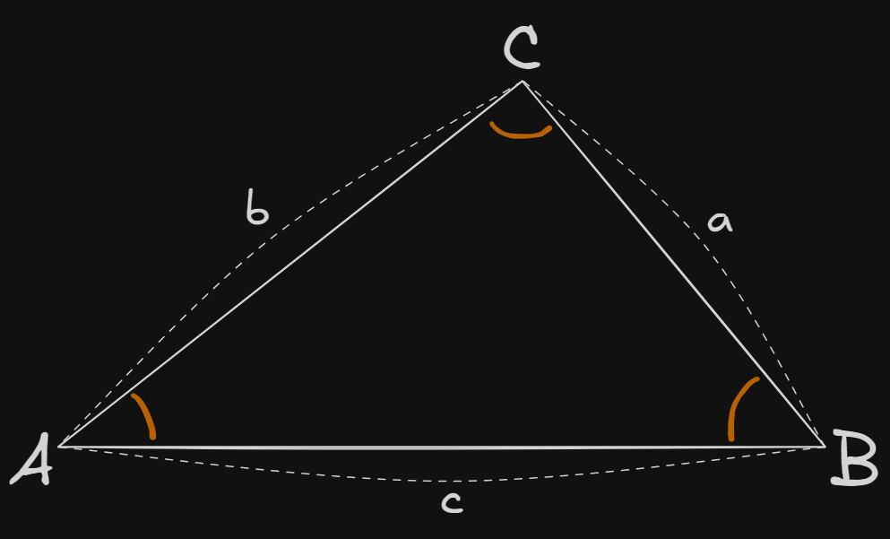

## 📌개요

탄젠트 법칙이 모든 삼각형에서 어떻게 성립하는지 증명을 정리

## 📌내용

탄젠트 법칙은 삼각법에서 삼각형의 두 변과 그에 끼인 두 각 사이의 관계를 나타내는 공식이다.
삼각형의 변과 각을 구하는 데 유용하며, 사인 법칙(Sine Rule)이나 코사인 법칙(Cosine Rule)과 함께 삼각형 문제를 해결하는 데 사용된다.

### 탄젠트 법칙의 증명

$\triangle ABC$에서 변의 길이를 $a,b,c$ 각각의 대변에 대응하는 각을 $A,B,C$라고 할 때, 탄젠트 법칙은 다음과 같이 표현된다.

$$
\begin{gathered}
\frac{a-b}{a+b} = \frac{\tan{(\frac{A-B}{2})}}{\tan{(\frac{A+B}{2})}}
\end{gathered}
$$

즉, 두 변의 차와 합의 비율이 두 각의 반각에 대한 탄젠트 비율과 같다는 것을 의미한다.

#### 탄젠트 법칙을 삼각함수로 변형

삼각형의 내각합 성질에 의해

$$
\begin{gathered}
A + B + C = 180^\circ \\
A + B = 180^\circ - C
\end{gathered}
$$

#### 사인 법칙 활용

삼각형에서 사인 법칙을 적용한다.

$$
\begin{gathered}
\frac{a}{\sin{A}} = \frac{b}{\sin{B}} = \frac{c}{\sin{C}} \\
\frac{a}{b} = \frac{\sin{A}}{\sin{B}}
\end{gathered}
$$

양 변을 변형한다.

$$
\begin{gathered}
\frac{a-b}{a+b} = \frac{\sin{A}-\sin{B}}{\sin{A}+\sin{B}}
\end{gathered}
$$

#### 삼각함수 변형

사인 함수의 덧셈과 뺄셈 공식

$$
\begin{gathered}
\sin{A} - \sin{B} = 2\cos{\frac{A+B}{2}}\sin{\frac{A-B}{2}} \\
\sin{A} + \sin{B} = 2\sin{\frac{A+B}{2}}\cos{\frac{A-B}{2}}
\end{gathered}
$$

위의 결과를 이용하여 변형한다.

$$
\frac{a-b}{a+b} = \frac{2\cos{\frac{A+B}{2}}\sin{\frac{A-B}{2}}}
{2\sin{\frac{A+B}{2}}\cos{\frac{A-B}{2}}}
$$

양 변의 2를 약분한다.

$$
\frac{a-b}{a+b} = \frac{\cos{\frac{A+B}{2}}\sin{\frac{A-B}{2}}}
{\sin{\frac{A+B}{2}}\cos{\frac{A-B}{2}}}
$$

분자와 분모를 나누어 확인한다.

분자 : $\cos{\frac{A+B}{2}}\sin{\frac{A-B}{2}}$, 분모 : $\sin{\frac{A+B}{2}}\cos{\frac{A-B}{2}}$

그럼 이 식은 다음과 같이 분리할 수 있다.

$$
\frac{\sin{\frac{A-B}{2}}}{\cos{\frac{A-B}{2}}} \times \frac{\cos{\frac{A+B}{2}}}{\sin{\frac{A+B}{2}}}
$$

이때 첫 번째 항과 두 번째 항을 다음과 같이 정리할 수 있다.

첫 번째 항 : $\tan{\frac{A-B}{2}}$, 두 번째 항 : $\frac{1}{\tan{\frac{A+B}{2}}}$

즉, 전체 식이 다음과 같이 정리된다.

$$
\begin{gathered}
\frac{\tan{\frac{A-B}{2}}}{\tan{\frac{A+B}{2}}} \\
\therefore \frac{a-b}{a+b} = \frac{\tan{(\frac{A-B}{2})}}{\tan{(\frac{A+B}{2})}}
\end{gathered}
$$

## ⚙️EndNote

### 사인 법칙

삼각형의 각 변과 대응하는 내각의 사인값의 비율이 같음을 의미한다.

$$
\frac{a}{\sin{A}} = \frac{b}{\sin{B}} = \frac{c}{\sin{C}}
$$

### 사인 덧셈/뺄셈 공식

$$
\begin{gathered}
\sin{A} - \sin{B} = 2\cos{\frac{A+B}{2}}\sin{\frac{A-B}{2}} \\
\sin{A} + \sin{B} = 2\sin{\frac{A+B}{2}}\cos{\frac{A-B}{2}}
\end{gathered}
$$

### 탄젠트 함수의 정의

탄젠트 함수의 정의는 다음과 같다.

$$\tan{x} = \frac{\sin{x}}{\cos{x}}$$
