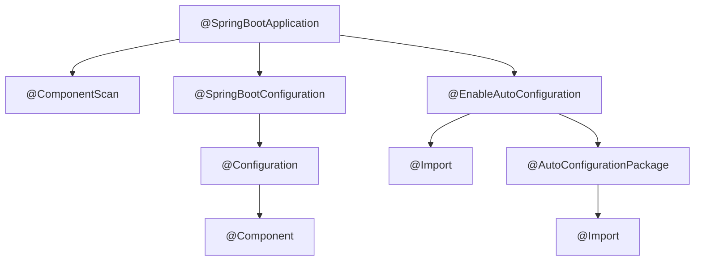
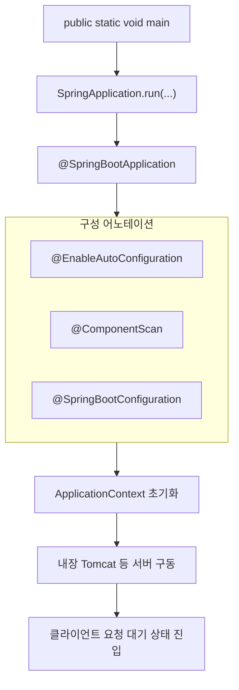

## 📌개요

Spring Boot는 Spring에 비해 설정을 따로 해주지 않아도 자동으로 설정해주는 게 많아서 더 간편하다.
이전에 Spring과 Spring Boot을 비교하며 자동 설정 기능에 대해 간단히 알아봤다.

이번엔 Spring Boot의 자동 설정(AutoConfiguration) 메커니즘을 이해하고 커스텀 설정을 구성할 수 있는지 알아보자.

## 📌내용

Spring Boot의 `@SpringBootApplication` 어노테이션은 내부적으로 `@EnableAutoConfiguration`, `@ComponentScan`, `@Configuration`을 조합한 메타 어노테이션(복합 구성)이다.



**Auto-configuration** 은 Spring Boot의 핵심 기능 중 하나로, 클래스패스에 있는 라이브러리와 환경 설정에 따라 적절한 Bean을 자동으로 구성해주는 메커니즘이다.

자세히 알아보기 앞서 용어를 정리하고 내려가보자.

- 자동 설정(Auto-configuration)
    - Spring Boot가 클래스 패스와 설정에 따라 자동으로 Bean 등을 구성하는 기능
- 자동 설정 클래스(auto-configuration class)
	- 자동 설정을 수행하는 실제 Java 클래스
	- 내부적으로 조건부 어노테이션(`@ConditionalOn`, ...)으로 구성된다.
- `@EnableAutoConfiguration`
	- 자동 설정 기능을 활성화하는 트리거
	- 일반적으로 `@SpringBootApplication` 안에 포함되어 있다.
- `@AutoConfiguration` (Spring Boot 3.0 이상)
	- 이전의 `@Configuration` + `spring.factories` 조합을 대체하는 새 방식.
	- 이 어노테이션을 붙인 클래스는 자동 설정 후보로 간주된다.
- `@Configuration`
	- Java 기반 설정을 정의하는 기본 Spring 어노테이션
	- `@AutoConfiguration`은 이를 확장한 것.

### Spring Boot 자동 설정 매커니즘 자세히 이해하기

#### 자동 설정이란?

자동 설정(Auto-Configuration)은 Spring Boot가 클래스패스에 있는 라이브러리, 설정값, Bean 존재 여부 등을 기반으로 적절한 Bean 설정을 자동으로 구성해주는 기능이다.

예를 들어 `spring-boot-starter-data-jpa`를 추가하면 자동으로 `DataSource`, `EntityManagerFactory`, `TransactionManager` 같은 Bean이 구성된다.

Spring Boot가 내부에서 이를 위한 자동 설정 클래스를 탐지하고 적용하기 때문이다.

#### `@SpringBootApplication` 실행 흐름 시각화



1. `main()` : 애플리케이션의 단순한 진입점이 아니라 Spring Boot 전체 실행의 기준점
2. `SpringApplication.run()` : 실행 컨텍스트 구성, 리스너 등록, 설정 파일 로딩 등 수행
3. `@EnableAutoConfiguration` : 클래스패스를 기반으로 설정 후보 자동 로딩 및 적용
4. `@ComponentScan` : 지정된 패키지에서 컴포넌트(@Component, @Service 등) 자동 탐색
5. `@SpringBootConfiguration` : Java 기반 설정 클래스 등록. 수동 Bean 정의에 사용
6. `ApplicationContext` 초기화 : 의존성 주입 및 라이프사이클 콜백 수행
7. 내장 서버 실행 : 기본 포트(8080)에서 HTTP 요청을 수신할 수 있는 상태로 전환됨

이 흐름은 단순히 외워야 할 절차가 아니라, **설정 누락, 컴포넌트 인식 실패, 자동 설정 충돌** 등의 문제를 디버깅할 때 반드시 이해하고 있어야 하는 구조이다.

#### 자동 설정을 활성화하려면?

>[!info] 공식 문서 명시
>
> You need to opt-in to auto-configuration by adding the [`@EnableAutoConfiguration`](https://docs.spring.io/spring-boot/3.4.5/api/java/org/springframework/boot/autoconfigure/EnableAutoConfiguration.html) or [`@SpringBootApplication`](https://docs.spring.io/spring-boot/3.4.5/api/java/org/springframework/boot/autoconfigure/SpringBootApplication.html) annotations to one of your [`@Configuration`](https://docs.spring.io/spring-framework/docs/6.2.x/javadoc-api/org/springframework/context/annotation/Configuration.html) classes.

즉, 자동 설정은 opt-in 기반이다.
자동 설정은 "설정이 필요 없는 간편함"을 제공하지만, "조건" 기반이라는 점을 반드시 이해해야 한다.

>[!info] Opt-in/Opt-out
>
>- Opt-in: 기본적으로 비활성화, 직접 명시적으로 활성화해야 동작하는 방식.
>- Opt-out: 기본이 활성화, 원하면 명시적인 비활성화 처리 필요.

```java
@SpringBootApplication // 내부에 @EnableAutoConfiguration 포함
public class MyApp {
    public static void main(String[] args) {
        SpringApplication.run(MyApp.class, args);
    }
}
```

##### 내부 구성

```java
@Target(ElementType.TYPE)  
@Retention(RetentionPolicy.RUNTIME)  
@Documented  
@Inherited  
@SpringBootConfiguration  
@EnableAutoConfiguration  
@ComponentScan(excludeFilters = { @Filter(type = FilterType.CUSTOM, classes = TypeExcludeFilter.class),  
   @Filter(type = FilterType.CUSTOM, classes = AutoConfigurationExcludeFilter.class) })  
public @interface SpringBootApplication {
...
```

#### `@EnableAutoConfiguration`의 동작 원리

핵심은 `@Import(AutoConfigurationImportSelector.class)` 이 클래스가 자동 설정 클래스들을 로드해온다는 것이다.

`@EnableAutoConfiguration`은 단순 트리거이고 실제로 자동 설정 클래스를 로드하고 필터링하는 핵심 로직은 바로 `AutoConfigurationImportSelector` 클래스에 들어 있다.

이 클래스는 `Spring-boot-autoconfigure.jar`에 포함되어 있으므로 Spring Boot starter를 프로젝트에 추가하면 자동으로 로드 가능한 구조다.

```java
@Target(ElementType.TYPE)  
@Retention(RetentionPolicy.RUNTIME)  
@Documented  
@Inherited  
@AutoConfigurationPackage  
@Import(AutoConfigurationImportSelector.class)  
public @interface EnableAutoConfiguration {
...
```

`ImportSelector`가 내부적으로 다음 파일들을 스캔한다.
- Spring Boot 2.x
	- `META-INF/spring.factories`
- Spring Boot 3.x 이상
	- `META-INF/spring/org.springframework.boot.autoconfigure.AutoConfiguration.imports`

#### 자동 설정 클래스는 어떤 형태인가?

자동 설정 클래스는 `@Configuration` 또는 `@AutoConfiguration`으로 선언된 설정 클래스 형태를 갖는다.

내부에 `@ConditionalOnClass`, `@ConditionalOnMissingBean`, `@ConditionalOnProperty` 등의 조건부 어노테이션을 사용하여 상황에 맞게 설정을 자동 적용한다.

##### JacksonAutoConfiguration 예시

```java
@AutoConfiguration
@ConditionalOnClass(ObjectMapper.class)
public class JacksonAutoConfiguration {

    @Bean
    @ConditionalOnMissingBean
    public ObjectMapper objectMapper() {
    return new ObjectMapper();
    }
}
```

자동 설정 클래스는 일반적으로 다음 조건부 어노테이션을 사용한다.
자동 설정 클래스는 조건에 따라 설정을 "선택적으로 적용"하기 위한 전략 집합이다.

| 어노테이션                          | 설명                                        |
| ------------------------------ | ----------------------------------------- |
| `@ConditionalOnClass`          | 특정 클래스가 클래스패스에 존재할 때만 활성화                 |
| `@ConditionalOnMissingBean`    | 같은 타입의 Bean이 없을 때만 등록                     |
| `@ConditionalOnProperty`       | application.yml에 설정된 프로퍼티가 조건과 일치할 때만 활성화 |
| `@ConditionalOnWebApplication` | 웹 애플리케이션일 때만 활성화 등                        |

#### 자동 설정이 실제로 등록되었는지 확인하는 방법

Spring Boot Actuator + 조건 리포트

1. `build.gradle` 또는 `pom.xml`에 actuator 추가
    ```groovy
    // build.gradle
    implementation 'org.springframework.boot:spring-boot-starter-actuator'
    ```
2. `application.yaml`에 아래와 같이 설정
    ```yaml
    management:
        endpoints:
            web:
                exposure:
                    include: conditions
    ```
3. 브라우저에서 `http://localhost:8080/actuator/conditions`로 접속 후 어떤 자동 설정 클래스가 적용(positiveMatches)됐고 어떤 조건이 왜 실패했는지(negativeMatches) 확인 가능.
	- IntelliJ IDE에서 제공하는 패널을 확인하는 방법도 있다.
		- `Spring Boot Dashboard` 또는 `View > Tool Windows > Spring`
		- `Beans`, `Mappings`, `Endpoints` 등으로 전체 컨텍스트 확인 가능

### 커스텀 AutoConfiguration 테스트

작성한 `HelloAutoConfiguration`과 `HelloService`가 **자동으로 빈 등록되는지 실제 확인**하려면,  
다음과 같은 방식으로 별도 테스트 프로젝트를 만들어 사용하는 것이 가장 확실하다.

- `/actuator/conditions`에서 `HelloAutoConfiguration` 자동 설정 작동 여부 확인
- `context.containsBean("helloService")` or `@Autowired HelloService` Bean 등록 확인
- `@ConditionalOnMissingBean`, `@ConditionalOnProperty` 등 추가 후 조건 적용 확인 테스트

#### 프로젝트 구성 방식

##### AutoConfiguration 모듈 (라이브러리 역할)

Gradle 또는 Maven으로 별도 모듈로 분리하여 사용할 프로젝트.

`hello-autoconfig` 프로젝트를 생성해서 모듈을 `jar`로 빌드하거나 `settings.gradle`에 `includeBuild(...)` 방식으로 연결하여 테스트할 예정이다.

- Java + Gradle로 빠르게 프로젝트 생성
	- 모듈은 Spring Boot로 만들지 않아도 된다는 점
    ```text
    hello-autoconfig/
    ├── src/
    │   ├── main/java/com/example/autoconfig/HelloService.java
    │   └── main/java/com/example/autoconfig/HelloAutoConfiguration.java
    │   └── main/resources/META-INF/spring/org.springframework.boot.autoconfigure.AutoConfiguration.imports
    ├── build.gradle
    ```
- build.gradle
    ```groovy
    plugins {  
        id 'java-library'  
    }  
    
    group = 'com.example'  
    version = '1.0-SNAPSHOT'  
    
    repositories {  
        mavenCentral()  
    }  
    
    dependencies {  
        implementation 'org.springframework.boot:spring-boot-autoconfigure:3.1.5' // 버전은 호환을 고려해야 한다.
    }  
    
    test {  
        useJUnitPlatform()  
    }
    ```
- HelloService.java
    ```java
    package com.example.autoconfig;
    
    public class HelloService {
        public String sayHello() {
            return "Hello from AutoConfiguration!";
        }
    }
    ```
- HelloAutoConfiguration.java
    ```java
    package com.example.autoconfig;
    
    import org.springframework.boot.autoconfigure.AutoConfiguration;
    import org.springframework.context.annotation.Bean;
    
    @AutoConfiguration
    public class HelloAutoConfiguration {
    
        @Bean
        public HelloService helloService() {
            return new HelloService();
        }
    }
    ```
- `src/main/resources/META-INF/spring/org.springframework.boot.autoconfigure.AutoConfiguration.imports`
	```
	com.example.autoconfig.HelloAutoConfiguration
	```

프로젝트 생성과 클래스 작성이 완료됐다면 모듈로 사용하기 위해 jar 파일로 빌드한다.

```bash
./gradlew clean build
# `hello-autoconfig-1.0-SNAPSHOT.jar` 생성됨
```

##### 테스트용 실제 앱 프로젝트에서 사용

Spring Boot 프로젝트(initializr 등) 생성

`my-app` 프로젝트는 위에서 만든 모듈을 연결해 테스트하는 용도다.

- `build.gradle`
    ```groovy
    plugins {  
        id 'java'  
        id 'org.springframework.boot' version '3.1.5' // 버전은 호환을 고려해야 한다.
        id 'io.spring.dependency-management' version '1.1.3'  
    }  
    
    group = 'com.example'  
    version = '0.0.1-SNAPSHOT'  
    
    java {  
        toolchain {  
            languageVersion = JavaLanguageVersion.of(17)  
        }  
    }  
    
    repositories {  
        mavenCentral()  
        flatDir {
            dirs '../hello-autoconfig/build/libs'  // jar 경로 지정 (지금은 테스트 용도로 같은 경로에 두 프젝을 만들었으니.)
        }
    }  
    
    dependencies {  
        implementation name: 'hello-autoconfig-1.0-SNAPSHOT' // .jar 이름 그대로
        implementation 'org.springframework.boot:spring-boot-starter'  
    }  
    
    tasks.named('test') {  
        useJUnitPlatform()  
    }
    ```
- DemoApplication.java
    ```java
    package com.example;  
    
    import com.example.autoconfig.HelloService;  
    import org.springframework.beans.factory.annotation.Autowired;  
    import org.springframework.boot.SpringApplication;  
    import org.springframework.boot.autoconfigure.SpringBootApplication;  
    
    import jakarta.annotation.PostConstruct;  
    
    @SpringBootApplication  
    public class DemoApplication {  
    
        @Autowired  
        private HelloService helloService;  
    
        public static void main(String[] args) {  
            SpringApplication.run(DemoApplication.class, args);  
        }  
    
        @PostConstruct  
        public void printHello() {  
            System.out.println(helloService.sayHello());  
        }  
    }
    ```

실행해보면 `Hello from AutoConfiguration!` 메시지를 잘 확인할 수 있다.

## 🎯결론

자동 설정의 작동 원리, 조건부 어노테이션, 확인 방법 등을 알아봤다.

Spring Boot의 자동 설정은 "있는지 보고 알아서 설정"하는 전략이다.
우리가 할 일은 조건과 우선 순위를 명확히 하여 Spring의 똑똑한 판단을 유도하는 것이다.

자동 설정의 아키텍처와 커스텀 구성 전략까지 이해하고 설계 수준에서 응용이 가능한지 다음 기회에 더 알아보자.

## ⚙️EndNote

### 사전 지식

- Java 어노테이션 이해
- Spring `@Configuration` 및 Bean 등록 방식

### 더 알아보기

- [Spring Boot 공식 문서 - 나만의 자동 구성 만들기](https://docs.spring.io/spring-boot/docs/current/reference/html/features.html#features.developing-auto-configuration)
- [spring-boot-autoconfigure GitHub 소스코드](https://github.com/spring-projects/spring-boot/tree/main/spring-boot-project/spring-boot-autoconfigure)