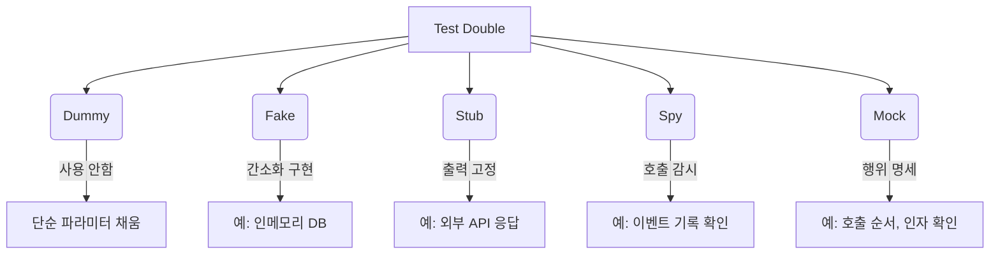

## 📌개요

테스트 코드 리팩토링을 하면서 테스트 더블에 대해 좀 더 깊이 있게 정리할 필요를 느꼈다.

Mock이랑 Stub이랑 뭐가 다르지? 왜 Spy를 쓰지? 같은 고민을 한 개발자라면 공감할 수 있을 것이다.

## 📌내용

### 테스트 더블이란?

테스트 더블은 테스트에서만 쓰이는 대체 객체를 말한다.
실제 객체가 아직 구현되지 않았거나 테스트에 방해가 되는 외부 의존성을 대체하기 위해 사용한다.

>[!INFO] 용어 유래
>영화에서 위험한 장면을 대신하는 스턴트 더블처럼 테스트에서도 그 역할을 대신 수행한다.

### 테스트 더블 5종 시각화 요약



| 유형        | 주용도               | 특징           |
| --------- | ----------------- | ------------ |
| **Dummy** | 자리는 필요하나 사용하지 않음  | 주로 파라미터 용    |
| **Fake**  | 간단한 로직으로 실제 동작 대체 | 인메모리 DB 등    |
| **Stub**  | 입력에 따라 고정된 출력 제공  | 결과 중심 테스트    |
| **Spy**   | 실제 동작 + 호출 기록     | 부분 mocking   |
| **Mock**  | 상호작용 행위 검증        | verify 기반 검증 |

### 각각의 실제 예제와 사용 기준

#### 요약 정리

|테스트 더블|실제 동작 유무|주 용도|주 검증 전략|
|---|---|---|---|
|Dummy|❌|자리 채움용|없음|
|Fake|✅ (간소화)|동작 대체|상태 검증|
|Stub|❌|응답 고정|상태 검증|
|Spy|✅|호출 감시|행위 + 상태|
|Mock|❌|상호작용 검증|행위 검증|

#### Dummy - 아무 일도 하지 않는 자리 채움용

생성자나 파라미터에 꼭 필요하지만 실제 동작에 영향 주지 않는 의존성을 대신할 때

```java
interface Logger {
    void log(String message);
}

class DummyLogger implements Logger {
    public void log(String message) {
        // do nothing
    }
}
```

```java
@Test
void sendEmail_doesNotRequireRealLogger() {
    Logger dummyLogger = new DummyLogger();
    EmailService es = new EmailService(dummyLogger);

    es.sendEmail("hello@test.com"); // 로그 기능은 테스트 대상 아님
}
```

#### Fake - 간이 구현체로 테스트 성능 향상

실제 구현 대신 동작은 유지하되 속도/제약을 줄인 테스트용 구현이 필요할 때

```java
class FakeUserRepository implements UserRepository {
    private final Map<String, User> store = new HashMap<>();

    public void save(User user) {
        store.put(user.getEmail(), user);
    }

    public boolean exists(String email) {
        return store.containsKey(email);
    }
}
```

```java
@Test
void userIsSavedInFakeRepo() {
    FakeUserRepository repo = new FakeUserRepository();
    repo.save(new User("test@fake.com"));

    assertTrue(repo.exists("test@fake.com"));
}
```

#### Stub - 미리 정해진 출력값 반환

- 특정 메서드가 고정된 값을 반환하도록 설정하고 싶을 때
- 외부 시스템 응답, 복잡한 연산 결과 등을 대체할 때

```java
UserRepository stubRepo = mock(UserRepository.class);
when(stubRepo.exists("stub@test.com")).thenReturn(true);
```

```java
@Test
void stubReturnsTrueWhenUserExists() {
    SignUpService sus = new SignUpService(..., stubRepo);

    assertTrue(sus.canRegister("stub@test.com")); // 상태 검증
}
```

#### Spy - 실제 객체와 호출 감시

- 실제 메서드 실행은 유지하면서 호출 여부/횟수를 검증하고 싶을 때
- 일부 동작은 stub하고 일부는 실제 로직을 유지하고 싶을 때

```java
List<String> list = new ArrayList<>();
List<String> spyList = spy(list);

spyList.add("item");
verify(spyList).add("item"); // 행위 검증
```

>[!TIP]
>실제 메서드 호출을 방지하려면 `doReturn(...).when(spy).method()` 패턴 사용

#### Mock - 행위 검증에 최적화된 전용 객체

- 메서드가 어떤 인자로 몇 번 호출되었는지 명확히 검증해야 할 때
- 객체의 상태 변화보다 호출 자체가 테스트 목적일 떄

```java
EmailService mockEmail = mock(EmailService.class);
SignUpService sus = new SignUpService(mockEmail, ...);

sus.signUp(new User("mock@test.com"));

verify(mockEmail).sendWelcome("mock@test.com");
```

#### 상태 검증 VS 행위 검증 비교 시나리오

회원 가입 시 이메일 발송을 예로 들면 다음과 같다.

##### 상태 검증

저장 결과 확인

```java
@Test
void testUserIsSaved() {
    UserRepository fakeRepo = new InMemoryUserRepository();
    EmailService dummyEmail = email -> {};

    SignUpService sus = new SignUpService(dummyEmail, fakeRepo);
    sus.signUp(new User("test@test.com"));

    assertTrue(fakeRepo.contains("test@test.com"));
}
```

##### 행위 검증

특정 메서드 호출 여부 확인

```java
@Test
void testWelcomeEmailSent() {
    EmailService mockEmail = mock(EmailService.class);
    UserRepository stubRepo = user -> {};

    SignUpService sus = new SignUpService(mockEmail, stubRepo);
    sus.signUp(new User("test@test.com"));

    verify(mockEmail).sendWelcome("test@test.com");
}
```

### 언제 어떤 테스트 더블을 써야 할까?

|시나리오|선택|이유|
|---|---|---|
|1. Redis 캐시 hit 여부 확인|Spy|실제 Redis는 사용하고 hit 여부만 확인|
|2. 대량 주문을 처리하는 서비스|Fake|In-memory OrderRepo로 테스트|
|3. 외부 결제 시스템 응답 시뮬레이션|Stub|실패 응답을 지정해서 테스트|
|4. 이메일 발송 여부 확인|Mock|`send()` 메서드 호출 여부 검증|
|5. Validator에 전달되는 객체 확인|Spy|메서드 호출 인자 확인 가능|

### Mockito 주의사항

| 상황                            | 권장 방식                                    | 이유                                     |
| ----------------------------- | ---------------------------------------- | -------------------------------------- |
| Spy의 실제 호출을 막고 싶을 때           | `doReturn().when(...)`                   | `when(...).thenReturn(...)`은 NPE 발생 가능 |
| Stub 응답을 순차적으로 지정할 때          | `when().thenReturn(...).thenReturn(...)` | 순차적 응답 가능                              |
| Mock과 Spy 중 무엇을 선택해야 할지 헷갈릴 때 | 기본은 Mock, 일부만 다르게 하려면 Spy                | 전체 stub이 필요 없다면 Spy 고려                 |

## 🎯결론

> 테스트는 코드를 검증하는 도구이자, 아키텍처를 되돌아보게 하는 거울이다.

Mock, Stub, Spy… 용어에 휘둘리기보다, **무엇을 검증하고 싶은지**를 기준으로 테스트 더블을 선택해보자.
테스트는 결국 **가독성, 유지보수성, 신뢰성**을 확보하는 핵심 도구다.

## ⚙️EndNote

### 사전 지식

- Java 또는 Kotlin 기반 테스트 경험
- JUnit 및 Mockito 기본 사용법
- 단위 테스트와 통합 테스트의 차이

### 더 알아보기

- [Mockito 공식 문서](https://site.mockito.org/)
- [Best Practices for Unit Testing in Java - baeldung](https://www.baeldung.com/java-unit-testing-best-practices)
- [Testing Strategies in a Microservice Architecture – Martin Fowler](https://martinfowler.com/articles/microservice-testing/)
- Effective Unit Testing - 테스트 설계 관점에서의 Mock, Stub
- Refactoring - 테스트와 리팩토링의 연결