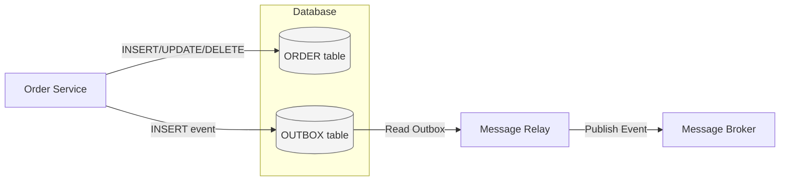
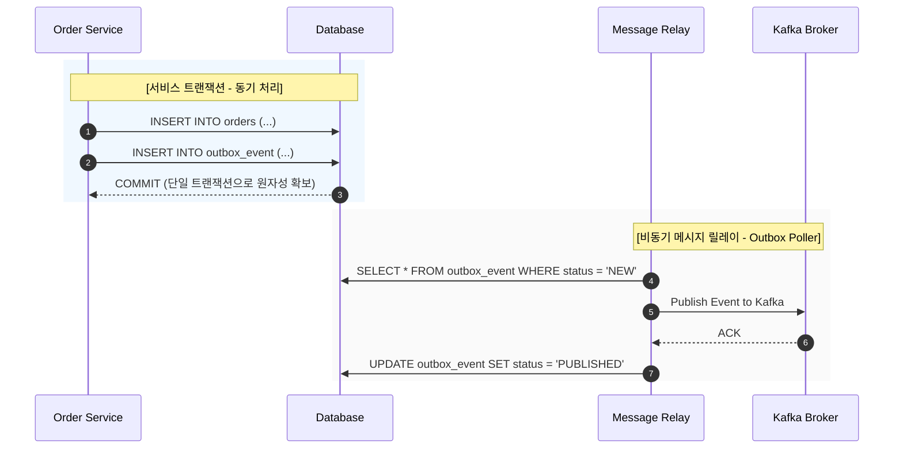

## 📌개요

MSA에서 각 서비스는 독립적인 데이터베이스와 메시지 브로커를 사용하며 이를 통해 비동기 이벤트를 교환한다.

하지만 이 구조는 하나의 트랜잭션 내에서 데이터 저장과 이벤트 발행이 분리되기 때문에 데이터 일관성과 메시지 신뢰성을 보장하기 어렵다.

예를 들어 결제 서비스가 결제 정보를 DB에 저장한 후 kafka에 결제 완료 이벤트를 발행한다고 하자. 만약 DB 저장은 성공했지만 kafka 발행이 실패한다면?
결제는 되었는데 알림 서비스나 배송 서비스는 이를 모르게 된다.

이런 문제를 해결하기 위한 안전한 전략이 바로 Outbox 패턴이다.

>[!INFO]
>Outbox는 보낼 편지함이라는 뜻이며 `Transactional Outbox Pattern`으로 조회했을 때 다양한 정보가 있었다.

## 📌내용

### 문제 상황

MSA 환경에서 다음과 같은 불일치가 자주 발생한다.

- DB에는 반영되었지만 이벤트 발행 실패
- 이벤트는 발행되었지만 데이터 저장 실패
- 중복 발행 및 순서 불일치
- 서비스 간 재시도 로직으로 인한 중복 처리

이는 **DB 트랜잭션과 메시지 발행이 원자적(atomic)** 으로 묶여있지 않기 때문에 발생한다.

### 기존 접근의 한계

#### 2PC(Two-Phase Commit)

DB와 메시지 브로커가 XA 트랜잭션을 지원해야 하며, 락 경합과 네트워크 오버헤드로 인해 확장성 측면에서 부적합하다.

>[!INFO] XS 트랜잭션
>표준화된 분산 트랜잭션 구현 XA(eXtended Architecture)는 2PC(2 phase commit)을 통한 분산 트랜잭션 처리를 위해 X-Open에서 명시한 표준이다.

#### Application-Level Retry

애플리케이션에서 발행 실패 시 재시도를 구현할 수 있지만 네트워크 장애나 장애 복구 시점에 따라 **중복 이벤트** 또는 **순서 역전**이 발생할 수 있다.

### Outbox 패턴으로 해결할 수 있는 것

Outbox 패턴은 **비즈니스 데이터와 이벤트를 동일 트랜잭션 내에서 처리하고** 이후 별도의 **Message Relay 프로세스**가 메시지 브로커(Kafka, RabbitMQ 등)에 발행하는 구조다.

이 방식은 트랜잭션 일관성과 메시지 신뢰성을 모두 확보한다.

#### 처리 흐름 요약

1. **비즈니스 트랜잭션 수행**
    - `ORDER` 테이블에 INSERT / UPDATE / DELETE 수행
    - 같은 트랜잭션 내에서 `OUTBOX` 테이블에 이벤트 메시지(페이로드) 저장
    - 두 테이블은 **하나의 트랜잭션 단위**로 커밋됨, 원자성(Atomicity) 확보
2. **메시지 릴레이(Message Relay)**
    - 트랜잭션이 커밋된 후, 별도 프로세스가 `OUTBOX` 테이블을 주기적으로 읽음
    - 발행되지 않은 이벤트(`status = NEW`)를 찾아 메시지 브로커에 Publish
    - 발행 성공 시 `status = PUBLISHED`로 갱신
    - 실패 시 재시도 로직 또는 DLQ(Dead Letter Queue)로 이동
3. **메시지 브로커**
    - Kafka, RabbitMQ, AWS SNS/SQS 등으로 메시지 전달
    - 구독 서비스들이 해당 이벤트를 비동기적으로 처리

#### 구성 요소

- **Sender (Order Service):** 비즈니스 로직 수행 및 Outbox에 이벤트 기록
- **Database:** 비즈니스 데이터(`ORDER`)와 이벤트 로그(`OUTBOX`)를 함께 저장
- **Message Outbox:** 발행 대기 중인 이벤트를 저장하는 테이블 또는 컬렉션
- **Message Relay:** Outbox 테이블에서 이벤트를 읽어 메시지 브로커로 발행
- **Message Broker:** 이벤트를 다른 서비스에 전달 (Kafka, RabbitMQ 등)

### 주요 장점

|항목|설명|
|---|---|
|**트랜잭션 일관성 보장**|DB 저장과 이벤트 기록이 하나의 트랜잭션으로 처리됨|
|**재처리 가능**|Outbox 테이블을 기준으로 실패한 이벤트를 재전송 가능|
|**멱등성(idempotency)**|이벤트 발행 시 `event_id`로 중복 처리 방지|
|**확장성**|Kafka Connect / Debezium 등을 통해 Change Data Capture(CDC) 기반으로 확장 가능|

### Outbox + CDC(Change Data Capture)

단순 폴링 기반은 부하가 크기 때문에 **Debezium + Kafka Connect** 조합을 사용하기도 한다.
DB 트랜잭션 로그를 구독하여 outbox 테이블의 변경 사항만 캡처해 이벤트를 발행하므로 효율적이다.

### 유사 패턴과 비교

|패턴|설명|한계|
|---|---|---|
|**Saga 패턴**|여러 서비스 트랜잭션을 보상 트랜잭션으로 관리|복잡한 보상 로직, 순차적 지연|
|**Event Sourcing**|상태를 이벤트 스트림으로 저장|이벤트 재생 비용, 복잡한 쿼리|
|**Outbox 패턴**|이벤트를 별도 테이블에 기록 후 발행|Outbox 테이블 관리 필요|

### 적용 시 고려사항

- Outbox 테이블은 주기적으로 정리(cleanup) 필요
- 이벤트 발행 실패 시 재시도 정책 및 DLQ(Dead Letter Queue) 구성
- 발행 순서 보장을 위한 파티셔닝 키 설계 (`aggregate_id` 기반)
- Kafka 등 메시지 브로커의 전달 보증 설정 (`at-least-once` vs `exactly-once`)
- 발행 중복 대비를 위한 멱등 처리 전략 (`unique event_id`)

### Outbox 패턴 적용 관련 트러블슈팅

날씨 정보로 사용자의 OOTD를 추천하는 서비스(피드 공유, DM 등 SNS 기능 포함)
날씨 도메인을 담당하는 팀원의 PR을 리뷰하다가 특이한 상황을 만났다.

1. 배치 잡을 실행하며 특별한 날씨 변화가 감지되면 알림을 생성하는 케이스
2. 해당 테스트는 다른 테스트의 DB와 충돌이 없도록 독립된 인메모리 DB로 실행.
3. 로컬 테스트 코드에서 실행 시 성공 또는 무한 루프로 인한 실패. 성공 보장이 안 됨.
4. 특이하게 CI 이력엔 성공 케이스만 있음.

#### 로직 점검

- `outboxes`가 비었을 때만 `FINISHED`, 기본은 `CONTINUABLE`
    - 모든 이벤트를 발송하기 위함
- 수신 대상이 없어도 `SENDING` 상태로 저장하는 결함 발견
    - 수신 대상이 없어서 `outbox`가 처리되지 않고 계속 남아있으며 `CONTINUABLE` 무한 루프

하지만 간헐적인 성공과 CI에서만 성공하는 건 설명되지 않음.

#### 성공 조건과 실패 조건 점검

>왜 로컬에선 무한 루프로 실패하는 케이스가 있고 CI에선 정상 동작하지?

- 성공의 조건
    - 배치 실행 시점에 `PENDING` `outbox`가 비어있다.
- 실패의 조건
    - 배치 시작 후, `PENDING` `outbox` 조회 쿼리와 수신 대상 조회 쿼리가 반복
    - 수신 대상이 0명인 경우: `SENDING`으로 바꾸지 않음, 여전히 `PENDING`
    - Step이 종료되지 않고 같은 쿼리를 계속 내며 무한 반복

질문이 잘못됐다..! 로컬과 CI로 구분해서 볼 게 아니라 로직 점검에서 확인했던 `outbox`의 생성 여부를 봤어야 했다. "outboxes가 비었을 때만 `FINISHED`" 였으니까..

>즉, 특별한 날씨 변화가 있는가? 였다.

날씨 조회에 대한 것도 Mocking 하거나 수신 대상을 보장하는 등 다양한 방법이 있었을텐데 정답이 없다 보니 발생했던 문제 같다.

특이하게 CI에 성공 이력만 있던 것도 마침 그때는 특별한 날씨 변화가 없던 것...

## 🎯결론

Outbox 패턴은 **MSA 환경에서 데이터 일관성과 이벤트 신뢰성을 확보하는 현실적인 대안**이 될 수 있다.

## ⚙️EndNote

### 사전 지식

- 트랜잭션 ACID 속성
- 메시지 브로커의 전달 보증 (`at-least-once`, `exactly-once`)
- Saga, 2PC, Event Sourcing 패턴

### 더 알아보기

- [분산 트랜잭션과 XA 트랜잭션에 대해](https://ssonzm.tistory.com/148)
- [[MSA 패턴] SAGA, Transactional Outbox 패턴 활용하기](https://devocean.sk.com/blog/techBoardDetail.do?ID=165445&boardType=techBlog)
- [Pattern: Transactional outbox](https://microservices.io/patterns/data/transactional-outbox.html#:~:text=The%20solution%20is%20for%20the,messages%20to%20the%20message%20broker)

### 추가 정리

#### 단일 인스턴스(Monolithic) 환경

- 하나의 DB, 하나의 트랜잭션에서 모든 로직이 처리된다.
- **2PC(2-Phase Commit)** 같은 표준 트랜잭션 메커니즘으로 DB 저장과 이벤트 처리(예: 메시지 큐 발행)를 하나의 논리적 단위로 묶을 수 있다.
- 따라서 **원자성(Atomicity)** 과 **일관성(Consistency)** 이 보장된다.

#### 확장 시 한계 (락 경쟁 & 처리 병목)

- 트래픽 증가 → DB Connection Pool 경쟁 → 락 경합(lock contention) 증가
- 대규모 트랜잭션으로 인해 응답 지연 발생
- DB가 **트랜잭션 코디네이터** 역할까지 하므로 병목이 심화된다.
- 이 시점에서 **단일 DB 트랜잭션 구조는 확장성의 한계**에 부딪힌다.

#### 분산 환경(= MSA 도입)

- 각 서비스가 **독립된 DB**를 가지게 되고 서비스 간에는 **비동기 메시지 큐(Kafka, RabbitMQ, SNS/SQS)** 로 이벤트를 전달한다.
- 이로 인해 처리 속도는 비약적으로 향상된다. (주요 비즈니스 로직만 빠르게 커밋, 나머지는 비동기로 후처리)
- 하지만 **데이터 일관성 문제**가 새롭게 등장한다.

#### 새로운 문제: 원자성 붕괴

- 비즈니스 트랜잭션(DB 커밋)과 이벤트 발행(Message Send)이 **서로 다른 시스템**에서 발생
- 두 작업 중 하나라도 실패하면 데이터 불일치 발생
- 메시지 순서가 바뀌거나 중복 이벤트가 발생할 수도 있음

#### Outbox 패턴의 해결 방식

- 서비스 로직 트랜잭션 안에서 **비즈니스 데이터 + 이벤트 로그(Outbox)를 함께 커밋**
- 이로써 “이벤트 기록”까지는 **원자성 보장**
- 이후 별도 프로세스(Message Relay)가 Outbox 테이블을 읽어 메시지 브로커(Kafka 등)에 발행
- 발행이 성공하면 상태를 `PUBLISHED`로 변경 실패하면 재시도 또는 DLQ(Dead Letter Queue)로 처리

#### 결과적으로

|구분|기존 구조|Outbox 적용 후|
|---|---|---|
|**원자성**|DB ↔ MQ 분리되어 깨짐|동일 트랜잭션 내 Outbox 기록으로 보장|
|**확장성**|단일 DB 락 병목|분산 환경 + 비동기 처리로 개선|
|**신뢰성**|발행 실패 시 유실 가능|Outbox 재시도 / CDC로 회복 가능|
|**운영 복잡도**|단순|Outbox 테이블 관리 필요(운영비 증가)|
