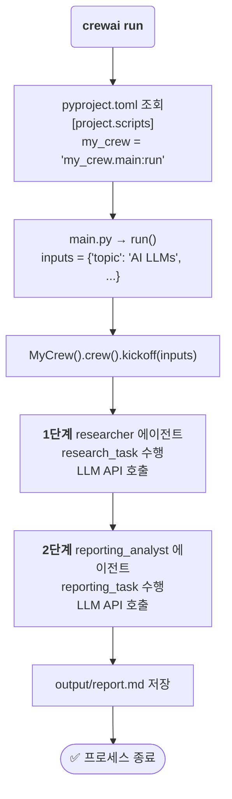
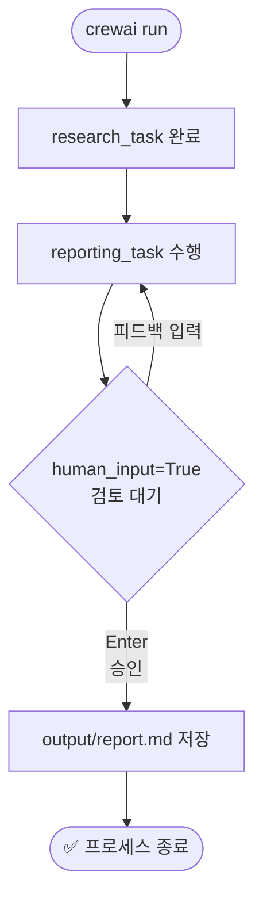

## 📌개요

ChatDev를 실험하며 멀티 에이전트 시스템의 가능성을 확인한 뒤, 다음 실험 대상으로 **CrewAI**를 선택했다. CrewAI는 역할 기반의 AI 에이전트 팀을 구성하여 복잡한 태스크를 자동화하는 Python 프레임워크로, 코드 중심의 접근 방식이 특징이다.

이 포스팅에서는 **CrewAI를 처음 설치하고 첫 번째 Crew를 실행**하기까지의 전 과정을 정리한다. 프로젝트 구조 이해, 에이전트 및 태스크 정의, LLM 연동까지 한 번에 파악할 수 있도록 구성했다.

## 📌내용

### 왜 CrewAI를 선택했나?

멀티 에이전트 프레임워크를 비교할 때, CrewAI는 **"비즈니스 프로세스 자동화"** 에 가장 특화된 구조를 갖고 있다. 특히 에이전트에게 명확한 역할(Role), 목표(Goal), 배경(Backstory)을 부여하는 방식이 실제 팀 운영 모델과 잘 맞아떨어진다.

| 프레임워크       | 핵심 컨셉         | 특징                             |
| :---------- | :------------ | :----------------------------- |
| **CrewAI**  | 전문화된 팀(Crew)  | 역할 기반, 비즈니스 프로세스 자동화에 적합       |
| **ChatDev** | 가상 소프트웨어 회사   | CEO/CTO 등 역할극 기반, 노드/엣지 UI     |
| **AutoGen** | 에이전트 간 대화     | Microsoft 개발, 코드 실행/디버깅 능력이 강력 |
| **MetaGPT** | 표준 운영 절차(SOP) | 한 줄 요구사항으로 설계 문서부터 코드까지 생성     |

CrewAI를 선택한 이유는 세 가지다.

1. **코드 기반의 세밀한 제어**: YAML로 에이전트와 태스크를 선언하고, Python으로 오케스트레이션 로직을 직접 작성하여 세밀하게 제어할 수 있다.
2. **Flows + Crews 이중 구조**: 상위 레벨의 실행 흐름(Flow)과 실제 작업 단위(Crew)를 분리하는 아키텍처가 복잡한 자동화에 적합하다.
3. **풍부한 내장 도구**: 웹 검색(SerperDev), 파일 읽기/쓰기, 코드 실행 등 다양한 도구가 기본 제공된다.

### CrewAI 아키텍처 이해

CrewAI는 **Flows**와 **Crews** 두 개의 레이어로 구성된다.

| 레이어       | 역할         | 핵심 기능                      |
| :-------- | :--------- | :------------------------- |
| **Flows** | 애플리케이션의 뼈대 | 상태 관리, 이벤트 기반 실행, 조건 분기/루프 |
| **Crews** | 실제 작업 단위   | 역할 기반 에이전트, 자율 협업, 태스크 위임  |

**실행 흐름:**

1. Flow가 이벤트를 발생시키거나 프로세스를 시작한다.
2. Flow가 상태를 관리하고 다음 동작을 결정한다.
3. Flow가 복잡한 태스크를 Crew에 위임한다.
4. Crew의 에이전트들이 협업하여 태스크를 완료한다.
5. Crew가 결과를 Flow에 반환한다.
6. Flow가 결과에 따라 실행을 이어간다.

### 환경 구성 및 설치

#### 사전 요구사항

> \[!IMPORTANT]
> 아래 항목이 모두 준비되지 않으면 설치 자체가 진행되지 않는다.

| 항목     | 필요 버전            | 확인 명령              |
| :----- | :--------------- | :----------------- |
| Python | 3.10 이상, 3.14 미만 | `python --version` |
| uv     | 최신               | `uv --version`     |

`uv`는 pip보다 훨씬 빠른 Python 패키지 매니저로, CrewAI의 공식 의존성 관리 도구다.

```bash
# Windows (PowerShell)
powershell -ExecutionPolicy ByPass -c "irm https://astral.sh/uv/install.ps1 | iex"

# macOS / Linux
curl -LsSf https://astral.sh/uv/install.sh | sh
```

#### CrewAI CLI 설치

```bash
# CrewAI CLI 설치
uv tool install crewai

# PATH 경고가 발생하면 실행
uv tool update-shell

# 설치 확인
uv tool list
# 출력 예시:
# crewai v0.102.0
#   - crewai

# 업그레이드가 필요한 경우
uv tool install crewai --upgrade
```

> \[!TIP]
> Windows에서 `chroma-hnswlib` 빌드 오류(`fatal error C1083: Cannot open include file: 'float.h'`)가 발생하면, [Visual Studio Build Tools](https://visualstudio.microsoft.com/downloads/)를 설치하고 **Desktop development with C++** 워크로드를 선택한다.

### 프로젝트 생성

CrewAI는 CLI 명령 하나로 바로 실행 가능한 프로젝트 골격을 생성해준다.

```bash
# 신규 Crew 프로젝트 생성
crewai create crew <your_project_name>

# 예시
crewai create crew latest-ai-development
cd latest_ai_development
```

현재 버전에서 생성된 프로젝트 구조는 다음과 같다.

```
my_project/
├── .gitignore
├── knowledge/          # 에이전트가 참조할 지식 베이스
├── pyproject.toml
├── README.md
├── .env                # API 키 등 환경 변수
└── src/
    └── my_project/
        ├── __init__.py
        ├── main.py         # 프로젝트 진입점
        ├── crew.py         # Crew 오케스트레이션
        ├── tools/          # 커스텀 도구
        │   ├── custom_tool.py
        │   └── __init__.py
        └── config/
            ├── agents.yaml # 에이전트 정의
            └── tasks.yaml  # 태스크 정의
```

| 파일            | 역할                      |
| :------------ | :---------------------- |
| `agents.yaml` | AI 에이전트의 역할, 목표, 배경 정의  |
| `tasks.yaml`  | 에이전트가 수행할 태스크와 워크플로우 설정 |
| `.env`        | API 키 등 민감한 환경 변수 보관    |
| `main.py`     | 프로젝트 진입점 및 실행 흐름        |
| `crew.py`     | Crew 오케스트레이션 및 조정       |
| `tools/`      | 커스텀 에이전트 도구 디렉토리        |
| `knowledge/`  | 에이전트 지식 베이스 디렉토리        |

### 에이전트 & 태스크 정의

#### agents.yaml — 에이전트 역할 정의

`{topic}` 같은 플레이스홀더를 사용해 실행 시점에 동적으로 값을 주입할 수 있다.

```yaml
# src/latest_ai_development/config/agents.yaml
researcher:
  role: >
    {topic} Senior Data Researcher
  goal: >
    Uncover cutting-edge developments in {topic}
  backstory: >
    You're a seasoned researcher with a knack for uncovering the latest
    developments in {topic}. Known for your ability to find the most
    relevant information and present it in a clear and concise manner.

reporting_analyst:
  role: >
    {topic} Reporting Analyst
  goal: >
    Create detailed reports based on {topic} data analysis and research findings
  backstory: >
    You're a meticulous analyst with a keen eye for detail. You're known for
    your ability to turn complex data into clear and concise reports, making it
    easy for others to understand and act on the information you provide.
```

#### tasks.yaml — 태스크 및 실행 순서 정의

````yaml
# src/latest_ai_development/config/tasks.yaml
research_task:
  description: >
    Conduct a thorough research about {topic}
    Make sure you find any interesting and relevant information given
    the current year is 2025.
  expected_output: >
    A list with 10 bullet points of the most relevant information about {topic}
  agent: researcher

reporting_task:
  description: >
    Review the context you got and expand each topic into a full section
    for a report. Make sure the report is detailed and contains any and
    all relevant information.
  expected_output: >
    A fully fledge reports with the mains topics, each with a full section
    of information. Formatted as markdown without '```'
  agent: reporting_analyst
  output_file: report.md
````

#### crew\.py — Crew 오케스트레이션

```python
# src/latest_ai_development/crew.py
from crewai import Agent, Crew, Process, Task
from crewai.project import CrewBase, agent, crew, task
from crewai_tools import SerperDevTool
from crewai.agents.agent_builder.base_agent import BaseAgent
from typing import List

@CrewBase
class LatestAiDevelopmentCrew():
    """LatestAiDevelopment crew"""
    agents: List[BaseAgent]
    tasks: List[Task]

    @agent
    def researcher(self) -> Agent:
        return Agent(
            config=self.agents_config['researcher'],
            verbose=True,
            tools=[SerperDevTool()]  # 웹 검색 도구 장착
        )

    @agent
    def reporting_analyst(self) -> Agent:
        return Agent(
            config=self.agents_config['reporting_analyst'],
            verbose=True
        )

    @task
    def research_task(self) -> Task:
        return Task(
            config=self.tasks_config['research_task'],
        )

    @task
    def reporting_task(self) -> Task:
        return Task(
            config=self.tasks_config['reporting_task'],
            output_file='output/report.md'  # 최종 보고서 저장 경로
        )

    @crew
    def crew(self) -> Crew:
        """Creates the LatestAiDevelopment crew"""
        return Crew(
            agents=self.agents,   # @agent 데코레이터로 자동 수집
            tasks=self.tasks,     # @task 데코레이터로 자동 수집
            process=Process.sequential,  # 순차 실행
            verbose=True,
        )
```

#### main.py — 진입점 및 입력값 전달

```python
#!/usr/bin/env python
# src/latest_ai_development/main.py
from latest_ai_development.crew import LatestAiDevelopmentCrew

def run():
    """Run the crew."""
    inputs = {
        'topic': 'AI Agents'  # agents.yaml / tasks.yaml의 {topic}에 주입
    }
    LatestAiDevelopmentCrew().crew().kickoff(inputs=inputs)
```

### LLM 및 API 키 설정

`.env` 파일에 사용할 LLM 제공자의 API 키를 입력한다.

```dotenv
# 웹 검색 도구 (SerperDev)
SERPER_API_KEY=YOUR_SERPER_API_KEY

# OpenAI (기본값)
OPENAI_API_KEY=sk-your-openai-api-key

# Google Gemini
GEMINI_API_KEY=your-gemini-api-key

# Anthropic Claude
ANTHROPIC_API_KEY=your-anthropic-api-key
```

> \[!TIP]
> CrewAI는 OpenAI 외에도 Gemini, Claude, Ollama(로컬) 등 다양한 LLM을 지원한다. LLM별 상세 설정은 [공식 LLM 가이드](https://docs.crewai.com/concepts/llms)를 참고한다.

### 실행

```bash
# 1. 의존성 설치 (프로젝트 루트에서 최초 1회)
crewai install

# 2. 추가 패키지가 필요한 경우
uv add <package-name>

# 3. Crew 실행
crewai run
```

실행이 완료되면 `output/report.md` 파일에 최종 보고서가 생성된다.

#### `crewai run`이 실행하는 것

`crewai run`은 서버를 띄우거나 백그라운드 프로세스를 유지하는 명령이 아니다. **에이전트팀에게 태스크를 주고, 완료되면 결과물을 파일로 저장한 뒤 프로세스가 종료되는 일회성 실행**이다.

내부적으로는 `pyproject.toml`의 `[project.scripts]`에 정의된 진입점을 읽어 `main.py`의 `run()` 함수를 호출한다.



| **구분**    | **웹 서버 실행 (예: npm run dev)** | **crewai run**               |
| --------- | ---------------------------- | ---------------------------- |
| **성격**    | 서버 프로세스 상시 대기 (Listening)    | 일회성 스크립트 실행 (Task Execution) |
| **종료 시점** | 사용자가 Ctrl+C로 수동 종료할 때까지      | 정의된 모든 태스크 완료 후 자동 종료        |
| **결과물**   | HTTP 요청을 처리하는 인터페이스 제공       | 최종 결과 파일 (report.md 등) 및 로그  |
| **비유**    | **식당 문 열기** (손님 기다리기)        | **요리사에게 요리 한 접시 주문하기**       |

***

### 관리자로서 Crew 다루기

CrewAI에서 개발자는 **단순한 코드 작성자가 아니라 팀을 지휘하는 관리자(Director)** 역할을 맡는다. 에이전트에게 무엇을 할지 지시하는 방법, 완전 자율로 실행시키는 방법, 중간에 개입하는 방법, 그리고 루프에 빠졌을 때 대응하는 방법을 알아야 한다.

#### 지시 설계 — 관리자가 명령서를 작성하는 법

Crew에 대한 지시는 코드가 아니라 **YAML 파일에 자연어로** 작성한다. 명확하고 구체적인 지시일수록 에이전트의 결과물 품질이 높아진다.

| 지시 위치                            | 역할                | 핵심 작성 원칙                 |
| :------------------------------- | :---------------- | :----------------------- |
| `agents.yaml` → `goal`           | 에이전트의 최종 목적       | 측정 가능한 목표로 작성            |
| `agents.yaml` → `backstory`      | 에이전트의 전문성·성격      | 역할에 맞는 구체적 배경 부여         |
| `tasks.yaml` → `description`     | 수행할 작업의 상세 내용     | 5W1H 기반으로 구체적으로 서술       |
| `tasks.yaml` → `expected_output` | 결과물의 형식과 기준       | 포맷·분량·조건을 명시             |
| `main.py` → `inputs`             | 실행 시 동적으로 주입하는 변수 | `{topic}` 등 플레이스홀더에 값 전달 |

```yaml
# tasks.yaml — 좋은 지시 예시
research_task:
  description: >
    {topic}에 대해 심층 조사를 수행한다.
    반드시 {current_year}년 기준의 최신 정보를 포함해야 하며,
    신뢰할 수 있는 출처(논문, 공식 문서, 주요 매체)를 우선한다.
  expected_output: >
    최소 10개 항목의 불릿 포인트 형식 리포트.
    각 항목에는 핵심 내용 요약과 출처 URL이 포함되어야 한다.
  agent: researcher
```

#### 프로젝트를 끝까지 자율 완수시키기

별도 개입 없이 처음부터 끝까지 자동으로 완료하게 하려면 `tasks.yaml`에서 `context`로 태스크 간 의존성을 연결하고, `output_file`로 최종 결과물 저장 경로를 지정하면 된다.

```yaml
# tasks.yaml — 태스크 체이닝으로 자율 완수
research_task:
  description: "{topic}에 대해 조사하라."
  expected_output: "10개 항목의 조사 결과 리스트"
  agent: researcher

reporting_task:
  description: "조사 결과를 바탕으로 보고서를 작성하라."
  expected_output: "마크다운 형식의 상세 보고서"
  agent: reporting_analyst
  # research_task의 output이 자동으로 context에 포함됨 (sequential process 기준)
  output_file: output/report.md  # 완료 시 자동 저장
```

`Process.sequential`에서는 앞 태스크의 결과가 자동으로 다음 태스크의 컨텍스트로 전달된다. 명시적으로 연결하려면 `crew.py`에서 `context` 파라미터를 사용한다.

```python
# crew.py — 명시적 태스크 의존성 연결
@task
def reporting_task(self) -> Task:
    return Task(
        config=self.tasks_config['reporting_task'],  # type: ignore[index]
        context=[self.research_task()],  # 앞 태스크 결과를 명시적으로 주입
        output_file='output/report.md',
    )
```

#### 중간에 개입하기 — Human-in-the-Loop

에이전트가 특정 태스크를 완료한 후 사람의 검토·승인을 받도록 하려면 `human_input=True`를 사용한다.

```python
# crew.py — 특정 태스크에서 사람의 검토 요청
@task
def reporting_task(self) -> Task:
    return Task(
        config=self.tasks_config['reporting_task'],  # type: ignore[index]
        human_input=True,   # 태스크 완료 후 터미널에서 피드백 입력 대기
        output_file='output/report.md',
    )
```

실행 시 해당 태스크가 끝나면 터미널에 결과물을 출력하고 **"Provide feedback (or press Enter to approve):"** 프롬프트가 뜬다. 피드백을 입력하면 에이전트가 재작업하고, 빈 값으로 Enter를 누르면 승인 후 다음 태스크로 진행한다.



> \[!TIP]
> Flow 레벨에서 더 세밀한 승인 분기가 필요하다면 `@human_feedback` 데코레이터(v1.8.0+)를 사용한다. `emit=["approved", "rejected"]`로 분기 라우팅을 정의할 수 있다.

#### 루프 방지

LLM이 도구를 반복 호출하거나 같은 추론을 반복하는 루프에 빠지는 것은 흔한 문제다. 아래 세 가지 파라미터로 상한선을 설정한다.

| 파라미터                 |  기본값 | 역할                              | 설정 위치     |
| :------------------- | :--: | :------------------------------ | :-------- |
| `max_iter`           |  20  | 에이전트가 최종 답변 전 시도할 수 있는 최대 반복 횟수 | `Agent()` |
| `max_execution_time` | None | 에이전트 실행 최대 시간(초). 초과 시 강제 중단    | `Agent()` |
| `max_retry_limit`    |   2  | 오류 발생 시 재시도 최대 횟수               | `Agent()` |

```python
# crew.py — 루프 방지 설정 예시
@agent
def researcher(self) -> Agent:
    return Agent(
        config=self.agents_config['researcher'],  # type: ignore[index]
        verbose=True,
        tools=[SerperDevTool()],
        max_iter=10,              # 기본 20 → 10으로 단축
        max_execution_time=120,   # 2분 초과 시 강제 종료
        max_retry_limit=1,        # 오류 재시도 1회로 제한
    )
```

> \[!WARNING]
> 실행 중 루프가 감지되면 **Ctrl+C**로 즉시 중단할 수 있다. 중단된 지점부터 재실행하려면 `crewai replay -t <task_id>`를 사용한다. task\_id는 `crewai log-tasks-outputs`로 확인한다.

```bash
# 루프 발생 시 긴급 대응
Ctrl+C                          # 즉시 실행 중단

# 어느 태스크까지 완료됐는지 확인
crewai log-tasks-outputs

# 실패한 태스크부터 재실행
crewai replay -t <task_id>
```

***

### 주요 Troubleshooting

| 증상                                       | 원인                 | 해결책                                                                                                                 |
| :--------------------------------------- | :----------------- | :------------------------------------------------------------------------------------------------------------------ |
| `uv tool install crewai` 빌드 실패 (Windows) | C++ 빌드 도구 미설치      | [Visual Studio Build Tools](https://visualstudio.microsoft.com/downloads/) 설치 후 **Desktop development with C++** 선택 |
| `PATH` 경고 발생                             | uv 바이너리 경로 미등록     | `uv tool update-shell` 실행 후 터미널 재시작                                                                                 |
| `crewai` 명령을 찾을 수 없음                     | PATH 미반영           | 터미널 재시작 또는 `uv tool update-shell` 재실행                                                                               |
| `SERPER_API_KEY` 관련 오류                   | .env 파일 미설정        | `.env`에 `SERPER_API_KEY` 키 추가                                                                                       |
| LLM API 연결 실패                            | API 키 오류 또는 잔액 부족  | API 키 및 결제 상태 확인                                                                                                    |
| Python 버전 오류                             | 3.10 미만 또는 3.14 이상 | Python 3.10\~3.13 버전으로 재설치                                                                                          |

***

## 🎯결론

**`uv tool install crewai` -> `crewai create crew <name>` -> `.env` 작성 -> `crewai install` -> `crewai run`, 이 다섯 단계만 기억하면 CrewAI의 첫 번째 멀티 에이전트 실행을 마칠 수 있다.**

CrewAI는 YAML로 에이전트와 태스크를 선언하고 Python으로 오케스트레이션 로직을 작성하는 코드 중심 프레임워크다. ChatDev의 노드/엣지 UI와 달리 세밀한 제어가 가능하고, Flows와 Crews의 이중 레이어 구조 덕분에 단순한 실험부터 프로덕션 수준의 자동화까지 확장하기 좋다. 다음 단계는 커스텀 Tool을 작성하고, Flow를 활용한 멀티 Crew 파이프라인을 구축해보는 것이다.

***

## ⚙️EndNote

### 사전 지식

* **Multi-Agent System**: 여러 자율적 에이전트가 상호작용하며 문제를 해결하는 시스템
* **LLM (Large Language Model)**: ChatGPT, Gemini, Claude 등 대규모 언어 모델
* **Role-Playing Agent**: 특정 역할(Role), 목표(Goal), 배경(Backstory)을 부여받아 그에 맞게 행동하는 AI 에이전트
* **Process.sequential**: 태스크를 정의된 순서대로 하나씩 순차 실행하는 CrewAI 실행 모드. `Process.hierarchical`을 사용하면 매니저 에이전트가 위임 구조로 실행한다.
* **Kickoff**: Crew를 시작하는 메서드. `crew().kickoff(inputs={...})`로 동적 입력값을 전달할 수 있다.
* **uv**: Rust로 작성된 고속 Python 패키지 매니저. pip 대비 10\~100배 빠른 속도를 자랑하며, CrewAI의 공식 의존성 관리 도구다.

### 더 알아보기

* **CrewAI 공식 문서**: [https://docs.crewai.com](https://docs.crewai.com)
* **CrewAI GitHub**: [https://github.com/crewAIInc/crewAI](https://github.com/crewAIInc/crewAI)
* **CrewAI AMP (SaaS)**: [https://app.crewai.com](https://app.crewai.com)
* **uv 공식 문서**: [https://docs.astral.sh/uv/](https://docs.astral.sh/uv/)
* **CrewAI LLM 연동 가이드**: [https://docs.crewai.com/concepts/llms](https://docs.crewai.com/concepts/llms)
* **SerperDev (웹 검색 API)**: [https://serper.dev/](https://serper.dev/)
* **Visual Studio Build Tools**: [https://visualstudio.microsoft.com/downloads/](https://visualstudio.microsoft.com/downloads/)
* **CrewAI 커뮤니티**: [https://community.crewai.com](https://community.crewai.com)
